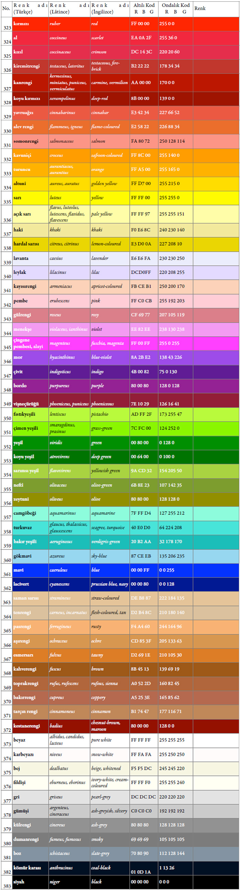

# Sözcükler

**Hazırlayanlar**
{: style="text-align: center"}

- __Adil Güner__
- __Ersin Karabacak__
- __Burçin Çıngay__
- __Fatma Güneş__
- __İsmail Eker__
- __Mehtap Öztekin__
- __Mustafa Keskin__
- __Tuğrul Körüklü__

Bu bölümün iki temel amacı vardır. İlki floristik botanik terminolojisinde bir standart meydana
getirmek. İkincisi, Türkçe yazılan “Resimli Türkiye Florası”nı, İngilizce ve Lâtince bilenlerin
okuyabilmesi için mütevazı bir olanak sağlamaktır. Bugüne kadar botanik terminolojisinde hemen
hepimizin kabul edebileceği ve kendi halkımızla da iletişimi ve anlaşmayı sağlayabilecek bir ortam
oluşmamıştır. Bunun hipotetik nedenleri olarak; dilimizdeki çok hızlı değişme ve daralmayı;
özellikle son yıllarda yabancı sözcüklerin dilimizi istilâsını ve birçok botanikçinin, Davis’in “Flora of
Turkey” eserinin verdiği ivmeyle artan çalışmalarda —neredeyse her birimizin— kendi teknik
sözlüğünü oluşturması olarak sayabiliriz.
{: style="text-align: justify"}

Türkçe’nin çok hızlı değişmesi ile dildeki daralma ve sebepleri hakkında hepimiz birşeyler belki
belirtebiliriz; ancak burada konuya sadece bir durum tespiti şeklinde değinilmektedir. Bunu
incelemek ve irdelemek bu bölümün hedefi değildir. Aynı şekilde Türkçe’nin son yıllarda, özellikle
İngilizce sözcüklerin istilâsı altında olduğu bir vakıadır. Hatta bu istilâ, yabancı sözcüklerin, çoğu
zaman hiç türkçeleştirilme yapılmadan, orijinal halleriyle istilâsı biçimindedir. Kelimelerin telâffuz
edildiği gibi yazılması Türkçe’nin en önemli özelliğidir; arasında sesli bir harf yerleştirilmeden
yazılan, yani içinde ünsüz yığılmaları olan, sözcüklerin tamamı yabancı kökenlidir. Bu nedenle,
inancımız, böyle sözcüklerin telâffuz edildiği gibi yazılarak türkçeleştirilmesi ve bu yolla yabancı
sözcük istilâsına bir nebze engel olunmasıdır. Bu sitratejinin kullanılışına kitabın çeşitli
bölümlerinde sıklıkla rastlayacaksınız.
{: style="text-align: justify"}

Son olarak gerek Dünya’daki botanik bilgisinin Türkçe’ye kazandırılması konusunda eski
bilginlerimizin çabaları, gerekse Davis’in “Türkiye Florası”nın yazımını takiben ortaya çıkan çok
sayıda botanikçinin, bu kitaptaki bilgiyi araştırma ve derslerinde kullanma çabası ile sözcük
dağarcıkları türetilmiştir. Bu dağarcıklarda kimimiz her teknik sözcüğe Türkçe bir karşılık bulma
çabasında iken bir kısım araştırmacı sözcüklerin Türkçe telâffuzunu daha çok benimsemiştir. Her
düşünce ve çabanın haklı gerekçeleri vardır; ancak yine de bu durumun bir karmaşa yarattığı da
meydandadır. Bu karmaşayı giderme ve bu kitapta yer alan betimler ile teşhis anahtarlarında
kullanılan teknik sözcüklerin, hangi anlamda kullanıldığı konusunu açık biçimde belirtme
ihtiyacıyla bu sözlük oluşturulmuştur.
{: style="text-align: justify"}

Aşağıdaki sözcük dağarcığı, betimlerde ve teşhis anahtarlarında kullanılacak çok sayıdaki
terimden yalnızca önemli ve gerekli olduğu düşünülenleri içermektedir. Kuşkusuz bu dağarcığa
eklenebilecek, dışarda kalmış çok sayıda sözcük vardır. Herbir sözcüğün açıklaması, varsa Türkçe
eşanlamlısı, ayrıca Lâtince ve İngilizce karşılıkları verilmiştir. Dağarcığı görsel olarak desteklemek
ve daha anlaşılır kılmak için terimlerin çoğunun resim ve şekilleri de eklenmiştir.
{: style="text-align: justify"}

Terimler cetveli başlıca iki bölümde ele alınmıştır. Birinci bölümde daha ziyade “betimleyici”
durumdaki çoğu sıfat ve zarflardan oluşan sözcükler, anlam yakınlıklarına göre sıralanmıştır.
Öbeklerin düzeninde büyük oranda Botanical Latin (Stearn, 1985) temel alınmıştır. İkinci bölümde
ise organlarla ilgili olan çoğu isim, isim tamlaması durumundaki terimler öbeklenmiştir. Sonuçta
ortaya çıkan terimler cetveli “1”den başlayarak numaralanmıştır.
{: style="text-align: justify"}

Her teknik sözcük maddesi şu ögelerden oluşmaktadır**: “sıra numarası”, bu eserde kullanılması
tercih edilen “teknik Türkçe sözcük”, anlamı ve varsa örneği; Türkçe eşanlamlıları; Lâtince
karşılıkları; İngilizce karşılıkları.
{: style="text-align: justify"}

Bölümün sonunda Türkçe, Lâtince ve İngilizce sözcükler kendi aralarında alfabetik olarak
dizilmiş ve karşısına madde numarası belirtilmiştir. Böylece okuyucunun ilgili maddeyi kolayca
bulması ve hem eşanlamlılarına hem de Lâtince ve İngilizce karşılıklarına ulaşması
kolaylaştırılmıştır.
{: style="text-align: justify"}

## I- Betimleyici Sözcükler. sıfatlar, zarflar.
### I.A- Bireysel terimler
#### I.A.i- Tam Terimler
##### I.A.i.1- Şekiller
###### I.A.i.1.a- Genel veya üç boyutlu şekiller

1- **anormal**: Biçimi genele (ortalamaya, kurala) uymayan, normal olmayan. _Lât.:_ abnormis. _İng.:_ 
abnormal.

2- **armutsu**: Armut şeklinde olan, bir ucu genişçe yuvarlak veya küresel; diğer ucu daha dar, yuvarlak
ya da sivrice biçim . _Lât.:_ pyriformis. _İng.:_ pyriform, pear-shaped.

3- **baltamsı**: Tabanda silindirik olup uca doğru genişleyip yassılaşan etli biçim; bir kenarı kalın ve
düz iken karşı kenar yassılaşıp genişleyerek dışbükey ve ince biçim almış. _Lât.:_ dolabriformis. _İng.:_ 
dolabriform, axe-shaped.

4- **bardaksı**: Tıpkı bir bardak biçiminde olan; testimsi’ye benzer ancak ağız kısmı dar değildir. _Lât.:_ 
cyathiformis. _İng.:_ cyathiform.

5- **basık**: Çökük veya basık şekilde görünüşlü. _Lât.:_ depressus. _İng.:_ depressed.

6- **borazansı**: Tepesinde yayık tepsi gibi ayası, altında uzunca bir tüpü bulunan borazana benzer yapı
(çiçek); hipokırateriform. _Lât.:_ hypocrateriformis. _İng.:_ hypocrateriform, salver-shaped.

7- **borumsu**: Borazana benzeyen, bir ucu genişlemiş, içi boş uzun borumsu yapı. _Lât.:_ tubiformis. _İng.:_ 
trumpet-shaped, tubiform.

8- **çansı**: Çıngırak veya çana benzeyen çiçek; alt kısmı (az veya çok) birleşik, yukarı doğru lopların
geniş tüpsü bir kısımdan yayılarak açılmış biçimi; çıngıraksı, kampanulat. _Lât.:_ campanulatus.
_İng.:_ campanulate, bell-shaped.

9- **çomaksı**: Çubuk, sopa şeklinde olan, tepeye doğru şişkinleşen, genişleyen şekilde. _Lât.:_ clavatus.
_İng.:_ clavate.

10- **düz**: Yüzeyinde girinti çıkıntı olmayan; kıvrımlı, eğik veya engebeli olmayan. _Lât.:_ planum. _İng.:_ 
plane.

11- **eyersi**: Eyere benzeyen şekilde olan. _Lât.:_ selliformis. _İng.:_ selliform.

12- **fıçımsı**: Meyveleri fıçı şeklinde gelişen. _Lât.:_ cupiformis . _İng.:_ barrel-shaped.

13- **fincansı**: Fincan şeklinde olan. _Lât.:_ cupulatus. _İng.:_ cup-shaped.

14- **göbekli**: Bir tarafın asimetrik biçimde şişkinleşmesi ya da genişlemesi; ventrikoz. _Lât.:_ 
ventricosus. _İng.:_ ventricose.

15- **hilâlsi**: Ayça, hilal şeklinde olan. _Lât.:_ lunatus. _İng.:_ crescent–shape, lunate.

16- **hörgüçlü**: Yapının bir tarafının kambur ya da hörgüç şeklinde şişkin olması; kamburlu. _Lât.:_ 
gibbosus. _İng.:_ gibbous.

17- **hunimsi**: Yapının (çiçeğin) dar bir tabandan başlayarak yukarı doğru tedricen genişleyerek huni
şeklinde olması; infundibular. _Lât.:_ infundibularis. _İng.:_ funnel-shaped, infundibular.

18- **ibikli**: Düzensiz bir çıkıntısı olan, miğferin üstündeki çıkıntı gibi. _Lât.:_ cristatus. _İng.:_ crested.

19- **içbükey**: Düzgün biçimde ortası çukur kenarları çıkık olan. _Lât.:_ concavus. _İng.:_ concave.

20- **içiboş**: İçi boş silindir şeklinde; ama iki ucu kapalı olan. _Lât.:_ fistulosus. _İng.:_ fistulose, hollow.

21- **kabzalı**: Genellikle iki kısımlı olup, alt kısmın tutamak, kabza biçiminde olması; örneğin bazı
süsen (Iris) ve turnagagası (Geranium) taçyapraklarının alt bölümü. _Lât.:_ unguiculatus. _İng.:_ clawed,
unguiculate.

22- **kadehsi**: Yapının (çiçek örtüsünün) yanardağ ağzı gibi veya kadeh gibi olması. _Lât.:_ crateriformis.
_İng.:_ goblet-shaped.

23- **kalkansı**: Bir yüzey ve ortasında yükselen alçak tümsekçik biçimi (bir kalkan ve ortasındaki
tümsek gibi). _Lât.:_ umbonatus. _İng.:_ bossed, umbonate.

24- **kayıksı**: Kayık şeklinde olan. _Lât.:_ navicularis, cymbiformis. _İng.:_ cymbiform, boat-shaped, navicular.

25- **kesecikli**: Bir tarafı torba gibi şişkin olan. _Lât.:_ saccatus. _İng.:_ saccate, bag-shaped.

26- **kılcal**: Kıl gibi çok ince olan; kapiler. _Lât.:_ capillaceus. _İng.:_ capillary.

27- **konik**: Ehramî, koni şeklinde. _Lât.:_ conicus. _İng.:_ conical.

28- **kubbemsi**: Kubbe şeklinde. _Lât.:_ tholiformis. _İng.:_ dome-shaped.

29- **külahlı**: Tepesinde külah şeklinde yapısı olan; kukullat. _Lât.:_ cucullatus. _İng.:_ hooded.

30- **küremsi**: Düzgün küre şeklinde, küresel. _Lât.:_ globosus. _İng.:_ globose, sphaerical, sphaeroidal.

31- **mekiksi**: Ortası şişkin ve iki uca doğru daralıp sivrilmiş, mekik şeklinde. _Lât.:_ fusiformis. _İng.:_ 
fusiform, spindle-shaped.

32- **mememsi**: İri bir memeye benzeyen biçim. _Lât.:_ mammosus. _İng.:_ mammous.

33- **merceksi**: Mercimek şeklinde, iki yüzü dış bükey olan bir mercek şeklinde. _Lât.:_ lentiformis,
lenticularis. _İng.:_ lentiform, lenticular.

34- **miğfersi**: Başlık, kukuleta veya miğfer biçiminde olan; galeat. _Lât.:_ galeatus. _İng.:_ galeate, helmetshaped.

35- **nalsı**: At nalı şeklinde. _Lât.:_ hippocrepiformis. _İng.:_ hippocrepiform, horseshoe-shaped.

36- **normal**: Biçimi genele (ortalamaya, kurala) uyan, farklılık taşımayan. _Lât.:_ normalis. _İng.:_ normal.

37- **oluksu**: Kanal veya oluk şeklinde yapı; kanalsı, kanalikulat. _Lât.:_ canaliculatus. _İng.:_ channeled,
canaliculate.

38- **omurgalı**: Oluk biçiminde, ancak sırt kısmı kayık omurgası gibi çıkıntılı yapı; karinat. _Lât.:_ 
carinatus. _İng.:_ carinate, keeled.

39- **s şeklinde**: S harfi şeklinde kıvrık olan; sigmoyit. _Lât.:_ sigmoideus. _İng.:_ sigmoid.

40- **salyangozsu**: Salyangoz kabuğu şeklinde bükülmüş. _Lât.:_ cochleatus. _İng.:_ cochleate.

41- **silindirik**: Üstüvane, alt ve üst kısımları eşit çapta olan sütun biçiminde uzun şekil. _Lât.:_ teres,
cylindiraceus. _İng.:_ terete, cylindrical.

42- **solucansı**: Kurtçuksu, küçük kurtlara benzer şekilde silindirik, ama sık aralıklı hafif boğumlu ve
kabarcıklı. _Lât.:_ vermiculatus. _İng.:_ vermiculate.

43- **tabaksı**: Yemek tabağı biçiminde olan yapı (çiçek); tüp kısmı kısadır, taç tabak gibi yayılır; rotat.
_Lât.:_ rotatus. _İng.:_ rotate.

44- **tablamsı**: Tablaya benzeyen, disk şeklinde olan. _Lât.:_ discoideus. _İng.:_ discoid.

45- **tepsimsi**: Tepsiye benzer biçimde kenarları yüksek geniş tabla. _Lât.:_ scutatus, scutiformis. _İng.:_ 
buckler-shaped, scutate.

46- **terliksi**: Çiçeği ayakkabı ya da terlik biçiminde olan. _Lât.:_ calceolatus, calceiformis. _İng.:_ calceolate.

47- **tesbihsi**: Tespih, boncuk dizisi şeklinde; toruloz, moniliform. _Lât.:_ moniliformis, torulosus. _İng.:_ 
moniliform, torulose.

48- **testimsi**: Çiçeğin, taban kısmı şişkin, ağzı dar bir testi biçiminde olması; urseolat. _Lât.:_ 
Urceolatus. _İng.:_ Urceolate, urn-shaped.

49- **topaçsı**: Topaç şeklinde, ters koni şeklinde. _Lât.:_ turbinatus. _İng.:_ turbinate.

50- **toynaksı**: Toynak, yani at tırnağı şeklinde olan. _Lât.:_ ungulatus. _İng.:_ hoof-shaped.

51- **turpsu**: Turp gibi şişkin şekilde olan. _Lât.:_ napiformis. _İng.:_ napiform.

52- **üç-köşeli**: Kesiti üçgen biçiminde olan. _Lât.:_ deltoides. _İng.:_ deltoid.

53- **uzamış**: Boyu eninden uzun. _Lât.:_ elongatus. _İng.:_ elongate.

54- **yapraksı**: Yaprağa benzeyen doku ve yapıda. _Lât.:_ foliaceus. _İng.:_ foliaceus.

55- **yassı**: İki taraftan sıkıştırılarak yassılaşmış. _Lât.:_ compressus. _İng.:_ compressed, flattened.

56- **yaysı**: Yay (ok atmaya yarayan) gibi kıvrık. _Lât.:_ arcuatus. _İng.:_ arcuate.

57- **yuvarlak**: Çember gibi dairemsi. _Lât.:_ circularis. _İng.:_ circular.

###### I.A.i.1.b- Yüzey Şekilleri

58- **baklavamsı**: Baklava dilimi şeklinde, eşkenar dörtgen. _Lât.:_ rhombeus, rhomboideus. _İng.:_ 
rhomboid.

59- **bizsi**: biz şeklinde, genişçe bir tabandan çok ince bir uca doğru daralan; subulat. _Lât.:_ subulatus.
_İng.:_ subulate.

60- **böbreksi**: Böbrek şeklinde düzlem, uçları yuvarlak, kalın hilâle benzer; reniform. _Lât.:_ reniformis.
_İng.:_ reniform.

61- **dairesel**: Dairesel, çember şeklinde olan düzlem; orbikular. _Lât.:_ orbiculatus, orbicularis. _İng.:_ 
orbicular, orbiculate.

62- **dikdörtgensi**: Köşeleri yuvarlak dikdörtgen biçiminde; oblong. _Lât.:_ oblongus. _İng.:_ oblong.

63- **dilsi**: Dil şeklinde, dile benzer. _Lât.:_ ligulatus. _İng.:_ ligulate.

64- **eliptik**: Elips biçiminde düzlem. _Lât.:_ ellipticus. _İng.:_ elliptic, elliptical.

65- **hilâlsi**: Ayça, hilâl şeklinde. _Lât.:_ lunatus. _İng.:_ crescent-shaped, lunate.

66- **iğnemsi**: İbreye veya iğneye benzeyen, dar bir tabandan çok ince bir uca doğru incelen biçimi
olan; ibremsi, aseroz, asikulat. _Lât.:_ acerosus, aciculatus. _İng.:_ acerose, aciculate.

67- **ipliksi**: İplik şeklinde çok ince; filiform. _Lât.:_ filiformis. _İng.:_ filiform.

68- **kaşıksı**: Kaşık, sıpatül şeklinde. _Lât.:_ spatulatus. _İng.:_ spatulate.

69- **kemansı**: Keman biçimindeki düzlemsel şekil; pandurat. _Lât.:_ panduratus. _İng.:_ pandurate,
panduriform.

70- **kılıçsı**: Kılıç şeklinde, kenarları paralel, düz ve uzun. _Lât.:_ ensiformis, gladiatus. _İng.:_ ensiform,
gladiate.

71- **lirat**: Keman şeklinde, ancak dar kısmı her iki tarafta tabana doğru oyuklu; ıklığsı. _Lât.:_ lyratus.
_İng.:_ lyrate.

72- **mızraksı**: Mızrak ucu gibi, iki ucu dar ve sivri, ortası geniş düzlem şekil, ancak en geniş yer
ortada değil, tabana daha yakın; lanseolat. _Lât.:_ lanceolatus. _İng.:_ lanceolate.

73- **oksu**: Okbaşı şeklinde, sagitat. _Lât.:_ sagitatus. _İng.:_ sagittate.

74- **oraksı**: Orak şeklinde olan. _Lât.:_ falcatus. _İng.:_ falcate.

75- **şeritsi**: Dar ve uzun şerit şeklinde; lineer, kayışsı. _Lât.:_ linearis, loratus. _İng.:_ linear, strap-shaped.

76- **tebersi**: Taban kısmı hilâl ayça şeklinde, tabanda uçları aşağı doğru yönelmiş eşit uçlu az çok
üçgen şeklinde loblu, Türk baltası şeklinde olan; hastat. _Lât.:_ hastatus. _İng.:_ hastate, halberd-shaped.

77- **terskonik**: Başaşağı koni, ehram şeklinde olan düzlem, ters konik şeklinde; obkonik. _Lât.:_ 
obconicus. _İng.:_ obconical.

78- **tersmızraksı**: Mızraksının tersi, en geniş yer uca daha yakın. _Lât.:_ oblanceolatus. _İng.:_ oblanceolate.

79- **tersüçgensi**: Tersüçgen şeklinde olan. _Lât.:_ obdeltoides. _İng.:_ obdeltoid.

80- **tersyumurtamsı**: Geniş tarafı üstte yer alan yumurta şeklinde olan düzlem ya da hacimli biçim;
obovat. _Lât.:_ obovatus, obovoideus. _İng.:_ obovate, obovoid.

81- **tersyüreksi**: Başaşağı yürek, kalp şeklinde olan; obkordat. _Lât.:_ obcordatus. _İng.:_ obcordate.

82- **üçgensi**: Üçgen şeklinde, üç açılı olan düzlem biçim. _Lât.:_ triangulus, triquetrus. _İng.:_ triangular.

83- **yelpazemsi**: Yelpaze şeklinde olan. _Lât.:_ flabellatus. _İng.:_ flabellate.

84- **yumurtamsı**: Yumurta şekline benzeyen düzlem ya da hacimli şekil; ovat. _Lât.:_ ovatus, ovoideus.
_İng.:_ ovate, ovoid.

85- **yuvarlak**: Bir daire gibi yuvarlak, dairemsi. _Lât.:_ rotundus. _İng.:_ round.

86- **yüreksi**: Yürek şeklinde olan düzlem biçim; kalpsi. _Lât.:_ cordatus. _İng.:_ cordate.

###### I.A.i.1.c- Uç şekilleri

87- **az girintili**: Ucunda hafif girintisi olan; retüz. _Lât.:_ retusus. _İng.:_ retuse.

88- **batıcı**: Tedricen sert ve keskin sivri bir uçla biten. _Lât.:_ pungens. _İng.:_ pungent.

89- **derin girintili**: Uç kısmın ortasında derin girinti ile biten; emarginat. _Lât.:_ emarginatus. _İng.:_ 
emarginate.

90- **gagalı**: Gaga gibi çıkıntı ile biten. _Lât.:_ rostratus. _İng.:_ rostrate, beaked.

91- **ince uçlu**: Sert bir uca doğru yavaşça daralan, incelen; kuspidat, incelici. _Lât.:_ cuspidatus. _İng.:_ 
cuspidate.

92- **kesik**: Kesilmiş gibi, birdenbire sonlanan, orta damara dik açılı sonlanan; turunkat. _Lât.:_ 
truncatus. _İng.:_ truncate.

93- **kılçıklı**: aniden sert, düz, bizsi bir uçla biten; aristalı. _Lât.:_ aristatus. _İng.:_ aristate.

94- **kılkılçıklı**: Tedricen çok ince, uzunca, sivri bir uçla biten; setoz. _Lât.:_ setosus. _İng.:_ setose.

95- **kuyruklu**: Kuyruk şeklinde uca sahip olan. _Lât.:_ caudatus. _İng.:_ caudate, tailed.

96- **küt**: Ucu kör olan; kör, obtuz. _Lât.:_ obtusus. _İng.:_ obtuse, blunt.

97- **mukronat**: Aniden küçük, sivri ve sert bir uçla biten; ortadamarın devamı şeklindedir; aya
oluşumuna katılmaz. _Lât.:_ mucronatus. _İng.:_ mucronate.

98- **sipsivri**: Sivri uca göre gittikçe incelerek daha keskin ve sivri olan uç; aküminat. _Lât.:_ acuminatus.
_İng.:_ acuminate, taper-pointed.

99- **sivri çıkıntılı**: Sivri, küçük bir uca doğru yavaşça sonlanan, mukronattan farklı olarak yaprak
ayası da bu çıkıntıya katılır; apikülat. _Lât.:_ apiculatus. _İng.:_ apiculate.

100- **sivri**: İki kenarı düz çizgi gibi gelip birleşerek oluşan sivri uç; akut. _Lât.:_ acutus. _İng.:_ acute.

101- **sülüklü**: Helezonî bükülebilen ipliksi bir uçla sonlanan. _Lât.:_ capreolus, cirrhosus. _İng.:_ capreolate,
cirrhous.

102- **top başlı**: Uç kısmında aniden en kalın olan; ucu topuz gibi aniden genişlemiş; kapitat, başlı.
_Lât.:_ capitatus. _İng.:_ capitate, headed.

103- **üç dişli**: Uç kısımda üç dişli olma durumu. _Lât.:_ tridentatus. _İng.:_ tridentate.

104- **yuvarlak uçlu**: Uç kısmın bir dairenin parçası gibi yuvarlak ulması; rotundat. _Lât.:_ rotundatus.
_İng.:_ rotundate.

###### I.A.i.1.ç- Taban şekilleri

105- **daralan**: Kenarları tedricen tabana doğru daralan; angustat, attenüat. _Lât.:_ angustatus,
attenuatus. _İng.:_ angustate, attenuate, tapering.

106- **kamamsı**: Tabanı kama şeklinde daralarak biten; küneat. _Lât.:_ cuneatus. _İng.:_ cuneate.

107- **kesik**: Tabanı kesilmiş gibi birdenbire, orta damara dik açılı sonlanan; turunkat. _Lât.:_ truncatus.
_İng.:_ truncate.

108- **sitipüllü**: Yaprak sapının iki yanında veya tek tarafında bulunan pulsu veya yaprak benzeri
yapıları olan; istipüllü. _Lât.:_ stipulatus. _İng.:_ stipulate.

109- **sitipülsüz**: Sitipülü olmayan; istipülsüz. _Lât.:_ exstipulatus. _İng.:_ exstipulate.

110- **kulaksı**: Kulak şeklinde, tabanda dışa doğru yuvarlak iki küçük lobu olan; avrikulat. _Lât.:_ 
auriculatus. _İng.:_ auriculate.

111- **oksu**: Okbaşı şeklinde, tabana doğru tedrici olarak genişleyen, iki dik ve düz lobu olan; sagitat.
_Lât.:_ sagitatus. _İng.:_ sagittate.

112- **tebersi **: Taban kısmı hilâl ayça şeklinde, tabanda uçları dışarı doğru yönelmiş üçgen şeklinde
lobları olan; hastat. _Lât.:_ hastatus. _İng.:_ hastate, halberd-shaped.

113- **yamuk**: Tabanı asimetrik biçimde olan; oblik. _Lât.:_ obliquus. _İng.:_ oblique.

114- **yuvarlak tabanlı**: Tabanın bir dairenin parçası gibi yuvarlak olması; rotundat. _Lât.:_ rotundatus.
_İng.:_ rotundate.

##### I.A.i.2- Bölünmeler

115- **az**: Lâtince’de “–fidus”, İngilizce’de “–fid” sonekinin karşılığı**: “palmatifidus=az elsi” gibi.

116- **derin**: Lâtince’de “–sectus”, İngilizce’de “–sect” sonekinin karşılığı**: “palmatisectus = derin elsi”
gibi.

117- **bölme**: Dilimlenmiş ya da parçalara ayrılmış her hangi bir organın herbir parçası; segment.
_Lât.:_ segmentum. _İng.:_ segment.

###### I.A.i.2.a- Kenarlar

118- **az fırfırlı**: Kenarın çok az dalgalı bir yapıda olması. _Lât.:_ repandus. _İng.:_ repand.

119- **çentikli**: Düzenli olarak derin kesiklerle bölünmüş olma; kesik kesik. _Lât.:_ incisus. _İng.:_ incised.

120- **derin kesikli**: Kenarın derin, düzgün kesilmiş gibi girintilerle bezenmesi; lasiniyat; “derin
kesikli”de girintiler “kesik kesik”den daha derindir. _Lât.:_ laciniatus. _İng.:_ laciniate.

121- **dişçikli**: Kenarın üçgen biçimli küçük dişlerle sık şekilde bezenmesi; dentikulat. _Lât.:_ 
denticulatus. _İng.:_ denticulate.

122- **dişli**: Kenarın üçgen biçimli dişlerle bezenmesi; diş açıları 90 derecedir; dentat. _Lât.:_ dentatus.
_İng.:_ dentate, toothed.

123- **duble dişli**: Kenardaki üçgen biçimli dişlerin tekrar üçgen dişlerle bezeli olması. _Lât.:_ duplicatodentatus.
_İng.:_ double-dentate.

124- **duble testeredişli**: Testere dişlerin tekrar dişli olması. _Lât.:_ duplicato-serratus. _İng.:_ biserrate.

125- **dümdüz**: Kenarın herhangi bir diş veya benzeri girinti-çıkıntısının olmaması, tamamen düz,
tam kenarlı. _Lât.:_ integer. _İng.:_ entire.

126- **fırfırlı**: Kenarın dalgalı bir yapıda olması; ondüleli. _Lât.:_ undulatus. _İng.:_ undulate.

127- **ikidişli**: İki tane dişi olan. _Lât.:_ bidentatus. _İng.:_ bidentate.

128- **kemirikli**: Kemirilmiş gibi düzensiz dişli kenarları olan; eroz. _Lât.:_ erosus. _İng.:_ erose.

129- **kütdişçikli**: Kenarın küçük küçük kat uçlu yuvarlak dişçiklerle bezeli olması; kırenülat. _Lât.:_ 
crenulatus. _İng.:_ crenulate.

130- **kütdişli**: Kenarın küt uçlu, yuvarlak dişlerle bezeli olması; kırenat. _Lât.:_ crenatus. _İng.:_ crenate.

131- **lüleli**: Kenarın lüle lüle, bukle bukle bezenmesi. _Lât.:_ crispus. _İng.:_ curled.

132- **saçaklı**: Kenarın düzensiz biçimli çıkıntılarla bezenmesi; fimbriyat. _Lât.:_ fimbriatus. _İng.:_ 
fimbriate, fringed.

133- **taraksı**: Kenarın tarak dişleri gibi bezeli olması; pektinat. _Lât.:_ pectinatus. _İng.:_ pectinate.

134- **testere dişçikli**: Kenarın küçük ve sık testere gibi yatık dişli olması; serrülat. _Lât.:_ serrulatus.
_İng.:_ serrulate.

135- **testere dişli**: Kenarın bir yana yatık, keskin, sivri dişlerle bezeli olması; serrat. _Lât.:_ serratus.
_İng.:_ serrate.

136- **yılankavî**: Kenarın geniş girintilerle bezeli olması; sinuat, girintili. _Lât.:_ sinuatus. _İng.:_ sinuate.

###### I.A.i.2.b- Dilimlenmeler

137- **ayaksı**: Yanal lobları da bölünmüş ayağa benzer parçalı; pedat. _Lât.:_ pedatus. _İng.:_ pedate.

138- **az elsi**: El biçiminde bölünmüş, ancak bölünme derinliği az; palmatifit. _Lât.:_ palmatifidus,
palmatipartitus. _İng.:_ palmatifid, palmatipartite.

139- **az teleksi**: Teleksi bölünmüş ancak bölünme derinliği az; pinnatifit. _Lât.:_ pinnatifidus,
pinnatipartitus. _İng.:_ pinnatifid, pinnatipartite.

140- **bir yaprakçıklı:. Bileşik bir yaprağın, biri hariç diğer yaprakçıklarının körelmiş olması. _Lât.:_ 
unifoliatus. _İng.:_ unifoliate.

141- **derin elsi**: El biçiminde bölünmüş, bölünme derinliği fazla, ama orta damara varmamış;
palmatisek. _Lât.:_ palmatisectus. _İng.:_ palmatisect.

142- **derin teleksi**: Hemen hemen orta damara kadar derin bölünmüş, teleksi düzlem yaprak;
pinnatisek. _Lât.:_ pinnatisectus. _İng.:_ pinnatisect.

143- **dilimli**: Derin şekilde bölmelere, parçalara ayrılmış. _Lât.:_ dissectus. _İng.:_ dissected.

144- **elsi loplu**: Yaprak el gibi beş loplu; Botanical Latin’de “palmat” olarak bu tarif edilir . _Lât.:_ 
palmatilobatus. _İng.:_ palmatilobate.

145- **ikiloplu**: İki loplu düzlem aya; bilobat. _Lât.:_ bilobatus. _İng.:_ bilobed.

146- **loplu**: Bölmelere, segmentlere ayrılmış. _Lât.:_ lobatus. _İng.:_ lobed.

147- **parmaksı**: Derince dilimlenmiş yaprağın bölmeleri parmak gibi dar ve uzun; digitat. _Lât.:_ 
digitatus. _İng.:_ digitate.

148- **çengel dişli**: Kenarlar geniş üçgen bölmeli dişli ve dişler geriye tabana doğru yönelmiş;
geriyeloplu, runsinat. _Lât.:_ runcinatus. _İng.:_ runcinate.

149- **telek loplu**: Yüzeyin teleksi biçimde loplu, bölmeli olması. _Lât.:_ pinnatilobatus. _İng.:_ 
pinnatilobate.

150- **az üçlü**: Ayanın üç parçaya az derin biçimde dilimlenmesi; tirifid. _Lât.:_ trifidus. _İng.:_ trifid.

151- **yırtık**: Ayanın derin ve düzensiz, yırtılmış gibi bölünmüş olması; bölünmeler ortadamara
varmaz; laserat. _Lât.:_ laceratus. _İng.:_ lacerate.

###### I.A.i.2.c- Dallanmalar

152- **ağaçsı**: Ağaç gibi dallı budaklı biçime sahip olan. _Lât.:_ dendroideus, arboreus. _İng.:_ tree-like.

153- **basit**: Bölünmemiş yaprak veya yüzey (loplanmış olabilir, bölünme sonucu bağımsız alt
bölümler oluşmamış). _Lât.:_ simplex. _İng.:_ simple.

154- **bileşik**: Çeşitli biçimde dallanmış veya bölünmüş yaprak veya yüzeyler (bölünme derinliği orta
damara kadar iner ve ögeler bağımsız birimler gibi gözükür; genellikle öğeler tek bir sapa
bağlanır). _Lât.:_ compositus. _İng.:_ compound.

155- **çatalsı**: Çatallanarak (genellikle ikiye) dallanan; furkat. _Lât.:_ furcatus. _İng.:_ furcate.

156- **çift teleksi**: Teleksi bölünmüş bir yüzeyin uç kısmının bir çift telekle bitmesi, uç kısımda bazan
bir mukro veya sülük olabilir; paripinnat. _Lât.:_ paripinnatus. _İng.:_ paripinnate, even-pinnate.

157- **çift üçlü**: İki kere bölünerek bir saptan üç sapçık üzerinde üçer yaprakçık toplamda 9 yaprakçık
durumu; biternat. _Lât.:_ biternatus. _İng.:_ biternate.

158- **çok-bileşik**: Dallanmış veya bölünmüş yaprak veya yüzeyler, genellikle öğelerin sekonder
sapları başka saplara onlar da ortak tek bir sapa bağlanır. _Lât.:_ supracompositus. _İng.:_ 
supradecompound.

159- **dallanmamış**: Çok az dallı gövdeler. _Lât.:_ simplex. _İng.:_ simple.

160- **dallı**: Çok sayıda dalı olan; ortak bir eksenden dalların düzenli dik açılarla çıkması. _Lât.:_ 
ramosus, brachiatus. _İng.:_ branched, brachiate.

161- **duble bileşik**: Dallanmış veya bölünmüş yaprak veya yüzeyler, genellikle öğelerin sapı başka bir
ortak sapa bağlanır. _Lât.:_ decompositus. _İng.:_ decompound.

162- **elsi**: El biçiminde bölünmüş, bölmeler serbest, ayrı birer parça gibi; palmat. _Lât.:_ palmatus. _İng.:_ 
palmate.

163- **hiç dallanmamış**: Hiç dallanmamış gövdeler. _Lât.:_ simplicissimus. _İng.:_ quite simple, unbranched.

164- **ızgaramsı dallı**: Izgara kafes şeklinde parankimasını yitirmiş, sadece damarlardan ibaret bir
yaprak gibi uçları birleşen yapı; kansellat. _Lât.:_ cancellatus. _İng.:_ cancellate, clathrate.

165- **iki teleksi**: Yüzeyin iki kere katman halinde telek biçiminde bölünmesi, parçacıklar serbest ve
bağımsız gibi gözükür; bipinnat. _Lât.:_ bipinnatus. _İng.:_ bipinnate.

166- **iki yaprakçıklı**: Ortak sapa bağlanan öğeler yaprakçıklar bir çift; yaprak iki ast yaprakçıklı. _Lât.:_ 
bifoliatus, binatus. _İng.:_ bifoliolate.

167- **monopodiyal**: Tek eksenli, ana ekseni uçtan devamlı olarak büyüyerek dallanan. _Lât.:_ 
monopodialis. _İng.:_ monopodial.

168- **simpodiyal**: Ana eksen uçtan büyümesini durdurur, yan dallar sırasıyla ana eksen
durumunu alarak büyüme biçimi; hâkim bir ana eksen yoktur. _Lât.:_ sympodialis. _İng.:_ 
sympodial.

169- **tanecikli**: Buğday daneleri gibi küçük düğüm ve yapılara bölünen. _Lât.:_ granulatus. _İng.:_ 
granular, granulate, granulose.

170- **tekteleksi**: Teleksi bölünmüş bir yüzeyin uç kısmının bir tek telekle bitmesi; imparipinnat. _Lât.:_ 
imparipinnatus. _İng.:_ imparipinnate, odd-pinnate.

171- **teleksi**: Telek tüyüne benzer biçimde bölünerek, ortadamarın iki yanında basit yaprakçık
çiftleri taşıyan yaprak biçimi; pinnat. _Lât.:_ pinnatus. _İng.:_ pinnate.

172- **üç yaprakçıklı**: Ayanın üç yaprakçıktan meydana gelmesi; tirifolyat. _Lât.:_ trifoliatus. _İng.:_ 
trifoliate.

173- **üç teleksi**: Aya üç kere, teleksi biçimde tam bölünmüş; tiripinnat. _Lât.:_ tripinnatus. _İng.:_ 
tripinnate.

174- **üçüçlü**: Ayanın üç kere üçe tam bölünerek meydana getirdiği yaprak biçimi toplamda 27
yaprakçık ; tiriternat. _Lât.:_ triternatus. _İng.:_ triternate.

175- **yıldızsı**: Ortak bir noktadan yıldıza benzer biçimde dallanan (çoğu durumda tüyler için
kullanılır). _Lât.:_ stellatus. _İng.:_ stellate.

##### I.A.i.3- Yüzeyler

###### I.A.i.3.a- Yüzey desenleri (yüzeyin görünüşü)

176- **adacıklı**: Düzensiz veya köşeli alancıklarla bezeli yüzey deseni. _Lât.:_ areolatus. _İng.:_ areolate.

177- **ağsı**: Düzensiz ağsı bir desenle bezeli yüzey. _Lât.:_ reticulatus. _İng.:_ reticulate.

178- **az buruşuk**: İnce buruşuk ya da kırışıklarla bezeli yüzey deseni. _Lât.:_ rugulose. _İng.:_ rugulose.

179- **benekli**: Büyük leke halinde deseni olan; makulat. _Lât.:_ maculatus. _İng.:_ spotted.

180- **beneksiz:. Beneği veya lekesi olmayan. _Lât.:_ astictus. _İng.:_ unspotted, spotless.

181- **buruşuk**: Buruşuk ya da kırışıklarla bezeli yüzey deseni. _Lât.:_ rugosus. _İng.:_ rugose, wrinkled.

182- **çiğnenmiş**: Ağızda çiğnenmiş görünüşlü deseni olan. _Lât.:_ ruminatus. _İng.:_ ruminate.

183- **çilli**: Nokta veya beneğe benzer çil şeklinde desenli. _Lât.:_ punctatus. _İng.:_ punctate, dotted.

184- **çizgili**: Çok sayıda çizgi gibi uzun yapılarla bezeli deseni olan. _Lât.:_ lineatus. _İng.:_ lineate, striate.

185- **çıbansı**: Çıban biçiminde yara izleri ile bezeli desen. _Lât.:_ cicatricatus. _İng.:_ scarred.

186- **çopur**: Çok sayıda iri derince çukurlarla bezeli yüzey. _Lât.:_ lacunosus. _İng.:_ lacunose.

187- **çukur çukur**: Çok sayıda küçük sığ çukurlarla bezeli yüzey. _Lât.:_ scrobiculatus, foveolatus. _İng.:_ 
pitted, foveolate.

188- **damalı**: Mozaik veya damalı görünüşlü. _Lât.:_ tessellatus. _İng.:_ tessellate.

189- **damla benekli**: Damla şeklinde lekeli deseni olan. _Lât.:_ guttatus. _İng.:_ guttate.

190- **delik deşik**: Çok sayıda deliksi yapı ile bezenmiş deseni olan; poroz. _Lât.:_ porosus. _İng.:_ porous.

191- **halkalı**: Halka biçiminde çıkıntılı veya çukur bir yapı ile çevrilmiş şey; yüzüklü, annulat. _Lât.:_ 
annulatus. _İng.:_ annulate, ringed.

192- **kabarcıklı**: Kabarcık veya fiske şeklinde yapılarla bezenmiş desen; fiskeli, pustulât. _Lât.:_ 
pustulatus. _İng.:_ pustulate.

193- **kovuk kovuk**: Çok sayıda iri kovuklarla bezenmiş desen; kavernoz. _Lât.:_ cavernosus. _İng.:_ 
cavernous.

194- **lekeli**: Yüzeyi çeşitli büyüklükte leke gibi düzensiz beneklerle bezeli olan. _Lât.:_ sphacelatus,
maculatus. _İng.:_ speckled.

195- **oluk oluk**: Çok sayıda oluk ile bezeli desen.

196- **oluklu**: Bir oluğu olan; sulkat. _Lât.:_ sulcatus. _İng.:_ sulcate, furrowed, grooved.

197- **pencereli**: Pencere gibi açıklıkları olan yüzey. _Lât.:_ fenestralis, fenestratus. _İng.:_ fenestrate.

198- **peteksi**: Bal peteği şeklinde çukurlarla bezeli. _Lât.:_ alveolatus, favosus. _İng.:_ alveolate, honeycombed.

199- **süzgeçli**: Düzensiz biçimde delik delik görünen yüzey deseni. _Lât.:_ perforatus. _İng.:_ perforate.

200- **yağ kanallı**: İçi reçine veya yağ dolu kanal(lar)la bezeli deseni ve görüntüsü (çoğu maydanozgil
[Apiaceae] meyvası gibi); vittalı. _Lât.:_ vittatus. _İng.:_ vittate.

201- **yivli**: Çizgili gibi, ama çizgi yerine uzunluğuna girintili yivleri olan; girintiler olukludaki gibi
derin ve geniş değil. _Lât.:_ striatus. _İng.:_ striate, fluted.

###### I.A.i.3.b- Tüy örtüsü ve kaplama

202- **tüy örtüsü**: Bir organın yüzeyindeki tüy ve benzeri uzantıların sıklığı, biçimi ile şekillenen
kaplama; indumentum, kaplama. _Lât.:_ indumentum. _İng.:_ indumentum, hair-covering.

203- **az pürüzlü**: Az miktarda kısa, sert ve dik çıkıntılarla kaplı yüzey. _Lât.:_ scabridus. _İng.:_ roughish,
scabrid, scabrous

204- **cılız tüylü**: Yumuşak dik ve uzunca cılız tüylerle kaplı; piloz. _Lât.:_ pilosus. _İng.:_ pilose.

205- **çapa tüylü**: Çapa biçimli tüylerle kaplı. _Lât.:_ glochidiatus. _İng.:_ glochidiate.

206- **çatal tüylü**: İki ucu olan çatalsı tüylerle kaplı; bifurkat. _Lât.:_ bifurcatus. _İng.:_ bifurcate.

207- **çengel tüylü**: Çengel veya kanca şeklinde kıvrılmış tüylerle kaplı; kancalı. _Lât.:_ hamatus,
hamosus. _İng.:_ hamate, hooked.

208- **çıplak**: Herhangi bir şeyle kaplı olmayan, üzerinde tüy, hav veya ülger olmayan yüzey. _Lât.:_ 
glabratus, nudus, denudatus. _İng.:_ glabrous, hairless, naked.

209- **dallı tüylü**: Ağaca ya da şamdana benzeyen dallı budaklı tüylerle kaplı yüzey.

210- **diken diken**: Çok sayıda dikensi yapıyla kaplı yüzey; sipinoz. _Lât.:_ spinosus. _İng.:_ spinose, spiny.

211- **dikencikli**: Çok sayıda küçük veya kısa dikenciklerle kaplı yüzey; sipinüloz. _Lât.:_ spinulosus.
_İng.:_ spinulose.

212- **dikenli**: Kalın dikenlerle kaplı yüzey. _Lât.:_ aculeatus. _İng.:_ aculeate.

213- **dikensiz**: Diken şeklinde çıkıntısı olmayan yüzey. _Lât.:_ inermis. _İng.:_ unarmed.

214- **havlı**: İnce ve kısa tüylerle kaplı (havlu gibi); pübesent. _Lât.:_ pubescens. _İng.:_ pubescent, downy.

215- **ince pürüzlü**: Daha ince, sert ve kısa çıkıntı ve pürüzlerle kaplı yüzey (“pürüzlü”de çıkıntılar
daha kaba dokunma hissi verir). _Lât.:_ scabridulus. _İng.:_ scabridulous.

216- **ipeksi**: Uzun, düzgün, parlak yatık yumuşak tüylerle kaplı yüzey. _Lât.:_ sericeus. _İng.:_ sericeous,
silky.

217- **kaba pürüzlü**: Çok sayıda sivri çıkıntı ile bezeli desen. _Lât.:_ muricatus. _İng.:_ muricate.

218- **kaba tüylü**: Sık, kısa, kalınca, dokunulduğunda kaba biçimde hissedilen tüylerle kaplı. _Lât.:_ 
tomentosus. _İng.:_ tomentose.

219- **kadifemsi**: Kadifeye benzer şekilde tüy şekli; kadife tüylü. _Lât.:_ velutinus. _İng.:_ velutinous,
velvety.

220- **keçe tüylü**: Zamanla demet demet dökülen, keçe gibi sık karışık tüylerle kaplı yüzey. _Lât.:_ 
floccosus. _İng.:_ floccose.

221- **kepekli**: Küçük, yuvarlak, yassı veya şekilsiz yapılarla kaplı gibi yüzey; pullu. _Lât.:_ squamosus.
_İng.:_ squamulose, scaly,.

222- **kirpikçikli**: Kirpik tüyleri daha kısa olan “kirpiksi” tüylenme. _Lât.:_ ciliolatus. _İng.:_ ciliolate.

223- **kirpikli**: Kenarın kirpik gibi tüylerle kaplı olması; siliyat. _Lât.:_ ciliatus. _İng.:_ ciliate.

224- **kıllı**: Uzun, sert, kılsı tüylerle kaplı; hispit. _Lât.:_ hispidus. _İng.:_ hispid, setose.

225- **kır tüylü**: Çok kısa sık tüylerle kaplı yüzey öyle ki yüzey grimsi beyaz, aklaşmış gibi görünür.
_Lât.:_ incanus. _İng.:_ canescent, hoary.

226- **kırışık tüylü**: kırışık, kıvrık, lüleli tüylerle kaplı. _Lât.:_ crispatus. _İng.:_ crisped-hairy.

227- **kısa havlı**: “Havlı”ya nazaran daha az tüyle kaplı yüzey; püberüloz. _Lât.:_ puberulous. _İng.:_ 
puberulent.

228- **kısa kabatüylü**: Yumuşak, ama daha ince ve kısa tüylerle kaplı yüzey; hirtellöz. _Lât.:_ hirtellus.
_İng.:_ hirtellous, hirtellate.

229- **kısa kıllı**: Sert, ama kısa kılsı tüylerle kaplı yüzey; setüloz. _Lât.:_ setulosus. _İng.:_ setulose.

230- **kısa sakallı**: İnce kısa, sakalsı tüylerle kaplı. _Lât.:_ barbellatus. _İng.:_ barbellate.

231- **kirpimsi**: Yüzeyin sık dikenciklerle kaplı olup kirpi gibi görünüşü olan; ekinat. _Lât.:_ echinatus.
_İng.:_ echinate.

232- **örümcekağsı**: Örümcek ağı gibi tüylerle kaplı yüzey; araknoyit. _Lât.:_ arachnoideus. _İng.:_ 
arachnoid, cob-webbed.

233- **pilifer**: Yumuşak dik tüyler taşıyan. _Lât.:_ piliferus. _İng.:_ piliferous.

234- **pürüzlü**: Sık kısa, sert ve dik çıkıntılarla kaplı yüzey. _Lât.:_ ccaber, asper, exasperatus. _İng.:_ rough,
asperous.

235- **sakallı**: Uzun ince bir demet sakal şeklinde tüyü olan. _Lât.:_ barbatus. _İng.:_ bearded.

236- **sitrigoz**: Tabanı şişkin, sert, kılçıksı tüylerle kaplı yüzey. _Lât.:_ strigosus. _İng.:_ strigose.

237- **sivilceli**: Sivilce gibi çıkıntılarla bezeli yüzey şekli; siğilli, kabarcıklı, tüberkülat. _Lât.:_ verrucosus,
tuberculatus, papillosus. _İng.:_ tubercled, warty, pimpled.

238- **sorguçsu**: Kendileri de uzun tüylü olan ince uzun tüylerle kaplı yüzey; pülümoz. _Lât.:_ plumosus.
_İng.:_ plumose.

239- **tüylü**: Az çok yumuşak tüylerle kaplı; hirsut. _Lât.:_ hirsutus. _İng.:_ hirsute.

240- **tüysüzce**: Az çok çıplaklaşmış yüzey şekli. _Lât.:_ glabratus. _İng.:_ glabrescent.

241- **ülgerli**: İnce uzun yumuşak tüy şekli; villoz. _Lât.:_ villosus. _İng.:_ villose, villous.

242- **yıldız tüylü**: Yıldıza benzeyen tüylerle kaplı; sitellat. _Lât.:_ stellatus. _İng.:_ stellate.

243- **yünlü**: Koyun yünü gibi uzun karışık tüylerle kaplı; lânat. _Lât.:_ lanatus, lanuginosus. _İng.:_ lanate,
lanuginose, woolly.

###### I.A.i.3.c- Yüzey görünümü

244- **aklaşmış**: Donuk, beyaz, unsu bir madde ile kaplı gibi görünen yüzey. _Lât.:_ dealbatus. _İng.:_ 
whitened.

245- **az yapışkan**: Yüzeyin az bir salgıyla kaplı olması. _Lât.:_ viscidulus. _İng.:_ viscidulous.

246- **buğulu**: Donuk su damlacıkları ile kaplı gibi görünen yüzey; “çiyli”ye benzer, ancak çıkıntılar
daha donuktur. _Lât.:_ pruinosus. _İng.:_ pruinose, pruinate, frosted.

247- **cilâlı**: Cilâlanmış gibi parlak görünen yüzey. _Lât.:_ laevigatus, politus. _İng.:_ polished, glossy.

248- **çiyli**: (Parankimanın saydam çıkıntılar oluşturması sonucu) çiy düşmüş gibi görünen yüzey.
_Lât.:_ roridus. _İng.:_ dewy.

249- **donuk**: “Parlak”ın zıttı; parlak olmayan düzgün yüzey; mat, opak. _Lât.:_ opacus, impolitus. _İng.:_ 
opaque.

250- **düzgün**: Tüyü olmayan yüzey; bkz.**: çıplak. _Lât.:_ glaber. _İng.:_ smooth.

251- **yağlı**: Gıres yağı ile kaplı gibi görünen yüzey; kaygan yağlı, gıresli. _Lât.:_ unctuosus. _İng.:_ greasy.

252- **kesecikli**: Küçük kese, fiske şeklinde yapılarla kaplı; vesikuloz. _Lât.:_ vesiculosus. _İng.:_ vesiculate.

253- **kırık cilâlı**: Cilâlı gibi, ancak cilâda kırık veya çatlak izlenimi veren çizgiler varmış gibi. _Lât.:_ 
splendens. _İng.:_ glittering.

254- **memecikli**: Meme başı gibi çıkıntılarla kaplı yüzey; mamiloz. _Lât.:_ mamillatus. _İng.:_ mammilate.

255- **merdivensi**: Merdiven şeklinde deseni olan. _Lât.:_ scalariformis. _İng.:_ scalariform.

256- **mumlu**: Donuk mavimsi yeşil bir mum tabakası ile kaplı gibi görünen yüzey; mavimsi yeşil.
_Lât.:_ glaucus. _İng.:_ glaucous, waxy.

257- **parlak**: Düzgün, pürüzsüz, hatta parlak olan yüzey. _Lât.:_ nitidus. _İng.:_ shining.

258- **pürtüklü**: Düzensiz küçük tanelere kırılmış gibi veya küçük kabarcık ya da yumrucuk
biçiminde görünümlü. _Lât.:_ grumosus. _İng.:_ grumous.

259- **pürüzsüz**: Çıkıntısı olmayan düzgün yüzey. _Lât.:_ laevis. _İng.:_ smooth.

260- **salgılı**: Herhangi türde bir salgı ile kaplı yüzey; bkz.**: yapış yapış, sümüksü, kaygan yağlı, az
yapışkan; zıttı**: salgısız. _Lât.:_ glandulosus. _İng.:_ glandular.

261- **salgısız**: Salgısı olmayan yüzey. _Lât.:_ eglandulosus. _İng.:_ eglandular.

262- **sümüksü**: Yüzeyin cıvık bir salgıyla kaplı olması; cıvık. _Lât.:_ mucosus. _İng.:_ mucous, slimy.

263- **tozlu**: pudrayla kaplı gibi görünen yüzey; pülverulent. _Lât.:_ pulverulentus. _İng.:_ pulverulent,
powdery.

264- **yapış yapış**: Yüzeyin salgıyla kaplı olması; yapışkan. _Lât.:_ viscidus, glutinosus. _İng.:_ viscid.

##### I.A.i.4- Yapılar, tekstür ve madde

265- **boynuzsu**: Sert ve sıkı dokulu, kolayca kesilebilen ancak kırılmayan bir yapı. _Lât.:_ corneus. _İng.:_ 
horny.

266- **derimsi**: Karayemiş’in yaprağına benzer biçimde deri gibi bir yapıda olan. _Lât.:_ coriaceus. _İng.:_ 
coriaceous, leathery.

267- **etli**: Çok sulu, şişkin ve etli yapıda olan; sukkulent. _Lât.:_ succulentus, carnosus. _İng.:_ succulent,
fleshy.

268- **gevrek**: Sert, ince ve kırılgan bir örtü yapısında olan; kırılgan. _Lât.:_ crustaceus, fragilis. _İng.:_ 
crustaceous, fragile, brittle.

269- **gevşek**: Birçok bitkinin özü gibi yumuşak hücresel dokusu olan. _Lât.:_ laxus. _İng.:_ lax, loose.

270- **kabuklu**: Dışı içinden sert yapıda olan; kaplı, kaplanmış. _Lât.:_ corticatus. _İng.:_ coated.

271- **kâğıtsı**: Saydam olmayan, kâğıda benzer yapıda olan. _Lât.:_ papyraceus, chartaceus. _İng.:_ 
papyraceous, papery.

272- **kalınlaşmış**: Normalinin üzerinde şişkinleşmiş ve kalınlaşmış yapı. _Lât.:_ incrassatus. _İng.:_ 
incrassate.

273- **kemiksi**: Kolay kesilemiyen kemiksi yapıda olan, kesilemez ama kırılabilir. _Lât.:_ osseus. _İng.:_ 
bony.

274- **kıkırdaksı**: Sert ve sağlam, kıkırdak gibi olan. _Lât.:_ cartilagineus. _İng.:_ cartilaginous.

275- **kuruzarsı**: İnce, kuru ve yırtılabilir yapıda olan; sıkaryoz. _Lât.:_ scariosus. _İng.:_ scarious.

276- **lifli**: İpliksi ve lifli bir yapıda olan; fibroz. _Lât.:_ fibrosus. _İng.:_ fibrous.

277- **mantarsı**: mantarlaşmış yapı veya görüntüye sahip olan. _Lât.:_ suberosus. _İng.:_ suberous, corky.

278- **mumsu**: Taze balmumu yapısında olan. _Lât.:_ ceraceus, cereus. _İng.:_ waxy.

279- **nasırlı**: Sertleşmiş; yapının kalınlaşıp kuvvetlenmesi, sert bir hal alması; bir nasır taşıyan;
pekleşmiş. _Lât.:_ induratus, callosus. _İng.:_ indurated, callous.

280- **odunsu**: bünyesinde odun bulunduran bir yapıda olan; lignoz. _Lât.:_ lignosus, ligneus. _İng.:_ woody.

281- **otsu**: Çoğu zarsı bir yaprakta olduğu gibi ince, yeşil ve hücreli yapıda olan. _Lât.:_ herbaceus. _İng.:_ 
herbaceous.

282- **peltemsi**: Pelte, jöle yapısında olan. _Lât.:_ gelatinosus. _İng.:_ gelatinous.

283- **pörsük**: Gevşek, gergin olmayan, kendi başına dik duramayan. _Lât.:_ flaccidus. _İng.:_ flaccid.

284- **reçineli**: Yapısında reçine içeren. _Lât.:_ resinaceus. _İng.:_ resinous.

285- **saydam**: Renksiz ve saydam olan; şeffaf. _Lât.:_ hyalinus. _İng.:_ hyaline.

286- **süngersi**: Yapısı sünger şeklinde olan. _Lât.:_ spongiosus. _İng.:_ spongious, spongy.

287- **sütlü**: Yapısında sütsü salgı bulunduran. _Lât.:_ lactarius. _İng.:_ laticiferous.

288- **unlu**: Unla kaplanmış gibi görünen yüzey veya unlu bir yapıda olan; farinoz. _Lât.:_ farinaceus.
_İng.:_ farinose, mealy.

289- **zarsı**: Bir karayosunu yaprağı gibi ince ve yarı saydam; membranöz. _Lât.:_ membranaceus. _İng.:_ 
membranaceous.

##### I.A.i.5- Boy ve Cüsse

290- **alçak**: Kıyaslamalı bir sözcüktür; özellikle küçük anlamına gelmez ama diğer türlere oranla
“alçak” denebilir. _Lât.:_ humilis. _İng.:_ low.

291- **basık**: Geniş, enli ve bodur, yatay büyüyen bitkiler için. _Lât.:_ depressus. _İng.:_ depressed.

292- **bodur**: boyu enine göre kısa olan, cüce. _Lât.:_ nanus, pygmaeus, pumilus. _İng.:_ dwarf.

293- **büyük**: Parçaları büyük ve oranlı olan, “küçük”ün zıttı. _Lât.:_ magnus. _İng.:_ great.

294- **çalımlı**: Daha fazla “uzun” gibi. _Lât.:_ exaltatus. _İng.:_ lofty.

295- **cüce**: “Bodur” gibi ama daha küçük indirgenmiş bir boyda. _Lât.:_ pusillus, perpusillus. _İng.:_ very
small.

296- **dev**: Uzun, sağlam ve gövdesi oranlı. _Lât.:_ giganteus. _İng.:_ gigantic.

297- **küçük**: Parçaları küçük ama oranlı olan, “büyük”ün zıttı. _Lât.:_ exiguus. _İng.:_ little.

298- **uzun**: Kısımlarından daha uzun bitkiler için kullanılır. _Lât.:_ elatus, procerus. _İng.:_ tall.

##### I.A.i.6- Ömür Uzunluğu / Süreçler

###### I.A.i.6.a- Bitki ömrü

299- **biryıllık**: Aynı yıl içinde tohumdan gelişip meyve verdikten sonra ölen bitki, yaşam döngüsünü
bir yıl içerisinde tamamlayan bitki. _Lât.:_ annuus. _İng.:_ annual.

300- **çokyıllık**: Birkaç veya çok uzun yıllar yaşayan ve heryıl meyve verip üreyen bitki. _Lât.:_ perennis.
_İng.:_ perennial.

301- **ikiyıllık**: Yaşam döngüsünü iki yılda tamamlayan bitki, birinci yıl vejetatif kısımlar, ikinci yıl
üretken kısımlar oluşur. _Lât.:_ biennis. _İng.:_ biennial.

302- **monokarpik**: Meyve verince ölen; ömründe bir kere çiçek açıp meyva veren ve sonrasında ölen.
_Lât.:_ monocarpus, hapaxanthus. _İng.:_ monocarpic.

303- **polikarpik**: Ömrü boyunca birçok defa çiçek açıp meyva veren. _Lât.:_ polycarpicus. _İng.:_ 
polycarpic.

###### I.A.i.6.b- Organ ömrü

304- **dökülücü**: (Mevsimin) sonunda düşen. _Lât.:_ deciduus. _İng.:_ deciduous.

305- **düşücü**: Vaktinden önce, erkenden düşen, dökülen; erken dökülücü. _Lât.:_ caducus, fugax. _İng.:_ 
caducous, fugacious.

306- **herdem yeşil**: Birkaç yıl boyunca kışın da yeşil kalan veya uzun süre olduğu gibi kalan. _Lât.:_ 
sempervirens. _İng.:_ evergreen.

307- **inatçı**: Bütün kısımlar tamamen olgunlaşana kadar dökülmeyen; kalıcı. _Lât.:_ persistens. _İng.:_ 
persistent.

308- **kalıcı**: Kısımları olgunlaşmadan solan veya kuruyan dökülmeyen. _Lât.:_ marcescens. _İng.:_ 
withering.

###### I.A.i.6.c- Çiçek açma zamanı

309- **akşam açılan**: Gün ışığında çiçeklerini kapatan, akşam olduğunda açan bitkiler. _Lât.:_ 
vespertinus . _İng.:_ vespertine.

310- **baharda çiçeklenen**: İlkbahar aylarında çiçeklenen bitkiler; vernal. _Lât.:_ vernalis. _İng.:_ vernal.

310a- **güzün çiçeklenen**: Güz aylarında çiçeklenen bitkiler; sonbaharda çiçeklenen, otomnal. _Lât.:_ 
autumnalis. _İng.:_ autumnal.

311- **geç çiçeklenen**: Çiçekler yapraklar tamamen geliştikten sonra açarlar. _Lât.:_ serotinus. _İng.:_ 
serotinous.

312- **gece çiçeklenen**: Gece olduğunda çiçeklerini açıp tozlaşan türler; noktürnal. _Lât.:_ nocturnus.
_İng.:_ nocturnal.

313- **gündüz açılan**: Gün ışığında çiçeklenen; diurnal. _Lât.:_ diurnus. _İng.:_ diurnal.

314- **histerantus**: Çiçek ve yaprakların farklı zamanda gelişmesi. _Lât.:_ hysteranthus. _İng.:_ 
hysteranthous.

315- **önce çiçeklenen**: Çiçekler, yaprakların çıkmasından önce açarlar. _Lât.:_ praecox. _İng.:_ precocious.

316- **sinantus**: Çiçek ve yaprakların aynı zamanda gelişmesi. _Lât.:_ synanthus. _İng.:_ synanthius.

##### I.A.i.7- Renkler ve renklilik

317- **alacalı**: Karışık renklerde olan. _Lât.:_ variegatus. _İng.:_ variegated.

318- **aynı renkli**: Her yüzeyi aynı renkte olan; tek renkli. _Lât.:_ concolorus. _İng.:_ concolor.

319- **esmerimsi**: Kirli, esmer renkte olan. _Lât.:_ sordidus. _İng.:_ sordid.

320- **iki renkli**: İki ayrı yüzeyi farklı renkte olan. _Lât.:_ bicolor, dichrous. _İng.:_ bicolored, discolorous.

321- **kır**: Koyu (genellikle yeşil) zemin üzerinde beyaz tüylerin meydana getirdiği aklaşmış renk;
aklaşmış; kırlaşmış. _Lât.:_ canus, incanus, canescens. _İng.:_ hoary.

322- **rengârenk**: Çeşitli renklerde olan, zamanla renk değiştiren. _Lât.:_ versicolor. _İng.:_ versicolorous.

{ width="600" }
/// caption
Renk Sıkalası
///

##### I.A.i.8- Damarlanma

384- **ağsı**: Damarlar yaprağın üzerinde ağ şeklinde yayılmış; retikulat. _Lât.:_ reticulatus, retinervis. _İng.:_ 
reticulate, net-veined.

385- **anastomoz**: Ana damardan çıkan ara ve yan damarların yaprak kenarında birbirleri ile birleştiği
damarlanma. _Lât.:_ anastomosis. _İng.:_ anastomose.

386- **birdamarlı**: Çoğu yapraktaki gibi çıkıntılı bir damarı olan. _Lât.:_ uninervis. _İng.:_ one-ribbed.

387- **damarlı**: Çıkıntılı damarları olan; kabartılı. _Lât.:_ nervosus, nervatus, costatus, venosus. _İng.:_ nerved,
ribbed, veined.

388- **damarsız**: Damar veya kabartı, çıkıntı yoksa ya da gözükmüyorsa. _Lât.:_ nullinervis, enervis. _İng.:_ 
nulli-nerved, nerveless, veinless.

389- **elsi damarlanma**: Yan damarların elsi şekilde orta damardan çıkması. _Lât.:_ palminervis. _İng.:_ 
palmi-nerved.

390- **kamtodrom damarlanma**: Geniş bir ayada, orta (ana) damardan çıkan yan damarların paralel
olduğu ve yan damarlar arasında bazı ara bağlantıların olduğu damarlanma; geniş paralel
damarlanma. _Lât.:_ campylodromus, camptodromus. _İng.:_ campylodromous, camptodromous.

391- **paralel damarlanma**: Bütün yan damarların düz ve paralel olduğu ve uçta birleştiği
damarlanma. _Lât.:_ rectinervis, parallelinervis. _İng.:_ parallel-veined, straight-veined.

392- **teleksi damarlanma**: Yan damarların teleksi şekilde orta damardan çıkması. _Lât.:_ penninervis.
_İng.:_ penni-nerved.

393- **üç damarlı**: Aya üzerinde görünür üç damar varsa. _Lât.:_ trinervis. _İng.:_ three-ribbed.

394- **yelpaze damarlanma**: Damarların sürekli olarak ikiye çatallanarak yelpaze şeklini aldığı
damarlanma (Ginkgo yaprağı gibi). _Lât.:_ flabellato-furcatus. _İng.:_ flabellate-furcate.

#### I.A.ii- Bireysel Karşılaştırmalı/Göreceli Terimler

##### I.A.ii.9- Katlanma (estivasyon ve vernasyon)

395- **katlanma**: Yaprakların ve çiçek kısımlarının (çanak ve taç yapraklar) açılmadan önceki, yani
tomurcuk içindeki katlanma biçimi (Lâtince’de çiçek kısımlarının katlanma biçimi için “aestivatio;
praefloratio”, yapraklar için “vernatio; praefoliatio” kullanılır. Esasen farklı organların katlanmalarını
betimleyen sözcükler farklı değildir. Türkçe’de durumu en güzel karşılayan sözcük “katlanma”
dır); estivasyon, vernasyon. _Lât.:_ vernatio, aestivatio, praefoliatio, praefloratio. _İng.:_ vernation,
aestivation, praefoliation, praefloration.

396- **alta kıvrık**: Kenarlar veya yanlar, alta kendi dışına doğru kıvrılmış; “yarım kıvrık”ın tersi,
revolüt. _Lât.:_ revolutiva, revoluta, revolutus. _İng.:_ revolute.

397- **az kıvrık**: Kenarlar veya yanlar (etek kısımları), aşağı veya yukarı doğru hafifçe kıvrılmış. _Lât.:_ 
curvativa. _İng.:_ curvative.

398- **birbirine katlanmış**: İki ayrı yaprağın kenarlar veya yanları, karşılıklı birbirine katlanmış;
“yarım kıvrık”ın tersi. _Lât.:_ obvolutiva, obvoluta. _İng.:_ obvolute.

399- **dürülmüş**: İki ayrı yaprağın (düzlemin) biri tamamen diğerinin üzerine sarılmış; konvolüt. _Lât.:_ 
convolutiva, convoluta, convolutus. _İng.:_ convolute.

400- **içe dürülmüş**: Bir düzlemin (yaprağın) iki kenarından biri içine kıvrılmış ve diğeri de tamamen
diğer yarının üzerine sarılmış; “dürülmüş” ile kıyaslayınız. _Lât.:_ supervolutiva. _İng.:_ supervolute.

401- **içe kıvrık**: Yaprakların kenarlarının içeri doğru kıvrık olması. _Lât.:_ volutus. _İng.:_ inrolled.

402- **içe katlanmış**: Çoklu düzlemlerin (yaprakların) her birinin kenarları içe doğru katlanır ve bu
kenarların dış yüzeyleri herhangi bir kıvrılma yapmaksızın birbirine değer. _Lât.:_ induplicativa.
_İng.:_ induplicate.

403- **kılıcına**: Organlar katlanmadan paralel biçimde keskin (dar) kenar üzerine sıralanmış,
genellikle süsen (Iris) yaprakları gibi diziliş. _Lât.:_ equitativa, equitans. _İng.:_ equitant.

404- **kırışık**: Yaprak ve benzeri düzlem organlar düzensiz biçimde buruşuk ve kırışık ise. _Lât.:_ 
corrugata, corrugativa. _İng.:_ corrugated,wrinkled.

405- **kıvrık**: Kenarlar veya yanlar, kendi içine doğru kıvrılmış; involüt. _Lât.:_ involutiva, involuta,
involutus. _İng.:_ involute.

406- **pileli**: Yüzeyin kendi üzerine çok sayıda katlanmalar yapması; pilikat. _Lât.:_ plicativa. _İng.:_ 
plicate.

407- **uzunluğuna katlanmış**: Bir yüzey (yaprak) ortasından katlanmış, her iki yarım düz biçimde;
konduplikat. _Lât.:_ conduplicativa, conduplicata. _İng.:_ conduplicate.

408- **zembereksi**: Yaprak ve benzeri organlar zemberek şeklinde kendi üzerine kıvrılmış; sirsinat.
_Lât.:_ circinnata, circinnatus, gyratus, circinalis. _İng.:_ circinate.

##### I.A.ii.10- Yönlenmeler ve simetri

409- **abaksiyal**: Eksenden uzağa doğru, uzak olan taraf ile ilgili; merkezkaç, dış yüz, sırtı. _Lât.:_ 
abaxialis. _İng.:_ abaxial.

410- **adaksiyal**: eksene yakın olan taraf ile ilgili, eksene doğru; karın. _Lât.:_ adaxialis. _İng.:_ adaxial.

411- **alçalıcı**: Dikeyden başlayıp gittikçe yatan; aşağı yönelen. _Lât.:_ descendens. _İng.:_ descending.

412- **aşağı kıvrık**: Aşağı doğru kıvrılmış olan; defleks. _Lât.:_ deflexus, declinatus. _İng.:_ deflexed, declinate.

413- **asık**: Bir yapının zayıf yapısından ötürü, kendini taşıyamadığından aşağı doğru asılması. _Lât.:_ 
pendulus. _İng.:_ pendulous.

414- **batık**: Su altında yüzen; batık yüzücü. _Lât.:_ submersus, demersus. _İng.:_ submersed, submerged.

415- **zigomorf**: Sadece bir simetri eksenine sahip olan, bir simetri eksenli; ikiyanlı, bir simetrili. _Lât.:_ 
zygomorphus. _İng.:_ zygomorphic, zygomorph.

416- **burkuk**: Kendi etrafında dönmüş olan; resupinat. _Lât.:_ resupinatus. _İng.:_ resupinate.

417- **aktinomorf**: Çiçeğin çok sayıda simetri ekseni olması; ışınsal simetrili, çok simetrili. _Lât.:_ 
actinomorphus. _İng.:_ actinomorphic.

418- **dik**: Yatay ve eğik olmayan, dik olarak yükselen. _Lât.:_ erectus, arrectus. _İng.:_ erect.

419- **dikey**: Başladığı zemine dik açı oluşturarak yönlenen. _Lât.:_ verticalis, perpendicularis. _İng.:_ 
vertical, perpendicular.

420- **dirsekli**: Dirseğe (dize) benzer şekilde kıvrık; gövde tabanda dirsek yaparak yükselir; dizsi,
genikulat. _Lât.:_ geniculatus. _İng.:_ geniculate.

421- **divergent**: Birbirinden uzaklaşan, dışa yönelen. _Lât.:_ divergens. _İng.:_ divergent.

422- **dışadönük**: Tutunduğu eksenden dışarı doğru, dışarıya yönelik; erkek organların açılan
yüzeyinin dışarıya yönelik olması, içedönük ile karşılaştır. _Lât.:_ extrorsus, anticus. _İng.:_ turned
outwards, extrorse.

423- **doğru**: dalgalı veya eğik olmayan; düz. _Lât.:_ rectus. _İng.:_ straight.

424- **dorsiventral**: Sırt ve karın doğrultusunda. _Lât.:_ dorsiventralis. _İng.:_ dorsiventral.

425- **dosdoğru**: Hiç bir biçimde dalgalı veya eğik olmayan; dümdüz. _Lât.:_ strictus. _İng.:_ very straight.

426- **eğri büğrü**: Düzensiz biçimde yer yer eğrilmiş veya bükülmüş. _Lât.:_ tortuosus. _İng.:_ tortuous.

427- **enine**: Bir şeyin (organın) bir yanından karşı yanına doğru olan. _Lât.:_ transversalis, transversus,
transversarius. _İng.:_ transverse, transversely.

428- **geri yatan**: Dikeyden az veya çok geriye doğru yatan; deklinat. _Lât.:_ reclinatus, declinatus,
inclinatus. _İng.:_ reclining, inclining.

429- **geriye dönük**: Bulunduğu gövdenin tepesinin zıttı yönde geriye veya aşağıya yönelik olan. _Lât.:_ 
retrorsus. _İng.:_ retrorse.

430- **geriye kıvrık**: Aniden dışa, geriye doğru kıvrılmış; yersomunu (Cyclamen) taçyapraklarındaki
gibi; refleks. _Lât.:_ reflexus, recurvus, refractus, retroflexus, retrocurvus. _İng.:_ reflexed.

431- **helezonî**: Yay benzeri sarılan, şişe mantarı açacağına benzeyen. _Lât.:_ spiralis, anfractuosus. _İng.:_ 
spiral.

432- **içedönük**: Tutunduğu eksene doğru, içeriye yönelik; erkek organların açılan yüzeyinin içe
dönük olması; dışadönük ile karşılaştır. _Lât.:_ introrsus, posticus. _İng.:_ turned inwards, introrse.

433- **bilateral**: Sadece iki simetri eksenine sahip olan, iki simetri eksenli; örneğin Lahanagiller
(Brassicaceae) çiçeği; iki yanlı, iki simetrili. _Lât.:_ disymmetricus. _İng.:_ disymmetrical.

434- **kıvrık**: Aniden içe doğru kıvrılmış; içe kıvrık. _Lât.:_ inflexus, curvus, infractus, introflexus,
introcurvus. _İng.:_ inflexed.

435- **sağa doğru**: Soldan sağa doğru helezon yaparak, saat yönünde sarılan. _Lât.:_ dextrorsum. _İng.:_ 
clockwise.

436- **sarkık**: bir yapının ekseninden aşağıya doğru az veya çok eğilmesi ve sarkması. _Lât.:_ cernuus,
nutans. _İng.:_ drooping, nodding.

437- **simetrisiz**: Hiçbir simetri ekseni olmayan; simetrisiz, asimetrik. _Lât.:_ asymmetricus. _İng.:_ not
symmetrical.

438- **sola doğru**: Sağdan sola doğru helezon yaparak, saatin tersi yönünde sarılan. _Lât.:_ sinistrorsum.
_İng.:_ anti-clockwise.

439- **sürünücü köklenici**: Toprak üzerinde yatık ve düğümlerden köklenen gövdeler. _Lât.:_ repens,
reptans. _İng.:_ repent, reptans.

440- **tektaraflı**: Sapları döndüğünden dolayı parçaları aynı yöne bakan; sekund. _Lât.:_ secundus,
unilateralis. _İng.:_ secund, one-sided,.

441- **ters**: Uçları birbirine zıt, ters yönde olan. _Lât.:_ inversus. _İng.:_ inverted.

442- **tırmanıcı**: Sülük, ek kök gibi organların yardımıyla tutunarak yükselen bitkiler. _Lât.:_ scandens.
_İng.:_ clambering, climbing.

443- **uzunluğuna**: Bir şeyin (organın) altından üstüne doğru olan. _Lât.:_ longitudinalis. _İng.:_ 
longitudinal, length-wise, longitudinally.

444- **yakınlaşan**: Tedricen içeri yönelmesi olan, çoğu taçyaprak gibi; erkek organların anterlerin
ucuna doğru birbirlerine yaklaşması. _Lât.:_ connivens. _İng.:_ converging, connivent.

445- **yamuk**: Tabanı asimetrik biçimde olan; oblik. _Lât.:_ obliquus. _İng.:_ oblique.

446- **yatay**: Zemine paralel olan; ufkî, horizontal. _Lât.:_ horizontalis. _İng.:_ horizontal.

447- **yatık-sürünücü**: Toprak üzerinde yatık, fakat düğümlerden köklenme yapmaz. _Lât.:_ procumbens,
humifusus, prostratus, pronus. _İng.:_ procumbent, prostrate.

448- **yatık-yükselici**: Toprağa yatan ve sonra uçlarından uzayan ve yükselen; dekümbent. _Lât.:_ 
decumbens. _İng.:_ decumbent.

449- **yatık**: Yüzey üzerine paralel olarak yatan. _Lât.:_ adpressus. _İng.:_ adpressed.

450- **yaygın**: Genişçe yayılan; düzensiz biçimde herhangi bir şeyden yaklaşık dik açıyla ayrılan,
yayılan, çoğu şeyin dalları gibi; divarikat. _Lât.:_ diffusus, divaricatus. _İng.:_ diffuse, stragling, divaricate.

451- **yayık**: Yüzeye dik olarak bağlı. _Lât.:_ patens. _İng.:_ patent.

452- **yukarı yönlü**: Özelikle tüy dizilişinde kullanılan yukarıya yönelen anlamında. _Lât.:_ antrorsus.
_İng.:_ antrorse.

453- **yükselici**: Eğik bir tabandan başlayıp gittikçe yükselen, tedricen dikey hale gelen. _Lât.:_ 
ascendens, assurgens. _İng.:_ ascending, assurgent.

454- **yüzücü**: Su üstünde, su yüzeyinde yüzen. _Lât.:_ natans, fluitans. _İng.:_ swimming, floating.

455- **zigzaklı**: Bir dışa bir içe doğru birkaç kere dönmüş, yönlenmiş. _Lât.:_ flexuosus. _İng.:_ flexuose,
zigzagged.

##### I.A.ii.11- Tutunma

456- **ayrık**: Erkek organların benzer parçalarının ayrık olması, “kaynaşık” ile karşılaştır. _Lât.:_ 
distinctus, liber, solutus. _İng.:_ distinct, separate.

457- **dekürent**: Bir şeyin bağlanma noktasından aşağı doğru uzaması; yaprak tabanından gövde
üzerine doğru uzanan yaprak ayası gibi. _Lât.:_ decurrens, decursivus. _İng.:_ decurrent.

458- **sırttan bağlı**: Bir şeye sırtından, arkasından bağlı olan. _Lât.:_ dorsifixus. _İng.:_ dorsifixed.
459- **eklemli**: Bir kısmın diğerine bir eklem, mafsal yoluyla bağlanması; mafsallı. _Lât.:_ articulatus.
_İng.:_ articulated, jointed.

460- **gövdeyi kısmen saran**: Tabanı gövdeyi kısmen saran. _Lât.:_ semiamplexicaulis. _İng.:_ semiamplexicaule.

461- **gövdeyi saran**: Tabanı gövdeyi saran; sadece gövdeler için kullanılır. _Lât.:_ amplexicaulis. _İng.:_ 
amplexicaule, stem-clasping.

462- **kalkansı**: Kalkan gibi sapı ortadan bağlı olan; peltat. _Lât.:_ peltatus, umbilicatus. _İng.:_ peltate,
umbilicate.

463- **kaynaşık**: İki karşılıklı yaprağın tabanları birleştiğinde, gövdenin ayayı delip geçiyormuş gibi
görünmesi; erkek organların benzer parçalarının birbirine yapışması, “ayrık” ile kıyasla; konnat.
_Lât.:_ connatus. _İng.:_ connate.

464- **kınlı**: Gövde veya diğer parçaların kendilerine bağlanan tabanlar tarafından sarılması, özellikle
Buğdaygillerin yapraksapında olduğu gibi. _Lât.:_ vaginans. _İng.:_ sheathing, vaginate.

465- **oynak**: Ortasından hafifçe tutunmuş, dengeli ama ileri geri rahatça oynayabilen. _Lât.:_ versatilis,
oscillatorius. _İng.:_ versatile.

466- **saplı**: Bir şeyin bir sap ile tutunduğu tabandan yükseltilmesi, sapı olma durumu; sitipitat. _Lât.:_ 
stipitatus. _İng.:_ stipitate.

467- **sapsız**: Bir sapı olmadan, kendini taşıyan yapıya bağlanan; sesil. _Lât.:_ sessilis. _İng.:_ sessile,
stalkless.

468- **saran**: Bir yaprağın karşılıklı tabanları birleştiğinde, gövdenin ayayı delip geçiyormuş gibi
görünmesi; perfolyat. _Lât.:_ perfoliatus. _İng.:_ perfoliate.

469- **tabandan bağlı**: Bir şeyin tabanından bağlı olması; bazifiks. _Lât.:_ basifixus. _İng.:_ basifixed.

470- **yapışık**: Bir şeyin yüzeyine yapışma veya tutunma; birbirine benzemeyen parçaların birleşmesi,
erkek organları taç’a bağlı olması gibi, çok güçlü bir yapışıklık durumu değil. _Lât.:_ adnatus,
annexus. _İng.:_ adnate.

##### I.A.ii.12- Konum

471- **çiçeksel**: Çiçeğe ait, çiçekten çıkan. _Lât.:_ floralis. _İng.:_ floral.

472- **en uçtaki**: En sondaki. _Lât.:_ extermum. _İng.:_ ultimate.

473- **gövdesel**: Gövdeden çıkan. _Lât.:_ caulinus. _İng.:_ cauline.

474- **içteki**: Organların birbirlerine göre içte kalan kısmı. _Lât.:_ interior. _İng.:_ inner.

475- **karşısında**: Bir şeyin tam karşısında olma (almaşlı olmayan) durumu. _Lât.:_ anti-. _İng.:_ anti-.

476- **koltuksal**: Koltuktan çıkan. _Lât.:_ axillaris, alaris. _İng.:_ axillary.

477- **lateral**: Herhangi bir şeyin yan tarafına, yanına bağlanmış, yan ile ilgili; yanal. _Lât.:_ lateralis.
_İng.:_ lateral.

478- **marjinal**: Herhangi bir şeyin kenarına bağlanmış, kenarda bulunan. _Lât.:_ marginalis. _İng.:_ 
marginal.

479- **posteriyor**: Eksene göre üstte, sonra olan, örn. ikidudaklı bir çiçekte üstteki dudak; üstteki.
_Lât.:_ posterior. _İng.:_ posterior.

480- **radikal**: Kökten çıkan; köksel. _Lât.:_ radicalis. _İng.:_ radical.

481- **sırtsal**: Herhangi bir şeyin sırtına bağlanmış, sırt ile ilgili; dorsal. _Lât.:_ dorsalis. _İng.:_ dorsal.

482- **tabanda**: Herhangi bir şeyin tabanına bağlanmış; tabanda yer alan; bazal. _Lât.:_ basilaris. _İng.:_ 
basal.

483- **terminal**: Bir şeyin ucundan çıkan, eksenin tepesine ait olan. _Lât.:_ terminalis. _İng.:_ terminal.

485- **toprakaltı**: Toprak altında büyüyen; hipogeal. _Lât.:_ hypogaeus, subterraneus. _İng.:_ hypogeal,
subterranean.

486- **topraküstü**: Toprak üstünde büyüyen; epigeal. _Lât.:_ epigaeus. _İng.:_ epigeal, epigeous.

487- **uçta**: Bir şeyin tepesinden, ucundan çıkan; apikal. _Lât.:_ apicalis. _İng.:_ apical.

488- **yapraktan**: Yapraktan çıkan, yaprağa tutunmuş. _Lât.:_ epiphyllus, foliaris. _İng.:_ epiphyllous.

### I.B- Beraber/Kolektif Terimler

489- **bitişik**: İki ayrı veya farklı organın birbirine sıkıca birleşmesi. _Lât.:_ adhaerens. _İng.:_ adherent.

490- **cılız**: Tam olmayan, bazı kısımları gelişmemiş olan; zayıf, çelimsiz. _Lât.:_ depauperatus. _İng.:_ 
depauperate.

#### I.B.i- Diziliş/Düzenlenme

491- **almaşlı**: Her düğümde bir tane yaprağın yer almasıyla sarmal dizilişi; alternat. _Lât.:_ alternus.
_İng.:_ alternate.

492- **aralıklı**: Birbirinden uzak ve aralıklı diziliş; kopuk, kesintili, uzak, mesafeli. _Lât.:_ distans,
emotus, rarus, interruptus. _İng.:_ distant, remote, interrupted.

493- **bileşik**: Basitin zıttı; birden çok öğesi ve parçası olan. _Lât.:_ compositus. _İng.:_ compound.

494- **çoksıralı**: Çok sıralı. _Lât.:_ multiseriatus. _İng.:_ multiseriate.

495- **dağınık**: Dairesel, karşılıklı, üçlü veya almaşlı olmayan düzensiz diziliş. _Lât.:_ sparsus. _İng.:_ 
scattered.

496- **dairesel**: Bir düğümde üç ya da daha çok yaprak veya parçanın bulunuşu; halkasal, vertisillat.
_Lât.:_ verticillatus. _İng.:_ verticillate, whorled.

497- **dekussat**: Birbirine dik, zıt çiftler halinde dizilmiş. _Lât.:_ decussatus. _İng.:_ decussate.

498- **demetsi**: Birçok benzer şeyin ortak bir noktadan çıkması; deste, bağlam. _Lât.:_ fasciculatus. _İng.:_ 
fascicled.

499- **distih**: Nesnelerin iki sıra halinde karşılıklı dizilişi; ikili diziliş. _Lât.:_ distichus, bifarius. _İng.:_ 
distichous.

500- **ehrami**: Bütün parçaların çıktıktan sonra yukarı doğru hemen hemen birbirlerine paralel olarak
gelişmesi, ör**: mezarlık servisi; fastigiyat. _Lât.:_ fastigiatus. _İng.:_ fastigiate.

501- **iki sıralı**: İki sıra üzerine dizili. _Lât.:_ biseriatus. _İng.:_ biseriate.

502- **ikiz**: Çifter, ya da ikiz olarak büyüyen; didimus. _Lât.:_ geminatus, duplicatus, didymus. _İng.:_ 
geminate, pair, didymous.

503- **ışınsal**: Merkezden çevreye yarıçap yönünde ilerleyen. _Lât.:_ radiatus. _İng.:_ radiate.

504- **kalabalık**: Sık olarak bir araya toplanmış; yoğun, sıkışık, dolgun. _Lât.:_ confertus, congestus. _İng.:_ 
conferted, crowded, congested.

505- **karışık**: Birbirinin içine girip düzensiz biçimde karışmış, kökler gibi. _Lât.:_ intricatus. _İng.:_ 
intricate, entangled.

506- **karşılıklı**: Aynı düzlem üzerindeki bazı yapıların, yapraklar ve dalların birbirlerine zıt duruşu;
almaşlı ve dekussat ile karşılaştır. _Lât.:_ oppositus. _İng.:_ opposite.

507- **kesintisiz**: Organların devamlı, sürekli ve aralıksız olması. _Lât.:_ continuus. _İng.:_ continuous,
uninterrupted.

508- **kiremitvari**: Kısımların düzenli biçimde birbiri üzerine binmesi; imbrikat. _Lât.:_ imbricatus. _İng.:_ 
imbricated.

509- **kümelenmiş**: Bir araya toplanmış, sıklaşmış, organ ve yapıların bir araya gelmesi; agregat. _Lât.:_ 
aggregatus, coacervatus, conglomeratus. _İng.:_ clustered.

510- **öbeksi**: Çok sayıda organın bir araya gelerek oluşturduğu küme. _Lât.:_ glomeratus. _İng.:_ glomerate.

511- **püsküllü**: Bir gövdenin ucunda bir demet yaprağın olması ya da bir organın ucunda bir tutam
tüyün bulunması; komoz. _Lât.:_ comosus. _İng.:_ comose.

512- **rozetsi**: Karşılıklı olmayan parçalar gövdedeki bağlantı yerlerinin birbirine yaklaşmasından
dolayı üstüste gelip kiremitvarî görünüşte olması. _Lât.:_ rosulatus, rosularis. _İng.:_ rosulate.

513- **sarmal**: Bir eksenin etrafında helezonî diziliş; helisel. _Lât.:_ spiralis. _İng.:_ spiral.

514- **seyrek**: Parçalar veya öğeler eksen üzerinde seyrek ve aralıklı olarak çıkması, bulunması. _Lât.:_ 
laxus. _İng.:_ lax, loose.

515- **sıralı**: Sıralar halinde dizilmiş düzgün şekilde takiple peş peşe yerleşme; iki sıralı, üç sıralı gibi
gider. _Lât.:_ serialis. _İng.:_ in rows.

516- **üçlü**: Müşterek bir eksen etrafında zıt olarak yerleşmiş 3 parçası olan; ternat. _Lât.:_ ternatus,
ternus. _İng.:_ ternate.

517- **yığınsı**: Çoğu bitkinin gövdeleri gibi öbek halinde bulunma, öbek biçimindeki yığın; kespitöz.
_Lât.:_ caespitosus. _İng.:_ caespitose.

## II- ORGANLAR

Bu kısımda niteleyici, betimleyici terimlerden ziyade genellikle isim durumundaki veya bir
organın kısımları ile ilgili sözcükler verilmiştir.

### II.C- KÖK

518- **ek (kök, tomurcuk)**: Normal olarak bulunması gereken yerler dışındaki bir yerde oluşan kökler.
Ana kök sistemi dışında gelişen yan kökler; kök dışındaki organlardan gelişen yan kökler;
tomurcuğun normal olarak bulunması gereken yerler dışındaki bir yerde meydana gelen
tomurcuklar. _Lât.:_ adventitius. _İng.:_ adventitious.

519- **emeç**: Parazit bitkinin anaç bitkiden besin emebilmek için anaç bitki içine uzattığı kökçükler.
_Lât.:_ haustorium. _İng.:_ haustorium.

520- **kabarcık**: Kök üzerindeki düğümler, yumrucuklar; nodül. _Lât.:_ nodulus. _İng.:_ nodule, tubercule.

521- **kazık kök**: Yan dalları olan ve dik bir şekilde aşağıya doğru gelişen ana kök. _Lât.:_ radix palaris.
_İng.:_ taproot.

522- **saçak kök**: Lifli, lifsi, ipliksi karışık kökler. _Lât.:_ radix fibrosus. _İng.:_ fibrous roots.

523- **yaka**: Kök ile gövdenin birleştiği yer; kök boynu. _Lât.:_ collum. _İng.:_ collar.

### II.Ç- GÖVDE

524- **ağaç kabuğu**: odunsu bitkilerde bütün dış dokuları kambiyum tabakasından oluşan, gövde dış
katmanı. _Lât.:_ cortex. _İng.:_ bark.

525- **ağaç**: Toprak üstünde kalın bir ana gövdesi (kütüğü) olan ve yukarısında çok dallanan bitkiler.
_Lât.:_ arbor. _İng.:_ tree.

526- **çalı**: Toprak seviyesinden itibaren birçok gövdesi bulunan, çok dallı, alçak boylu odunlu bitki.
_Lât.:_ frutex. _İng.:_ bush, shrub.

527- **çatalsı**: Genellikle ikiye çatallanarak gelişen. _Lât.:_ dichotomus. _İng.:_ dichotomous.

528- **çimensi**: Buğdaygiller (Poaceae) ailesi üyelerine benzer gövdeli. _Lât.:_ gramineus. _İng.:_ grassy, grasslike.

529- **çubuksu**: Çubuk gibi uzun ve ince olan gövdeli. _Lât.:_ virgatus. _İng.:_ virgate, twiggy.

530- **dal-diken**: Küçük bir daldan türeyen, kısa sivri odunsu yapı, herhangi bir dalın üzerinden çıkan
keskin, sivri, batıcı yapı. _Lât.:_ aculeus. _İng.:_ thorn, prickle.

531- **dal**: bitkinin yana doğru büyüme ekseni, büyüme eksenin yanlara doğru uzamış her bir parçası.
_Lât.:_ ramus. _İng.:_ branch.

532- **dalcıklı**: Dalcıkları olan bitkiler. _Lât.:_ ramulosus. _İng.:_ ramulose.

533- **dallı**: Dalları olan bitkiler. _Lât.:_ ramosus. _İng.:_ ramose, ramous.

534- **diken**: Bazı bitkilerin dal, yaprak, mevya gibi bölümlerinde bulunan sert, ucu sivri, batıcı
çıkıntıların herbiri. _Lât.:_ spina. _İng.:_ spine.

535- **dört köşeli**: Gövdesi dört köşeli olan bitkiler, örneğin Ballıbabagiller (Lamiaceae) ailesinin
çoğu. _Lât.:_ quadrangular. _İng.:_ four-angled, tetragonal.

536- **düğüm**: Bitki gövdelerinden yaprakların çıktığı düğüm yerleri; ağaçlarda, tomurcuğun sürgüne
bağlandığı yer. _Lât.:_ nodus. _İng.:_ node.

537- **düğümarası**: İki düğüm, nod arasındaki sürgün parçası. _Lât.:_ internodium. _İng.:_ internode.

538- **emergens**: Epidermisin altındaki dokulardan kökenlenen çıkıntı veya uzantılar. _Lât.:_ emergens.
_İng.:_ emergens.

539- **filiz**: Tohumdan çıkan yeni uçlar, yeni çıkan sürgün. _Lât.:_ turio. _İng.:_ turion.

540- **gövde**: Bitkinin dal, yaprak ve üreme organlarını taşıyan otsu veya odunsu organ. _Lât.:_ caulis.
_İng.:_ stem.

541- **gövdeden çiçekli**: Çiçekleri odunlu gövde veya yaşlı dallar üzerinde gelişen bitkiler, erguvan
(Cercis siliquastrum) gibi; kavlifilori. _Lât.:_ cauliflorus. _İng.:_ cauliflorous.

542- **gövdeli**: Gövdesi olan bitkiler. _Lât.:_ caulescence. _İng.:_ caulescent.

543- **gövdesel**: Gövde ile ilgili, gövdeye bağlı olan; kaulin. _Lât.:_ caulinus. _İng.:_ cauline.

544- **gövdesiz**: Gövdesi olmayan; akaulesent. _Lât.:_ acualescens, acualis. _İng.:_ acaulescent, stemless.

545- **ince dal**: Dallanma sistemindeki son bölünmede ortaya çıkan ince dallar. _Lât.:_ ramulus. _İng.:_ 
branchlet.

546- **kanatlı**: Gövdesinde kanatlar olan bitki. _Lât.:_ alatus. _İng.:_ alate, winged.

547- **kökgövde**: Odunlaşmış gövde, çokyıllık bitkilerde o yılın otsu sürgünlerini taşıyan odunlaşmış
taban kısmı. _Lât.:_ caudex. _İng.:_ rootstock.

548- **kormus**: Soğana benzeyen fakat yapı itibariyle ondan farklı olan şişkin toprak altı gövde
metamorfozu; sert soğan; örn. Çiğdem’de (Crocus) olduğu gibi. _Lât.:_ cormus. _İng.:_ corm.

549- **köşeli**: Gövdesi 5 veya daha fazla köşeli veya uzunluğuna çıkıntısı olan bitkiler. _Lât.:_ angulatus.
_İng.:_ angular.

550- **kovucuk**: Ağaçların yaşlı kabuklarının mantar dokusunda meydana gelen, mantar tabakası
altındaki canlı hücrelerin hava ile gaz ve su buharı giriş-çıkışını sağlayan açıklıklar; lentisel. _Lât.:_ 
lenticella. _İng.:_ lenticel.

551- **küçük çalı**: Alçak boylu çalı. _Lât.:_ fruticulus, frutescens, fruticans.. _İng.:_ fruticose, shrublet, bushy.

552- **kütikula**: Epidermisin yüzeyindeki mumsu tabaka. _Lât.:_ cuticula. _İng.:_ cuticle.

553- **kütük**: Ağaç gövdesi, odunsu bitkilerde gövde, _Lât.:_ turuncus. _İng.:_ trunk.

554- **odunlu**: Gövdesinde odunlu dokular nedeniyle çalı veya ağaç biçiminde olan bitkiler. _Lât.:_ 
lignosus, ligneus. _İng.:_ ligneous.

555- **odunsu**: Toprak yüzeyinde alt kısımlar odunlu ve devamlı canlı, üst kısımları ise otsu olan, her
yer yıl ölüp yeniden sürgün veren bitkiler; yarı çalı. _Lât.:_ suffrutescens, suffruticosus. _İng.:_ 
suffrutescent, suffruticose.

556- **otsu**: Gövdesi odunlaşmamış yumuşak dokulu bitkiler. _Lât.:_ herbaceus. _İng.:_ herbaceous.

557- **öz**: Gövdenin veya dalın ortasındaki yumuşak kısım. _Lât.:_ medulla. _İng.:_ pith.

558- **rizom**: Taşıdığı tomurcuk, pulsu yaprak ve düğümler ile kökten kolayca ayrılan toprak altı
gövdesi, köksap. _Lât.:_ rhizoma. _İng.:_ rhizome.

559- **rizomlu**: Toprak altında yatay olarak gelişen rizom gövdeli; köksaplı. _Lât.:_ rhizomatosus. _İng.:_ 
rhizomatous.

560- **sarmaşık**: Tırmanıcı, sülük, ek kök gibi organların yardımıyla tutunarak ya da bitkiye veya bir
nesneye sarılarak tırmanan otsu ya da odunsu bitkiler. _Lât.:_ scandens. _İng.:_ clambering, climbing,
trailing.

562- **sitolon**: Toprak üzerinde uzanan ve düğümlerinden köklenerek yeni bitkiler veren sürünücü
gövde. _Lât.:_ stolonis. _İng.:_ stolon, runner.

563- **sitolonlu**: Sitolon gövdeleri olan. _Lât.:_ stoloniformis. _İng.:_ stoloniform.

564- **sobol**: Gövdenin toprak altında kalan sürünücü tabanı. _Lât.:_ sobolis. _İng.:_ sobol, sobole.

565- **sobollu**: Sobol gövdeleri olan bitki, örneğin kasnak meşesi (Quercus vulcanica). _Lât.:_ soboliformis.
_İng.:_ soboliferous.

566- **soğan**: Yaprakları etli ve çok sıkı dizilişli toprakaltı gövdesi. _Lât.:_ bulbus. _İng.:_ bulb.

567- **soğancık**: Toprakaltı soğanlarında veya gövdelerde oluşan yavru soğanlar; küçük soğan, yavru
soğan. _Lât.:_ bulbulis, bulbulus. _İng.:_ bulblet, bulbil.

568- **sürgün**: Vejetatif ve üretken veya her iki organı birden taşıyan bitki kısmıdır, körpe dal; filiz.
_Lât.:_ ramunculus. _İng.:_ shoot, twig.

569- **tomurcuk pulu**: Tomurcukların en dış kısmında bulunan, siklerankima dokusu fazla miktarda
bulunması ve reçineli olması sebebiyle dışarıdan gelen tehlikelere karşı tomurcuğu koruyan
yapılar. _Lât.:_ perula. _İng.:_ bud-scale, perule.

570- **tomurcuk**: Yaprakları bir biri üzerine sıkıca kapanmış ve düğümarası uzamamış embiryonik
sürgün; gemma. _Lât.:_ gemma. _İng.:_ bud.

571- **toprak altında**: Gövdeleri toprak altında olan. _Lât.:_ subterraneus, hipogaeus. _İng.:_ subterranean,
subterraneous.

572- **üç köşeli**: Gövdesi üç köşeli olan bitkiler; örneğin Hasırotugiller (Cyperaceae) ailesinin çoğu.
_Lât.:_ tres-angulatus. _İng.:_ three-angled.

573- **yapraksı gövde**: Yaprak şeklini almış gövde ya da dal, yassılaşarak bir aya şeklini ve görevini
almış olan, metamorfoza uğramış dal; kuşkonmaz (Asparagus) ve tavşanmemesindeki (Ruscus)
gibi. _Lât.:_ cladodium, phyllocladium. _İng.:_ cladode, phylloclade.

574- **yapraksız**: Yaprağı olmayan bitki. _Lât.:_ aphyllus. _İng.:_ aphyllous.

575- **yumru**: Depo yapmak üzere şişkinleşmiş toprak altı gövde metamorfozu; tüber. _Lât.:_ tuber. _İng.:_ 
tuber.

576- **yumrulu**: Yumrulu gövdeleri olan bitki; papatesteki (Solanum tuberosum) gibi. _Lât.:_ tuberifer.
_İng.:_ tuberous.

### II.D- YAPRAK

577- **yaprak sapı**: Yaprak ayasıyla gövdeyi bağlayan, genellikle ince silindirik kısım; petiyol. _Lât.:_ 
petiolus. _İng.:_ petiole.

578- **sitipül**: yaprak sapı tabanının iki yanındaki kulakçık benzeri ekler. _Lât.:_ stipula. _İng.:_ stipule.

579- **dil**: Buğdaygiller (Poaceae) ailesinde yaprakta kın ve ayanın birleştiği yerdeki uzantı; ligula.
_Lât.:_ ligula. _İng.:_ ligule.

580- **taban**: Yaprak ayasının sapa bağlandığı alt kısmı. _Lât.:_ basis. _İng.:_ base.

581- **kulakçık**: Yaprak tabanının iki yanındaki ek çıkıntılar. _Lât.:_ auricula. _İng.:_ auricle.

582- **aya**: Yaprağın veya benzeri organın geniş, yayık kısmı; lâmina. _Lât.:_ lamina. _İng.:_ blade .

583- **uç**: Ayanın en tepesinde bulunan kısmı (hem yaprak hem de diğer organlar için kullanılabilir);
tepe. _Lât.:_ apex. _İng.:_ apex.

584- **yaprakçık sapı**: Bileşik yaprakta yaprakçıkların sapı; petiyolül. _Lât.:_ petiolulus. _İng.:_ petiolule.

585- **yaprakçık**: Bileşik yaprağın her bir parçası; küçük yaprak. _Lât.:_ foliolum. _İng.:_ leaflet.

586- **front**: Yaprağa benzeyen, genellikle üreme yapılarını da taşıyan tallus veya yapraksı bir organ;
eğrelti yaprağı . _Lât.:_ frons. _İng.:_ frond.

587- **basit yaprak**: Tam bir ayaya sahip yaprak; kenarları dişli ya da derin girintili olabilir, ancak
bölünme ortadamara varmamış ve bölmeler bağımsızlaşmamış. _Lât.:_ folium, phyllum. _İng.:_ 
simple leaf.

588- **bileşik yaprak**: Bağımsız yaprakçıklardan meydana gelen yaprak; bölünme ortadamara varmış
ve bölmeler bağımsızlaşmış. _Lât.:_ folium compositum. _İng.:_ compound leaf.

589- **telek**: Teleksi dallanmış yaprağın herbir parçası; pinna. _Lât.:_ pinna. _İng.:_ pinnae.

590- **telekçik**: Teleksi dallanmış teleğin herbir parçası; küçük telek. _Lât.:_ pinnula. _İng.:_ pinnule.

591- **damar**: İçinden iletim demetlerinin geçtiği boru. _Lât.:_ nervosus. _İng.:_ nerves, veins.

592- **orta damar**: Yaprakların tam ortasında bulunan ve yan damarlara göre kalın olan damar. _Lât.:_ 
costa. _İng.:_ midnerve, midrib, midvein.

593- **ara damar**: Ana ya da yan damarlardan çıkan küçük damarlar. _Lât.:_ venula. _İng.:_ veinlet.

594- **sülük**: Gövdenin tırmanmasını sağlayan ipliksi, basit veya dallanmış organ; genellikle yaprak ,
nadiren gövde metamorfozudur. _Lât.:_ cirrhus. _İng.:_ tendril.

595- **heterofili**: Bitkinin değişik şekilli ve yapılı yaprakları olması. _Lât.:_ heterophyllus. _İng.:_ heterophyly.

### II.E- ÇİÇEK ve MEYVA DURUMLARI

596- **çiçekdurumu**: Bir gövde üzerinde bir veya daha çok çiçeğin diziliş ve kümelenme biçimi; çiçek
kurulu, çiçek kümesi, infiloresens. _Lât.:_ inflorescentia. _İng.:_ inflorescence.

597- **meyvadurumu**: Bir gövde üzerinde bir veya daha çok meyvanın diziliş ve kümelenme biçimi;
çiçekdurumu ile yakından bağıntılıdır, meyva oluşumu sırasında çiçekdurumu az veya çok
değişerek meyvadurumu’nu meydana getirir; meyva kurulu, meyva kümesi, infuruktesens. _Lât.:_ 
infructescentia. _İng.:_ infructescence.

598- **çiçekdurumu sapı**: Çiçekdurumunu taşıyan, bitki gövdesine bağlayan genellikle ince silindirik
yapı; pedünkül. _Lât.:_ pedunculus. _İng.:_ peduncle.

599- **tek çiçekli**: Yapraklı gövdelerin ucunda tek bir veya yaprak koltuklarında çiçeklerin münferit
olduğu durumlar; soliter, münferit çiçekli. _Lât.:_ solitarius, unicus, singularis. _İng.:_ solitary, singleflowered.

600- **terminal çiçekli**: Yapraklı veya yapraksız gövdelerin ucunda tek bir çiçeğin olduğu
çiçekdurumu; örneğin kurtkulağı (Iris) ve lâle (Tulipa). _Lât.:_ flos solitarius terminalis. _İng.:_ solitary
terminal-flowered.

601- **yan çiçekli**: Yaprak koltuklarında, gövde yanında çiçeklerin münferit olduğu çiçekdurumu;
örneğin menekşe (Viola); lâteral çiçekli. _Lât.:_ flos solitarius lateralis. _İng.:_ axillary single-flowered.

602- **salkım çiçekdurumları**: Ana gövdenin büyümesine devam ettiği çiçekdurumlarıdır.

603- **salkım**: Ana gövdenin büyümesine devam ettiği ve gövde üzerindeki bıraktelerin koltuğundan
allanmamış saplı çiçeklerin çıktığı çiçekdurumu; rasem. _Lât.:_ racemus. _İng.:_ raceme.

604- **salkımlı**: Çiçekdurumlarının salkım halinde olduğu bitkilere denir; rasemoz. _Lât.:_ racemosus.
_İng.:_ racemose.

605- **şemsiye**: Gövdenin ucunda tek bir noktadan çıkan eşit veya farklı boyda sapların ucunda
çiçeklerin olması; _Lât.:_ umbella. _İng.:_ umbel. Bazan şemsiyelerin bağlandığı kollar da başka bir
şemsiyenin uçları olabilir, yani bir şemsiyenin kollarında çiçek yerine başka bir şemsiye bulunur;
umbelül, şemsiyecik. _Lât.:_ umbellula. _İng.:_ umbellule.

606- **kol**: Basit, bileşik ya da yalancı şemsiye çiçekdurumundaki her bir ana veya ikincil durumdaki
kollar, çiçek sapları veya dallar; ışın, ışıncık. _Lât.:_ radius, radiolus. _İng.:_ ray; raylet.

607- **başak**: Ana gövdenin büyümesine devam ettiği, gövde üzerindeki bıraktelerin koltuğundan
tamamen sapsız çiçeklerin çıkmasıyla meydana gelen çiçekdurumu; sipika. _Lât.:_ spicatus. _İng.:_ 
spicate.

608- **tırtılsı**: Ana gövdenin büyümesine devam ettiği ve gövdenin, esnek eğilip bükülebildiği başağa
benzeyen çiçekdurumu; kedicik, amentum. _Lât.:_ amentum. _İng.:_ catkin.

609- **koçan**: Ana gövdenin büyümesine devam ettiği ve kalınlaşıp etlendiği bir başak
çiçekdurumudur; yani bıraktelerin koltuğundan sapsız çiçekler çıkar; Yılanyastığıgillerdeki
(Araceae) çiçekdurumu; çomak çiçekdurumu, sıpadiks. _Lât.:_ spadix. _İng.:_ spadix.

610- **şemsiye**: Bir gövdenin ucundaki çiçekdurumunun bir şemsiyeden meydana gelmesi; basit
şemsiye, umbellât. _Lât.:_ umbellatus. _İng.:_ umbellate.

611- **yalancı şemsiye**: Gövdeden farklı seviyelerden çıkan çiçeklerin, üst kısımda bir düzlem
oluşturduğu çiçekdurumu; çiçeklerin sapları farklı uzunluktadır, öyle ki çiçekdurumu bir şemsiye
gibi gözükür, ama çiçekler farklı noktadan çıktıkları için buna yalancı şemsiye denir; korimb.
_Lât.:_ corymbus. _İng.:_ corymb.

612- **yalancı şemsiyeli**: Yalancı şemsiye çiçekdurumları olan; korimboz. _Lât.:_ corymbosus. _İng.:_ 
corymbose.

613- **kapitulum**: Gövdenin kalınlaşıp bir tabla halini aldığı ve tabla üzerinde çok sayıda sapsız
çiçeğin bulunduğu çiçekdurumu; kömeç, tepe, kelle. _Lât.:_ capitulum. _İng.:_ head.

614- **bileşik salkım**: Çok sayıda çiçeğin ana eksene tekrar tekrar dallanmış saplarla bağlandığı
çiçekdurumu; panikula. _Lât.:_ panicula. _İng.:_ panicle.

615- **bileşik salkımlı**: Çiçekdurumlarının bileşik salkım halinde olduğu bitkilere denir; panikulat.
_Lât.:_ paniculatus. _İng.:_ paniculate.

616- **bileşik şemsiyeli**: Bir gövdenin ucundaki çiçekdurumunun ardarda veya üstüste dizilmiş birden
çok şemsiyeden meydana gelmesi; umbellülât. _Lât.:_ umbellulatus. _İng.:_ umbellulate.

617- **bileşik yalancışemsiye**: Gövdeden çıkan yan dalların tekrar dallandığı yalancı şemsiye
çiçekdurumu; bileşik korimboz. _Lât.:_ corymbus compositus. _İng.:_ compound corymb.

618- **talkım çiçekdurumları**: Ana gövdenin büyümesini durdurarak, çiçeklenmenin ikincil dallarla
devam ettiği çiçekdurumlarıdır; büyümenin bir, iki veya çok yandalla devam ettiği biçimleri
vardır; talkım. _Lât.:_ cyma. _İng.:_ cyme.

619- **talkımlı**: Çiçekdurumunun talkımlar halinde olduğu bitkiler; kimöz, simöz. _Lât.:_ cymosus. _İng.:_ 
cymose.

620- **monokazyum**: Büyümenin bir yan dalla devam ettiği talkım çiçekdurumları. _Lât.:_ monochasium.
_İng.:_ monochasium.

621- **monokazyumlu**: Monokazyum çiçekdurumu olan. _Lât.:_ monochasialis. _İng.:_ monochasial.

622- **oraksı**: Birbirini takip eden yandalların orak biçiminde yana doğru uzayan bir düzlem meydana
getirdiği monokazyum çiçekdurumu; direpanyum. _Lât.:_ drepanium. _İng.:_ drepanium.

623- **yelpazemsi**: Birbirini takip eden yandalların almaşlı düzeninden ötürü yelpaze biçiminde bir
düzlem meydana getirdiği monokazyum çiçekdurumu; ripidiyum. _Lât.:_ rhipidium. _İng.:_ rhipidium.

624- **akrepsi**: Birbirini takip eden yandalların akrep kuyruğu gibi kıvrılarak oluşturduğu
monokazyum çiçekdurumu; sinsinus, sirsinat, zembereksi. _Lât.:_ cincinnus, scorpioideus, scorpioides.
_İng.:_ cincinnus, scorpioid.

625- **bostirik**: Birbirini takip eden yandalların sürekli olarak bir yöne doğru yönelme-kıvrılma
meydana getirdiği monokazyum çiçekdurumu; helikoyit talkım, sarmal talkım. _Lât.:_ bostryx.
_İng.:_ bostryx.

626- **dikazyum**: Büyümenin iki yan dalla devam ettiği talkım çiçekdurumu. _Lât.:_ dichasium. _İng.:_ 
dichasium.

627- **polikazyum**: Büyümenin çok yan dalla devam ettiği talkım çiçekdurumu; pileyokazyum. _Lât.:_ 
pleiochasium. _İng.:_ pleiochasium.

628- **bardak**: Sütleğengiller (Euphorbiaceae) ailesinde, bir sitamenden oluşan erkek çiçek ile iri yapılı
ve saplı, genellikle üç odacıklı bir dişi çiçeğin oluşturduğu yapı; siyatiyum. _Lât.:_ cyathium. _İng.:_ 
cyathium.

629- **bardaksı**: Çiçekdurumunun bardaklardan oluşması. _Lât.:_ cyathiformis. _İng.:_ cyathiform.

630- **tirsus**: Ana eksenin görünüşte salkım şeklinde olup buna ait dalların talkım biçimde olduğu
birleşik çiçekdurumu. _Lât.:_ thyrsus. _İng.:_ thyrse.

632- **kozalak**: Açıktohumlu bitkilerde genellikle odunsu yapıda olan çiçekdurumu. _Lât.:_ strobilus.
_İng.:_ cone, strobile.

633- **merkezcil çiçeklenme**: Çiçek açma sırasının aşağıdan yukarı, dıştan merkeze doğru olduğu
çiçeklenme; önce dış kısımdaki çiçekler açar. _Lât.:_ inflorescentia centripeta. _İng.:_ centripetal
inflorescence.

634- **merkezkaç çiçeklenme**: Çiçek açma sırasının yukardan aşağı, merkezden dışa doğru olduğu
çiçeklenme; merkezdeki çiçekler daha erken açar. _Lât.:_ inflorescentia centrifuga. _İng.:_ centrifugal
inflorescence.

635- **başakçık**: Buğdaygiller’de (Poaceae) çiçekdurumunun birimi**: en altta iki dışkavuzun taşıdığı
eksen üzerinde periyantı olmayan, bir veya çok çiçek bulunur; herbir çiçek dışardan iç kavuz,
içerden kapçık ile örtülmüştür. _Lât.:_ spicula. _İng.:_ spikelet.

### II.F- ÇİÇEK

636- **çiçek sapı**: Herbir çiçeğin sapı; çiçek tabanı ile bitki gövdesini bağlayan genellikle ince
silindirik yapı; çiçekdurumu sapı ile kıyaslayınız; pedisel. _Lât.:_ pedicellus. _İng.:_ pedicel.

637- **bırakte**: Çiçek sapının dip kısmında, sapın gövdeye bağlandığı yerde bulunan genellikle
yaprağa benzer yapı. _Lât.:_ bractea. _İng.:_ bract.

638- **bıraktesiz**: Bıraktesi olmayan, bırakte olmama durumu. _Lât.:_ ebracteatus. _İng.:_ ebracteate.

639- **bırakteli**: Bıraktesi olan, olma durumu. _Lât.:_ bracteatus. _İng.:_ bracteate.

640- **sıpata**: Tüm çiçekdurumunu örtecek kadar büyük ve bazan etli bırakte. _Lât.:_ spatha. _İng.:_ spathe.

641- **çiçek**: Tohumlu bitkilerin üreme organı; erselik, bir eşeyli ya da kısır olabilir. _Lât.:_ flos. _İng.:_ 
flower.

642- **çiçek örtüsü**: Taç ve çanak yaprak toplulukları; periyant. _Lât.:_ perianthium. _İng.:_ perianth.

643- **çiçek örtüsüz**: Taç ve çanakyaprakları bulunmayan. _Lât.:_ achlamydeus. _İng.:_ Without perianth.

644- **perigon**: Eğer çanak ve taç birbirine benzer yapıda ise periyanta perigon denir. _Lât.:_ perigonium.
_İng.:_ perigon.

645- **tepal**: Çanak ve taç yapraklar birbirine benzer olduğunda örtü yapraklarının her biri, perigonun
bölümleri. _Lât.:_ tepalum. _İng.:_ tepal.

646- **dış tepal**: Çoğu gösterişli birçeneklide, çiçek dış halkasını oluşturan tepaller. _İng.:_ Outer tepal,
fall.

647- **dışkavuz**: Buğdaygillerde (Poaceae) çiçekdurumunun dip kısmında, çiçeği destekleyen genellikle
biri altta biri üstte iki tane olan özelleşmiş bırakte; guluma. _Lât.:_ gluma. _İng.:_ glume.

648- **içkavuz**: Buğdaygillerde (Poaceae) başakçıklarda çiçeği dıştan saran yapı; lemma. _Lât.:_ lemma.
_İng.:_ lemma.

649- **kapçık**: Buğdaygillerde (Poaceae) başakçıklarda çiçeği içten örten genellikle zarsı yapı; palea.
_Lât.:_ palea. _İng.:_ palea.

650- **bırakteol**: Çiçek sapının üzerinde (tabanda değil) bulunan, genellikle yaprağa benzer yapı;
ikincil bırakte. _Lât.:_ bracteola. _İng.:_ bracteole.

651- **involukrum**: Bıraktelerin bir araya gelerek, çiçekdurum etrafında oluşturduğu yapı. _Lât.:_ 
involucrum. _İng.:_ involucre.

652- **involusel**: Küçük bırakte topluluğu. _Lât.:_ involucellum. _İng.:_ involucel.

653- **filari**: Papatyagillerde çiçekdurumunu saran bıraktelerin oluşturduğu yapıdaki herbir bırakte.
_Lât.:_ phyllarium. _İng.:_ phyllary.

655- **küçük çanak**: Bazı Papatyagillerde (Asteraceae) kapitulumlarda involukrum tabanında kısa
birkaç bırakteciğin oluşturduğu küçük halka; kalikulus. _Lât.:_ calyculus. _İng.:_ calyculus.

656- **çiçek tablası**: Çiçek parçalarını üzerinde taşıyan yapı; ayrıca Papatyagillerde çiçekdurumunu
oluşturan çiçekleri taşıyan tabla; reseptakulum, torus. _Lât.:_ receptaculum. _İng.:_ receptacle, torus.

657- **tabla**: Çiçeklerin bağlı olduğu alan; torus, disk. _Lât.:_ discus. _İng.:_ disc.

658- **pulcuk**: Buğdaygillerde (Poaceae) çiçeklerde körelmiş çiçek örtüsünün yerini tutan 2 ya da 3
yapıdan herbiri; lodikula. _Lât.:_ lodicula. _İng.:_ lodicule.

659- **çiçekçik**: Genellikle şemsiye veya bileşik (papatyamsı) çiçekdurumlarındaki herbir çiçek. _Lât.:_ 
flosculus. _İng.:_ floret.

660- **çanakyaprak**: Çiçekte çanağı oluşturan her bir bağımsız parça; sepal. _Lât.:_ sepalum. _İng.:_ sepal.

661- **çanakyapraksı**: Genellikle taçyaprakların gösterişsiz ve çanakyaprak gibi yeşil renkli olması;
sepaloyit, _Lât.:_ sepaloideus. _İng.:_ sepal-like.

662- **çanakyapraksız**: çiçek örtüsünde çanakyaprakların olmaması; sepalsiz. _Lât.:_ asepalus. _İng.:_ 
asepalous.

663- **çanak**: Çiçekte genellikle yeşil renkli olan en dış örtü; kaliks. _Lât.:_ calyx. _İng.:_ calyx.

664- **çanakdişi**: Birleşik çanak yaprakların diş şeklinde olan serbest uç kısımları. _İng.:_ calyx teeth.

665- **çanaktüpü**: Birleşik çanak yaprakların altta tüp oluşturan kısmı. _İng.:_ calyx tube.

666- **çanakyapraklar birleşik**: Çanakyaprakların alttan itibaren az veya çok kaynaşması, birleşmesi;
sinsepal. _Lât.:_ synsepalus, gamosepalus. _İng.:_ synsepalous, gamosepalous.

667- **çanakyapraklar serbest**: Bütün çanakyaprakların birbirinden tamamen ayrık ve serbest olması;
aposepal, polisepal. _Lât.:_ aposepalus, polysepalus. _İng.:_ aposepalous, sepals-free, polysepalous.

668- **ekçanak**: çanağın genelikle üstünde olan küçük çıkıntı benzeri sekonder bırakteler; epikaliks.
_Lât.:_ epicalyx. _İng.:_ epicalyx.

669- **sorguç**: Papatyagiller (Asteraceae) ailesinde kapçık meyvanın tepesindeki, tüy demeti biçiminde
körelmiş sepaller; körçanak. _Lât.:_ pappus. _İng.:_ pappus.

670- **taç yaprak**: Çiçek örtüsünde tacı oluşturan her bir yaprak; petal. _Lât.:_ petalum. _İng.:_ petal.

671- **taç**: çiçek örtüsünde ikinci halkayı oluşturan, çanağın içinde yer alan genellikle renkli örtü;
korolla. _Lât.:_ corolla. _İng.:_ corolla.

672- **taççık**: Tacın iç tarafında bulunan renkli bir taca benzeyen ikincil yapı. _Lât.:_ corona. _İng.:_ corona.

673- **taçyapraklar birleşik**: Taç yaprakların alttan itibaren az veya çok kaynaşması, birleşmesi;
simpetal, gamopetal. _Lât.:_ sympetalus, gamopetalus. _İng.:_ gamopetalous, sympetalous.

674- **taçyapraklar serbest**: Bütün taç yaprakların birbirinden tamamen ayrık ve serbest olması;
apopetal, polipetal, koripetal. _Lât.:_ apopetalus, polypetalus. _İng.:_ apopetalous, choripetalous,
dialypetalous, polypetalous, petals-free.

675- **taçyapraksı**: Çiçekte, taçyaprak dışındaki bir organın (genellikle çanak yapraklar veya erkek
organlar) genişleyip renklenerek taçyaprak gibi görünmesi; petaloyit. _Lât.:_ petaloideus. _İng.:_ 
petaloid.

676- **taçyapraksız**: Çiçek örtüsünde taçyaprağı olmayan; petalsiz. _Lât.:_ apetalus. _İng.:_ apetalous.

677- **taç lopu**: Birleşik taç yapraklarda serbest kalan uçdaki loplar. _İng.:_ corolla lobe.

678- **taç tüpü**: Birleşik taç yapraklarda, taçyaprakların altta birleşerek oluşturduğu tüp şeklinde yapı.
_İng.:_ corolla tube.

679- **katmerli**: Çiçek örtüsünün, genellikle taçyaprakların, alışılmışın dışında fazla sayıda olması.
_Lât.:_ duplicatus. _İng.:_ doubled.

680- **bayrakçık**: Baklagil (Fabaceae) çiçeklerinde üstte tek ve büyük olan taç yaprak. _Lât.:_ vexillum.
_İng.:_ standart, vexillum.

681- **kanatçık**: Baklagil çiçeğinde karşılıklı iki taç yaprak. _Lât.:_ ala. _İng.:_ wing.

682- **kayıkçık**: Baklagil çiçeğinde alt iki taç yaprağın birleşmesi ile oluşan kayık şeklindeki
taçyaprak. _Lât.:_ carina. _İng.:_ keel.

683- **kelebeksi**: Baklagil çiçeği / kelebeğe benzeyen şekilde, bir bayrakçık, iki kanatçık ve bir
kayıkçıktan oluşan taç. _Lât.:_ papilionaceus. _İng.:_ papilionaceous.

684- **dilsi çiçek**: Papatyagillerde (Asteraceae) bütün taçyapraklarının birleşerek küçük bir dil şeklini
aldığı çiçek; ligulat çiçek. _Lât.:_ flos ligulatus. _İng.:_ ligulate flower.

685- **dudak**: Bazı çiçeklerde taç loplarının birleşmesiyle oluşturduğu dudak biçimli yapılar; labellum.
_Lât.:_ labellum. _İng.:_ labellum, lip.

686- **dudaklı**: Çiçek örtüsünün dudak şeklinde kısımları olması. _Lât.:_ labiatus. _İng.:_ labiate, lipped.

687- **boğaz**: Birleşik çanak ya da taç yaprakların dip kısımlarında oluşturdukları tüp şeklindeki yapı.
_Lât.:_ faux. _İng.:_ throat.

688- **epipetal**: Taç yaprak üzerine bağlı olma (genellikle erkek organlar için kullanılır). _Lât.:_ 
epipetalus. _İng.:_ epipetalous.

689- **erkek organ**: Çiçeklerde, çiçektozu üreten erkek üreme organı; sitamen, ercik, etamin. _Lât.:_ 
stamen. _İng.:_ stamen.

690- **başçık**: Erkek organda çiçek tozu keselerini taşıyan uçtaki genellikle şişkin kısım; anter. _Lât.:_ 
anthera. _İng.:_ anther.

691- **teka**: Başçıktaki çiçektozu keseleri. _Lât.:_ theca. _İng.:_ theca.

692- **konektif**: Başçıkta bulunan iki çiçektozu kesesini birbirine bağlayan kısır kısım. _Lât.:_ 
conectivum. _İng.:_ connective.

693- **iplikçik**: Çiçekte erkek organdaki anteri taşıyan iplik benzeri sap; filament. _Lât.:_ filum,
filamentum. _İng.:_ filament.

694- **androfor**: Erkek organ kümesinin sapı; Karanfilgiller’ de (Caryophyllaceae) olduğu gibi. _Lât.:_ 
androphorum. _İng.:_ androphore.

695- **androkeum**: Çiçekte erkek organlar kümesi, çiçek tozu (polen) üreten sitamenler topluluğu.
_Lât.:_ androecium. _İng.:_ androecium.

696- **androginofor**: Hem erkek hem de dişi organları birlikte taşıyan sap şeklindeki uzamış eksen;
Çarkıfelek (Passiflora) cinsinde olduğu gibi. _Lât.:_ androgynophorum. _İng.:_ androgynophore.

697- **diyadelfus**: Erkek organların iki küme halinde bulunması ya da bir tanesi serbest diğerlerinin
bitişik olması; Baklagiller (Fabaceae) ailesinde görülür. _Lât.:_ diadelphus. _İng.:_ diadelphous.

698- **monadelfus**: İplikçiklerin bir demet halinde birleşik, ama başçıkların serbest olması;
Baklagiller (Fabaceae) ailesinde görülür. _Lât.:_ monadelphus. _İng.:_ monadelphous.

699- **sitaminot**: Körelmiş, kısır veya verimsiz erkek organ. _Lât.:_ stamenodium. _İng.:_ staminode.

701- **didinam**: Çiçeğin ikisi uzun ikisi kısa dört erkek organının bulunması. _Lât.:_ didynamus. _İng.:_ 
didynamous.

702- **tetradinam**: Turpgiller (Brassicaceae) ailesinde dört uzun ve iki kısa erkek organın bulunması.
_Lât.:_ tetradynamus. _İng.:_ tetradynamous.

703- **içkin**: Erkek organların taç boğazının, korollanın içinde kalması, dışarıya çıkmaması ve
dışardan gözükmemesi. _Lât.:_ stamina inclusa. _İng.:_ stamens included.

704- **taşkın**: Erkek organların taç boğazından, korolladan dışarıya çıkması; fırlak. _Lât.:_ stamina
exclusa. _İng.:_ stamens excluded.

705- **dişi organ**: İçinde tohum taslaklarının geliştiği üreme organı; pistil. _Lât.:_ pistillum. _İng.:_ pistil.

706- **ginokeum**: Çiçekte dişi organlar kümesi. _Lât.:_ gynoecium. _İng.:_ gynoecium.

707- **pistilot**: Körelmiş, kısır veya verimsiz dişi organ. _Lât.:_ pistillodium. _İng.:_ pistillode.

708- **sitilus**: Dişi organda sitigma ile yumurtalığı bağlayan kısa veya uzun yapı; boyuncuk. _Lât.:_ 
stylus. _İng.:_ style.

709- **sitilopodyum**: Maydanozgil (Apiaceae) çiçeklerinde sitilusun tabanındaki şişkin kısım. _Lât.:_ 
stylopodium. _İng.:_ stylopod.

710- **ginobazik sitilus**: Sitilusun yumurtalığın tabanından çıkması, Hodangiller (Boraginaceae) ve
Ballıbabagiller (Lamiaceae) ailelerinde olduğu gibi. _Lât.:_ stylus gynobasicus. _İng.:_ gynobasic style.

711- **heterositil**: Sitilusların farklı biçim ve boyda olması. _Lât.:_ heterostylus. _İng.:_ heterostylous.

712- **sitigma**: Dişi organın çiçek tozlarının konduğu tepe kısmı; tepecik. _Lât.:_ stigma. _İng.:_ stigma.

713- **yumurtalık**: Geliştiğinde meyvaya dönüşen dişi organın tohum taslaklarını taşıyan kısmı;
ovaryum. _Lât.:_ ovarium. _İng.:_ ovary.

714- **altdurumlu yumurtalık**: Diğer çiçek örtüsü parçaları yumurtalığın üzerinden çıkar; epigin. _Lât.:_ 
epigynus. _İng.:_ epigynous; ovary inferior.

715- **ortadurumlu yumurtalık**: Çiçek tablası çukurdur, yumurtalık bu çukurun içindedir, diğer çiçek
örtüsü parçaları çiçek tablasının kenarına bağlıdır; perigin. _Lât.:_ perigynus. _İng.:_ perigynous; ovary
half-inferior.

716- **üstdurumlu yumurtalık**: Çiçek örtüsü yaprakları dişi organın altından çıkar, dişi organ diğer
çiçek kısımlarının en üstünde yer alır; hipogin. _Lât.:_ hipogynus. _İng.:_ hypoginous, ovary superior.

717- **basit yumurtalık**: Tek bir karpelden ibaret yumurtalık. _Lât.:_ ovarium simplex. _İng.:_ simple ovary.

718- **bileşik yumurtalık**: İki ya da daha fazla karpelden meydana gelen yumurtalık. _Lât.:_ ovarium
compositum. _İng.:_ compound ovary.

719- **karpel**: Dişi organın içinde tohum taslaklarını taşıyan bölümlerden her biri; bir karpelli dişi
organda karpel dişi organın kendisidir. _Lât.:_ carpellum. _İng.:_ carpel.

720- **tekkarpelli**: Tek bir karpeli olan çiçek. _Lât.:_ monocarpus, monocarpicus, monocarpaeus,
hapaxanthus, monotocus. _İng.:_ monocarpous.

721- **ayrık karpelli**: Yumurtalıkta karpellerin birbirinden serbest olması; apokarp. _Lât.:_ apocarpus.
_İng.:_ apocarpous.

722- **birleşik karpelli**: Yumurtalıkta karpellerin birleşik olması; sinkarp. _Lât.:_ syncarpus. _İng.:_ 
syncarpous.

723- **pilasenta**: Tohum taslaklarının yumurtalık içinde bağlı olduğu doku. _Lât.:_ placenta. _İng.:_ 
placenta.

724- **çevresel pilasentalanma**: Tohum taslaklarının yumurtalık duvarına bağlı olması. _Lât.:_ 
placentatione parietali. _İng.:_ parietal placentation.

725- **eksenden pilasentalanma**: Tohum taslaklarının yumurtalık orta ekseni üzerine bağlı olması.
_Lât.:_ placentatione axiali. _İng.:_ axile placentation.

726- **kenardan pilasentalanma**: Tohum taslaklarının karpellerin kenarlarına bağlı olması. _Lât.:_ 
placentatione marginali. _İng.:_ marginal placentation.

727- **serbest eksenli pilasentalanma**: Tohum taslaklarının tek gözlü yumurtalıkta tabandan çıkan
serbest bir eksen üzerine bağlanması. _Lât.:_ placentatione centrali libera. _İng.:_ free-central placentation.

728- **tabandan pilasentalanma**: Tohum taslaklarının yumurtalığın tabanına bağlı olması. _Lât.:_ 
placentatione basilari. _İng.:_ basal placentation.

729- **tohumgömleği**: Yumurtalık duvarı, genellikle iki tabakalıdır; integüment. _Lât.:_ integumentum.
_İng.:_ integument.

730- **mikropil**: Tohum taslağının ağzı, çiçek tozu tüpünün tohum taslağına girdiği küçük açıklık.
_Lât.:_ micropyle. _İng.:_ micropyle.

731- **tohumtaslağı sapı**: Tohum taslağını pilasentaya bağlayan sap; fünikül. _Lât.:_ funiculus. _İng.:_ 
funicle.

732- **tohumtaslağı**: Döllendikten sonra gelişip tohum haline geçen yapı; ovül. _Lât.:_ ovulum. _İng.:_ 
ovule.

733- **atrop**: Tohum taslağının düz ve dik olması, sapı ve mikropili aynı eksen üzerindedir; dik
tohumtaslağı. _Lât.:_ atropus, orthotropus. _İng.:_ atropous ovule, orthotropous ovule.

734- **anatrop tohumtaslağı**: Tohum taslağının sapına göre 180° dönmüş olması, tohum taslağı
başaşağı dönük; devrik tohumtaslağı. _Lât.:_ anatropus. _İng.:_ anatropous ovule.

735- **amfitrop tohumtaslağı**: Tohum taslağının sapına göre 90 derece dönerek yandan bitişik gibi
görünmesi, tohum taslağı pilasentaya yandan bağlı; azkıvrık tohumtaslağı. _Lât.:_ amphitropus. _İng.:_ 
amphitropous ovule.

736- **hemitrop tohumtaslağı**: Tohum taslağının yatık gözükmesi, sap mikropil açıklığına dik açı ile
taslağın ortasına yakın bir yerden bağlanmıştır; yatık tohumtaslağı. _Lât.:_ hemitropus. _İng.:_ 
hemitropous ovule.

737- **kampilotrop tohumtaslağı**: Tohum taslağının eksenine göre 90° dönmüş olması; kıvrık
tohumtaslağı. _Lât.:_ campylotropus. _İng.:_ campylotropous ovule.

738- **bölüm**: Yumurtalığın tohum taslağını, meyvanın tohumu taşıyan kısmı; göz. _Lât.:_ loculus. _İng.:_ 
locule, loculus.

740- **embiryo kesesi**: Döllenmemiş tohum taslağının içindeki yumurta hücresinin bulunduğu yapı.
_İng.:_ embryo sac.

741- **dişi çiçek**: Sadece dişi organı verimli olan çiçek, erkek çiçekle kıyasla; pistilat çiçek. _Lât.:_ 
femineus. _İng.:_ female flower, pistillate flower.

742- **erkek çiçek**: Sadece erkek organı verimli olan çiçek, dişi çiçekle kıyasla; sitaminat çiçek. _Lât.:_ 
mascula, masculus. _İng.:_ male flower, staminate flower.

743- **iki evcikli**: Erkek ve dişi çiçeklerin ayrı ayrı bireyler üzerinde bulunması, bitki erkek veya
dişidir; diyoyik. _Lât.:_ dioecius, dioicius. _İng.:_ dioecious, dioicous.

744- **birevcikli**: Erkek ve dişi çiçeklerin aynı bireyde bulunması durumu, çiçekler erselik veya tek
eşeyli olabilir. _Lât.:_ monoecius, monoicus. _İng.:_ monoecious.

745- **tek eşeyli**: Çiçeklerin ya erkek ya da dişi olması. _İng.:_ unisexual.

746- **erselik**: Aynı çiçeğin verimli (doğurgan) hem erkek hem de dişi organı olması; erdişi,
hermafrodit, monoklin. _Lât.:_ hermaphroditus. _İng.:_ hermaphrodite, bisexual, hermaphroditic.

747- **androdioyik**: Bir türdeki bazı bireylerin sadece erkek çiçeğinin olması, buna karşılık diğer
bireylerin erselik çiçeklerinin olması durumu. _Lât.:_ androdioecius. _İng.:_ androdioecious.

748- **ginodioyik**: Bir türdeki bazı bireylerin sadece dişi çiçeğinin olması, buna karşılık diğer
bireylerin erselik çiçeklerinin olması durumu. _Lât.:_ gynodioecius. _İng.:_ gynodioecious.

749- **mahmuz**: Çiçeğin bir parçasının (taç, çanak, taç yaprak ya da çanak yaprak) dönüşerek aldığı
içi boş, uzun ve kese benzeri yapı. _Lât.:_ calcar. _İng.:_ spur.

750- **mahmuzlu**: Çiçeğin bir parçasının mahmuz şeklini alması. _Lât.:_ calcaratus. _İng.:_ calcarate, spurred.

751- **maskeli**: İki dudaklı çiçekte ve alt dudaktaki bir tümsek bölge ile çiçek ağzının kapalı olması;
aslanağzı (Antirrhinum) çiçeği gibi. _Lât.:_ personatus, ringens. _İng.:_ personate, ringent.

752- **ibik**: Bazı çiçek parçalarında oluşan düzensiz çıkıntılı ikincil yapı. _Lât.:_ crista. _İng.:_ crest.

753- **miğfer**: Miğfer şeklini almış üst taç yaprak; başlık. _Lât.:_ galea. _İng.:_ helmet.

754- **verimli**: Üreme organlarının doğurgan olması; doğurgan, fertil. _Lât.:_ fertilis, fecundus. _İng.:_ fertile.

755- **verimsiz**: Üreme organlarının kısır olması; kısır, infertil, siteril. _Lât.:_ sterilis. _İng.:_ infertile, sterile.

756- **poliniyum**: Salepgiller (Orchidaceae) ailesinde çiçektozlarının taneler halinde dağılmayıp
hepsinin bir arada kalmasıyla oluşan kütle. _Lât.:_ pollinium. _İng.:_ pollinium.

757- **hamdüşen**: (Genellikle üreme organlarının) gelişmemesi, körelmesi ya da olgunlaşmadan
düşmesi; gelişmemiş, kısır, verimsiz, olgunlaşmadan düşen. _Lât.:_ abortivus, rudimentalis,
rudimentarius, sterilis. _İng.:_ abortive, rudimentary, sterile.

### II.G- MEYVE

758- **meyve**: Genellikle döllenmeden sonra yumurtalığın gelişmesiyle oluşan, çoğunlukla içinde
tohum bulunduran yapı; meyva. _Lât.:_ fructus. _İng.:_ fruit.

759- **yalancı meyve**: Yumurtalık haricinde çiçek tablası ve çiçek örtüsünden gelişerek oluşan meyve.
_Lât.:_ fructus falsus. _İng.:_ false fruit.

760- **perikarp**: Meyvanın endo-, mezo- **ve ekzokarptan oluşan kabuğu; meyve kabuğu, meyva
örtüsü. _Lât.:_ pericarpium. _İng.:_ pericarp.

761- **ekzokarp**: Meyve kabuğunun (perikarp) en dış tabakası. _Lât.:_ exocarpium. _İng.:_ exocarp.

762- **endokarp**: Meyve kabuğunun (perikarp) en iç tabakası. _Lât.:_ endocarpium. _İng.:_ endocarp.

763- **mezokarp**: Meyve kabuğunun (perikarp) orta tabakası. _Lât.:_ mesocarpium. _İng.:_ mesocarp.

764- **karpofor**: Meyva sapı; özellikle Maydanozgiller’de (Apiaceae) yarılan meyvalardaki
merikarpların herbir sapı. _Lât.:_ carpophorum. _İng.:_ carpophore.

765- **kapak**: Kapaklı kapsül meyvelerde, tohumların çıkması için olgunlukta açılan kısım; valf,
operkülüm. _Lât.:_ operculum, valva. _İng.:_ operculum, valve.

766- **merikarp**: Yarılan bir meyvedeki, her bir meyve parçası. _Lât.:_ mericarpium. _İng.:_ mericarp.

767- **hipantiyum**: Orta durumlu yumurtalığı olan bir çiçekte yayık veya çukur şeklindeki çiçek
tablası. _Lât.:_ hypantium. _İng.:_ hypanthium.

768- **çotanak**: Kayıngiller (Fagaceae) gibi bitkilerde meyveyi kısmen ya da tamamen kapsayan
fincansı yapı; kupula, kadeh. _Lât.:_ cupula. _İng.:_ cupula.

769- **aril**: Tohum taslağının sap tarafından ya da mikropilden bir gelişme sonucu meydana gelen,
tohumu kısmen ya da tamamen saran doku; etli doku, etli örtü, etli halka. _Lât.:_ arillus. _İng.:_ aril.

770- **arilli**: Arili olan. _Lât.:_ arillatus. _İng.:_ arillate.

771- **partenokarpik**: Döllenme meydana gelmeden çekirdeksiz olarak oluşan meyve. _Lât.:_ 
parthenocarpicus. _İng.:_ parthenocarpic.

772- **amfikarpik**: Hem toprak üzerinde hem de toprak altında iki çeşit meyve veren. _Lât.:_ 
amphicarpus. _İng.:_ amphicarpous.

773- **geokarpik**: Toprak altında olgunlaşan meyve; döllenmeden sonra çiçek sapı aşağıya doğru
kıvrılır, genç meyve toprağa yönelir ve toprak altında olgunlaşır. _Lât.:_ geocarpus. _İng.:_ geocarpic.

775- **basit meyve**: Bir çiçeğe ait bir tek yumurtalığın gelişmesiyle meydana gelmiş meyve. _Lât.:_ fructus
solitarius. _İng.:_ solitary fruit.

776- **bileşik meyve**: Çok sayıda çiçeğe ait yumurtalıkların gelişmesiyle meydana gelmiş meyveler
topluluğu. _Lât.:_ fructus compositus. _İng.:_ compound fruit.

777- **küme meyve**: Çok dişi organlı, serbest karpelli çiçeğe ait yumurtalıklardan gelişmiş meyveler
topluluğu. _Lât.:_ fructus aggregatus. _İng.:_ aggregate fruit.

778- **üzümsü**: Bütün meyve örtüsü etlenmiş, az ya da çok tohumlu etli meyve; bakka. _Lât.:_ bacca.
_İng.:_ baccate, berry.

779- **limonsu**: Birleşik karpelli ve üstdurumlu yumurtalıktan meydana gelen, perdelerle bölünmüş,
bölümleri içinde çok sayıda özsu torbacıkları bulunan, kalın ve derimsi bir kabukla örtülü
üzümsü meyve; Turunçgiller (Rutaceae) ailesinde görülür; hesperidyum. _Lât.:_ hesperidium. _İng.:_ 
hesperidium.

780- **eriksi**: Ekzokarpı ve mezokarpı etlenmiş, endokarpı odunlaşmış, içinde bir tohum taşıyan
meyve; durupa. _Lât.:_ drupa. _İng.:_ drupe.

781- **erikçik**: Küçük eriksi meyvaların bir araya geldiği bileşik meyvaların her bir parçası. _Lât.:_ 
drupeola. _İng.:_ drupelet.

782- **elmamsı**: Yumurtalık çiçek tablası içine gömülü olduğu orta durumlu çiçeklerden çiçek
tablasının etlenerek meydana getirdiği yalancı meyve; etli çiçek tablası iç kısımdaki gerçek
meyvayı sarar. _Lât.:_ pomum. _İng.:_ pome.

783- **açılan meyve**: Olgunlaştığında delikler, kapaklar ya da gözler gibi düzenli bir yolla
kendiliğinden açılıp tohumları dağıtan meyve; dehisent. _Lât.:_ dehiscentia. _İng.:_ dehiscence.

784- **folikül**: Bir karpelli, bir gözlü, karpelin dikişi boyunca açılan kuru meyve. _Lât.:_ folliculus. _İng.:_ 
follicle.

785- **bakla**: Bir karpelli, bir gözlü, karpelin orta damarı ve dikişi boyunca açılan kuru meyve tipi;
legümen. _Lât.:_ legumen. _İng.:_ legume.

786- **boğumlu bakla**: Her bölümünde tek bir tohum bulunacak şekilde boğumlanan bakla;
lomentum. _Lât.:_ lomentum. _İng.:_ lomentum.

787- **kapsül**: İki veya daha fazla karpelden oluşan açılan kuru meyve. _Lât.:_ capsula. _İng.:_ capsule.

788- **perde**: Meyve boşluğunu, karpellere denk gelen yerlerde, kısımlara ayıran ince bölme; septum.
_Lât.:_ septum. _İng.:_ septum.

789- **perdeli kapsül**: Karpellerin bitişme çizgisi, perdeler boyunca yarılarak açılan kapsül meyva,
bölmeli kapsül ile kıyaslayınız. _Lât.:_ septicidalis, septicidus. _İng.:_ septicidal capsule.

790- **yalancı perde**: Pilasentanın meyve içine doğru büyümesiyle oluşan perde; Turpgiller
(Brassicaceae) ailesinde görülür; replum, iğit septum. _Lât.:_ replum. _İng.:_ replum.

791- **perdeli**: Meyvaları perdeli olan _Lât.:_ septatus. _İng.:_ septate.

792- **dişli kapsül**: Üst kısmında bulunan diş şeklindeki küçük kapaklarla açılan kapsül; dentisit
kapsül. _Lât.:_ capsula denticidalis. _İng.:_ denticidal capsule.

793- **bölmeli kapsül**: Herbir karpelin ortadamarı boyunca, bölmelerden yarılarak açılan kapsül
meyve tipi, “perdeli kapsül” ile kıyaslayınız. _Lât.:_ capsula loculicidalis. _İng.:_ loculisidal capsule.

794- **kapaklı kapsül**: Kapsül meyvenin daire biçimli ortadan ya da üst kısımdan düşen bir kapakla
açılan çeşidi. _Lât.:_ capsula circumcirca. _İng.:_ circumscissile capsule.

795- **delikli kapsül**: Tohumlarını deliklerle dışarıya atan kapsül; porisit kapsül. _Lât.:_ capsula
poricidalis. _İng.:_ poricidal capsule.

796- **silikula**: Lahanagiller (Brassicaceae) ailesinin iki karpelli, kuru ve açılan, boyu eninin üç
katından daha kısa olan meyvaları; çenetleri aşağıdan yukarıya doğru yarılarak açılır ve düşer,
ortada yalancı perdesi kalır. _Lât.:_ silicula. _İng.:_ silicle.

797- **silikva**: Lahanagiller (Brassicaceae) ailesinin iki karpelli, kuru ve açılan, boyu eninin üç katından
daha uzun olan meyvaları; çenetleri aşağıdan yukarıya doğru yarılarak açılır ve düşer, ortada
yalancı perdesi kalır. _Lât.:_ siliqua. _İng.:_ siliqua.

798- **kapalı meyve**: Olgunlaştığında açılmayıp kapalı kalarak tohumları içerde tutan meyve;
indehisent. _Lât.:_ indehiscentia. _İng.:_ indehiscence.

799- **palamut**: odunsu bir çotanak içerisinde, kalın kabuklu kuru açılmayan meyva tipi; örneğin
meşe (Quercus) meyvaları; pelit. _Lât.:_ glans. _İng.:_ acorn.

800- **fındıksı**: Meyve kabuğu sertleşmiş, içinde serbest tek tohumlu açılmayan kuru meyve. _Lât.:_ nux.
_İng.:_ nut.

801- **fındıkçık**: Küçük fındıksı meyve; nukula. _Lât.:_ nucula. _İng.:_ nutlet.

802- **kanatlı fındık**: Fındıksı meyvaların kanatlı olanı; samara. _Lât.:_ samara. _İng.:_ samara.

803- **dane**: Üstdurumlu bir yumurtalıktan oluşan, tohum örtüsü ile tohum kabuğunun kaynaşmış
olduğu, tek tohumlu açılmayan, küçük kuru meyve. _Lât.:_ caryopsis. _İng.:_ caryopsis, grain.

804- **kapçık**: Alt durumlu yumurtalıktan gelişmiş, küçük, kuru, açılmayan, bir karpelli ve bir
tohumlu meyve; tohum meyve duvarına zayıfça, tek bir noktadan bağlanmıştır; aken, sipsela.
_Lât.:_ achenium, cypsela. _İng.:_ achene, cypsela.

805- **yarılan meyve**: Bileşik bir ovaryumdan oluşan karpelleri yarılarak iki veya daha çok parçalara
ayrılan kuru meyve; şizokarp. _Lât.:_ schizocarpium. _İng.:_ schizocarp.

### II.Ğ- TOHUM

806- **tohum**: Tohum taslağının döllenip gelişmesi sonucu meydana gelen üreme organı. _Lât.:_ semen.
_İng.:_ seed.

807- **hilum**: Tohum taslağının ya da tohumun sapına bağlandığı yer; tohum düştükten sonra bu
yerin tohum üzerinde kalan izi; tohum göbeği. _Lât.:_ hilum. _İng.:_ hilum.

808- **tohum kabuğu**: Tohumun üzerindeki kabuk tabakası; testa. _Lât.:_ testa. _İng.:_ seed coat, testa.

809- **karunkula**: Tohum yüzeyindeki ibiğe benzer etli küçük bir yapı. _Lât.:_ caruncula. _İng.:_ caruncle.

810- **embiryo**: Yumurta hücresinin siperm çekirdeği tarafından döllenmesi ile oluşan tohum
içerisindeki bitki taslağı; embryo. _Lât.:_ embryo. _İng.:_ embryo.

811- **çenek**: tohum içerisindeki embiryonun yaprakları; tohum yaprağı, kotiledon. _Lât.:_ cotyledon.
_İng.:_ cotyledon, seed leaf.

812- **besidoku**: Tohumun besin depo eden dokusu, embiryo kesesi içinde çift döllenme sonucu
oluşan triployit hücreden gelişir; endosperm. _Lât.:_ endospermium. _İng.:_ endosperm.

813- **fide**: Tohumun çimlenmesi ile oluşan genç bitki. _Lât.:_ plantula. _İng.:_ seedling.

### II.H- TOZLAŞMA

814- **böcekle tozlaşan**: Tozlaşmanın böcekler yardımıyla oluşması; entomofil. _Lât.:_ entomophilus.
_İng.:_ entomophilous.

815- **rüzgârla tozlaşan**: Rüzgâr aracılığıyla tozlaşan; anemofil. _Lât.:_ anemophilus. _İng.:_ anemophilous.

### II.I- ÜREME

816- **döllenme**: Çiçek tozunun dişi organa taşınıp gametlerin birleşmesi. _Lât.:_ fecundatio. _İng.:_ 
fertilisation.

817- **eşeysiz üreme**: Erkek ve dişi gamet birleşimi olmadan her türlü üreme biçimi, (bkz. apogami,
apomiksi, partenokarpik); apogami, aseksüel üreme. _Lât.:_ agamicus, asexualis. _İng.:_ asexual,
apogamy.

818- **apomiktik**: Erkek ve dişi gamet birleşimi olmadan tohum geliştirerek bir çeşit partenokarpik
üreme (bkz. apogami, aseksüel üreme); apomiksi. _Lât.:_ apomixis; apomicticus. _İng.:_ apomixis,
apomictic.

819- **gamet**: Mayoz bölünme sonucu oluşan üreme hücresi; eşey hücresi, siperma. _Lât.:_ gameta. _İng.:_ 
gamete.

820- **gametangiyum**: Gametleri oluşturan kese, erkek gametangiyum (Tohumlu Bitkilerde, çiçek
tozu tüpü), dişi gametangiyum (Tohumlu Bitkilerde, embiryo kesesi). _Lât.:_ gametangio. _İng.:_ 
gametangium.

821- **üretken organlar**: Bitkinin eşeyli üremeye katılan veya yardım eden organları, çiçek, meyve,
tohum gibi. _Lât.:_ organa generativa, organa reproductionis. _İng.:_ generative organs.

822- **vejetatif organlar**: Bitkinin üreme organları dışında kalan organları, kök, gövde, yaprak. _Lât.:_ 
organa vegetativa. _İng.:_ vegetative organs.

823- **çapraz döllek**: çiçek tozlarının bir bitkiden başka bir bitkideki dişi organa aktarılması; karşı
döllek, allogami. _Lât.:_ allogamus. _İng.:_ allogamy.

824- **çapraz tozlaşma**: İki farklı birey arasında meydana gelen tozlaşma. _İng.:_ cross-pollination.

825- **kendidöllek**: kendi kendini tozlayarak dölleyebilen; kendini polenleme, kendini dölleme,
kendini tozlama. _Lât.:_ autogamus. _İng.:_ autogamous, autogamy, self-fertilization, self-pollinating.

826- **kendine kısır**: Zorunlu olarak başka bireyle tozlaşıp döllenmesi gereken. _İng.:_ self-incompatible.

827- **purotandroz**: Çiçekte erkek organların dişi organdan daha önce olgunlaşması. _Lât.:_ protandrus.
_İng.:_ protandrous.

828- **purotoginoz**: Çiçekte dişi organın erkek organlardan daha önce olgunlaşması. _Lât.:_ protogynus.
_İng.:_ protogynous.

829- **spor**: Döllenme özelliğinde olmayan, başka bir hücre ile birleşmeden, tek başına yeni bir
organizma oluşturabilen bir üreme hücresidir. _Lât.:_ spora. _İng.:_ spore.

830- **spor kesesi**: sporların üretildiği kese. _Lât.:_ sporangia. _İng.:_ sporangium.

831- **sorus**: Eğreltilerde spor keseleri topluluğu. _Lât.:_ sorus. _İng.:_ sorus.

832- **induzyum**: Spor keselerini gençken örten, üstderi uzantısı olan zarımsı yapı. _Lât.:_ indusium.
_İng.:_ indusium.

833- **büyük spor**: Oluşturulan spor iki farklı tipte ise büyük olanı. _Lât.:_ macrospora. _İng.:_ megaspore.

834- **küçük spor**: Oluşturulan spor iki farklı tipte ise küçük olanı. _Lât.:_ miscrospora. _İng.:_ microspore.

835- **önçim**: Eğreltilerde sporun çimlenmesiyle gelişen ve eşeysel yapıları taşıyan organ. _Lât.:_ 
prothallus. _İng.:_ prothallium.

836- **sitrobilus**: Eğreltilerde spor yapraklarının sıkıca birbirini örterek oluşturduğu başak/kozalak
benzeri üreme yapısı; spor başağı. _Lât.:_ strobilus. _İng.:_ cone.

837- **spor yaprağı**: Spor keselerini altında yada kenarında taşıyan yaprak. _Lât.:_ sporophyllum. _İng.:_ 
sporophyll.

838- **parafiz**: Üreme yapılarının arasında bulunan verimsiz ipliksi yapılar. _Lât.:_ paraphysis. _İng.:_ 
paraphysis.

839- **heterofili**: Aynı bitki üzerinde verimli ve verimsiz yaprakların farklı şekillerde olması. _Lât.:_ 
heterophyllus. _İng.:_ heterophyllous.

840- **çiçektozu**: Erkek üreme hücresi, çiçek tozu; polen. _Lât.:_ pollen. _İng.:_ Pollen.

## III- YAŞAM ORTAMI VE DURUŞ

841- **yaşama ortamı**: Bitkinin yetiştiği yer, yaşadığı ortam, çevre. _Lât.:_ habitatio. _İng.:_ habitat.

842- **duruş**: Bitkinin genel görünüşü, dış görünüş; büyüme biçimi. _Lât.:_ habitus. _İng.:_ habit, manner of
growth.

843- **asalak**: Beslenmesi tamamen üzerinde yaşadığı başka bir canlı üzerinde olup onun zararına
yaşayan canlı; parazit. _Lât.:_ parasitus. _İng.:_ parasite.

844- **bataklık bitkisi**: Bataklık alanlarda yaşayan bitki; helofit. _Lât.:_ helophyton. _İng.:_ helophyte.

845- **çürükçül bitki**: Çürümekte olan organik maddelerden faydalanarak yaşayan bitki; saprofit.
_Lât.:_ saprophyticus. _İng.:_ saprophytic.

846- **epifit**: Başka bir bitki üzerinde, organik bağı olmadan, ondan besin almaksızın yaşayan bitki.
_Lât.:_ epiphyticus. _İng.:_ epiphyte.

847- **etobur bitki**: Üzerine konan çoğu böcek hayvanı yakalayıp sindirerek yiyen bitki; etçil,
böcekkapan, insektivor. _Lât.:_ insectivorus. _İng.:_ insect-eating.

848- **karasal**: Karada, yerde veya toprakta yaşayan. _Lât.:_ terrestris. _İng.:_ terrestrial.

849- **kayasever**: Kayalık, taşlık yerlerde yetişen. _Lât.:_ saxatilis. _İng.:_ saxatile.

850- **kireçsever**: Kireçli topraklarda yaşayan. _Lât.:_ calciphilus. _İng.:_ calcicole.

851- **kumcul**: Kum seven, kumsal-sahil bitkisi, kumlu sahillerde yetişen. _Lât.:_ psammophilus. _İng.:_ 
psammophilous.

852- **kurakçıl**: Kurak yerlere uyum gösteren bitkiler. _Lât.:_ xerophilus, _İng.:_ xerophilous.

853- **simbiyoz**: İki ayrı türün birbirine yarar sağlayacak şekilde birlikte yaşaması. _Lât.:_ symbiosis. _İng.:_ 
symbiosis.

854- **soğanlı bitkiler**: Kışı (elverişsiz mevsimi), toprak altında soğan, rizom, kormus, yumru gibi
organları ile geçiren bitkiler; geofit. _Lât.:_ geophytus. _İng.:_ geophyte, bulbous plants.

855- **sucul**: Suda yaşayan bitkiler; akuvatik. _Lât.:_ aquaticus, aquatilis. _İng.:_ aquatic.

856- **tuzcul**: Tuz seven, tuzcul ortamlarda yetişen bitkiler; halofit. _Lât.:_ halophytum. _İng.:_ halophyte.

857- **yarı asalak**: Kısmen parazit, fotosentez yapabildiği halde su ve besin maddesi için başka bir
bitkiye muhtaç olan bitki; yarı parazit, hemiparazit. _Lât.:_ hemiparasitus. _İng.:_ hemiparasite.

858- **yastıksı**: Duruşu dışbükey bir biçimde yastık şeklini alan; pulvinat. _Lât.:_ pulvinatus. _İng.:_ 
pulvinate, cushion-formed, pulviniform.

## IV- SINIFLANDIRILAMIYAN

859- **balözü bezi**: bitkiye ait özel dış salgıları üreten yapı; nektaryum. _Lât.:_ nectarium. _İng.:_ nectarium,
nectary, nectar gland.

860- **balözü**: balözü bezi tarafından üretilen salgı. _Lât.:_ nectar. _İng.:_ nectar.

861- **beze**: Salgı yapan herhangi bir organ. _Lât.:_ glans. _İng.:_ gland.

862- **dikişizi**: Bir organın kısımlarının bitişme çizgisi; çoğu zaman da açılma çizgisi; sütür. _Lât.:_ 
sutura. _İng.:_ suture.

863- **efemeral**: Kısa ömürlü bitki, ilkbahar başında çiçek açıp meyve ve tohum bağladıktan sonra yaz
gelmeden ölen biryıllık bitki; bölgede geçici olarak rastlanan bitki. _Lât.:_ ephemerus. _İng.:_ 
ephemeral.

864- **eksen**: Bir organı iki eşit parçaya bölen gerçek ya da hayali çizgi; bu bazen gövdedir, bazen
ortadamar. _Lât.:_ axis, rachis. _İng.:_ axis, rachis.

865- **genişlemiş**: Normalden daha genişlemiş olan. _Lât.:_ dilatatus. _İng.:_ dilated.

866- **halka**: Genellikle çiçek örtüsüne ait üyelerde meydana gelen halkavari şişkinlik, kalınlaşma, tüy
halkası gibi yapı; bazı soğanların tunikasının alt kısmında bulunan halkavari yapı; annulus. _Lât.:_ 
annulus. _İng.:_ ring.

867- **ibreli**: İbremsi, iğne biçiminde yaprakları olan bitkiler (genellikle ibre/iğne yapraklı
Açıktohumluları anlatmak için kullanılır).

868- **iki biçimli**: Aynı bitki üzerinde aynı organ ya da yapının birbirinden iki farklı yapıda veya
biçimde olması; dimorfik. _Lât.:_ dimorphus. _İng.:_ dimorphic.

869- **ıtırlı**: Hoşkokulu bitkiler; koku ve tat maddesi olma potansiyeline sahip bitkiler; aromatik,
aromalı. _Lât.:_ aromaticus. _İng.:_ aromatic.

870- **kesecik**: İçi sıvı dolu küçük kese. _Lât.:_ vesicula. _İng.:_ vesicle.

871- **kılıf**: Gövdeyi saran genellikle tüpsü sitipülsü yapı; Madımakgillerde (Polygonaceae) rastlanır;
boğum kılıfı, düğüm kılıfı, okrea. _Lât.:_ ocrea, ochrea. _İng.:_ ochrea.

872- **kılıflı**: Kılıfı olan bitkiler; okrealı. _Lât.:_ ocreatus, ochreatus. _İng.:_ ochreate.

873- **kokulu**: Koku salan, barındıran. _Lât.:_ odoratus. _İng.:_ odour.

874- **körelmiş**: Eksik ve belli belirsiz olan; eksik, düşmüş, obsolet. _Lât.:_ obsoletus. _İng.:_ obsolete,
rudimentary.

875- **kötü kokulu**: Fena, hoş olmayan, kötü kokulu. _Lât.:_ foetens, foetitus. _İng.:_ foetid.

876- **lop**: Dilimli veya parçalı bir organda küçük parça. _Lât.:_ lobus. _İng.:_ lobe.

877- **lopçuk**: İkincil dilimlenme veya parçalanmada ki en küçük parça. _Lât.:_ lobus. _İng.:_ lobe.

878- **mazı**: Bir böceğin etkisi sonucu bitki üzerinde gelişen, içinde böceğin yumurtaları bulunan
yapı. _Lât.:_ galla. _İng.:_ gall.

879- **mikoriza**: Mantar ile kök ortaklığı, bir mantar ile bir bitki kökünün ortaklaşa yaşama şekli.
_Lât.:_ mycorrhiza. _İng.:_ mycorrhiza.

880- **perde**: Organ veya boşluğu kısımlara ayıran ince bölme; bölme perde. _Lât.:_ septum. _İng.:_ septum,
partition.

881- **saplı**: Sapı olan herşey (yaprak, yaprakçık, çiçekdurumu veya çiçek) için kullanılır; petiyolat,
petiyolulat, pedünkülât, pedisellât. _Lât.:_ petiolatus; petiolulatus; pedunculatus; pedicellatus, stipitatus.
_İng.:_ petiolate; petiolulate; pedunculate, pedicellate, stipitate, stalked.

882- **silik**: Çok çabuk düşen, belli belirsiz hale gelen, kaybolan, silinen; örn. damarlar kenarlarda
silik. _Lât.:_ evanescens, evanidus. _İng.:_ evanescent.

883- **sıkapoz**: Bitkinin tabandaki rozet yaprakların arasından çıkan ve tepesinde çiçek ya da çiçek
durumu taşıyan gövdesinin yapraksız olması. _Lât.:_ scaposus. _İng.:_ scapose.

884- **tırnak**: Bir parmağın tırnağı gibi bir organın ek yapısı; apendaj, ekçıkıntı. _Lât.:_ appendix. _İng.:_ 
appendage.

885- **torbacık**: Hasırotugiller (Cyperaceae) ailesi meyvelerini saran torbacık; ütrikül. _Lât.:_ utriculus.
_İng.:_ utricle.

886- **tünik**: Bir gövde yumrusunu veya bir soğanı saran zarımsı örtü ve bu örtünün yapraklarından
herbiri; gömlek. _Lât.:_ tunica. _İng.:_ tunic.

887- **tüy**: Bitkilerde çeşitli organların yüzeyinde bulunan çoğunlukla epidermal uzantılar. _Lât.:_ pilus,
trichoma. _İng.:_ hair, trichome.

888- **yakıcı**: Dokunulduğunda yakıcı etkisi olan (örn. ısırgan otu). _Lât.:_ urens. _İng.:_ stinging.

889- **yapraksı**: Genişleyerek yaprak şeklini almış, hatta görevini üstlenmiş herhangi bir organ. _Lât.:_ 
phyllodium. _İng.:_ phyllode.

890- **genç**: Henüz erginleşmemiş, olgunlaşmamış çağda olan odunlu veya otsu bitki, ermemiş,
yetişmemiş; ham, ergen. _Lât.:_ juvenalis, juvenilis, juvenis. _İng.:_ youthful, juvenile.

891- **ergin**: Gençlik dönemini tamamlayıp erginleşmiş, olgunlaşmış çağda olan odunlu veya otsu
bitki; yetişkin, olgun. _Lât.:_ adultus, maturus. _İng.:_ adult, mature.

892- **cılız**: Tam olmayan, bazı kısımları gelişmemiş olan; zayıf, çelimsiz. _Lât.:_ depauperatus. _İng.:_ 
depauperate. Bu sözcük 490 numarada tekrarlanıyor.

893- **nahif**: Çok zayıf, çok cılız ve çelimsiz yapıda olan. _Lât.:_ gracilis, tenuis. _İng.:_ slender.

## Ek - 2. Ciltteki Terimler

Türkçe Bitki Terimleri

Ersin Karabacak

Adil Güner, Burçin Çıngay, Fatma Güneş, İsmail Eker,

Mehtap Öztekin, Mustafa Keskin, Tuğrul Körüklü

Bu bölümde 1. ciltte genel terimlerde yer almayan ya da değişiklik yapılan terimler ile bu ciltte yer
alan familyalarla ilgili özel terimlere yer verilmiştir. Sıralama olarak öncelikle değiştirilen ya da
ilâve edilen sözcükler numara sırasına göre verilmiş, daha sonra yeni eklenen sözcükler için
birinci ciltte hazırlanan düzen takip edilmiştir; ancak sözcük ilâve edilen ya da değiştirilenler için
bölüm başlıkları belirtilmiş, diğer başlıklar verilmemiştir. Yararlanılan kaynaklar bölüm sonunda
verilmiştir.
{: style="text-align: justify"}

### Değiştirilen ya da anlamı değiştirilen sözcükler

89- **kertikli**: Uç terimlerinde kullanıldığında derin girintili (emarginat) anlamında**: “yaprağın ucu
kertikli“; emarginat, derin girintili (Cilt 1, Şekil 16.4). _Lât.:_ emarginatus. _İng.:_ emarginate. (Cilt
1’deki “derin girintili” sözcüklerinin yerine.)

130- **kertikli**: Kenar terimlerinde kullanıldığında kütdişli (kırenat) anlamında; kırenat, kütdişli
(Cilt1, Şekil 16.5). _Lât.:_ crenatus. _İng.:_ crenate. (Cilt 1’deki “kütdişli” sözcüğünün yerine.)

191a- **ızgara desenli**: Yüzeyin ızgara gibi desene sahip olması. _Lât.:_ clathratus. _İng.:_ clathrate. (Cilt
1’deki “ızgaralı” sözcüğünün yerine.)

539- **filiz**: Gövde veya dallardan yeni çıkan körpe sürgün. _Lât.:_ turio. _İng.:_ turion. (Cilt 1’deki “filiz”
sözcüğünün yerine, anlamı ayrıntılı hale getirildi.)

539a- **fidecik**: Tohumun ilk çimlenmesi sonucunda oluşan genç fide, çenekleri taşıyan fide (Cilt 1,
Şekil 16:15). _Lât.:_ turio. _İng.:_ turion.

539b- **uyku tomurcuğu**: Sucul bitkilerde özel vejetatif çoğalma birimi, turyon. _Lât.:_ turio. _İng.:_ 
turion. Cilt 1’dekinden farklı.

586- **fıront**: Yaprağa benzeyen, genellikle üreme yapılarını da taşıyan tallus veya yapraksı organ (Cilt
1, Şekil 16.16); eğrelti yaprağı. _Lât.:_ frons. _İng.:_ frond, megaphyll. (Cilt 1’deki “front” sözcüğünün
yerine.)

589- **telek**: Teleksi bölünmüş veya dallanmış bir yüzeyin her bir parçası. _Lât.:_ pinna. _İng.:_ pinna.
(Cilt 1’deki “telek” sözcüğünün açıklaması yerine.)

590- **telekçik**: Teleğin bölünmüş veya dilinmiş her bir küçük parçası. _Lât.:_ pinnula. _İng.:_ pinnule.
(Cilt 1’deki “telekçik” sözcüğünün açıklaması yerine.)

592- **orta damar**: Yaprakların tam ortasında bulunan ve yan damarlara göre kalın olan damar, bazen
eksen olarak da adlandırılır (Cilt 1 Şekil 16.16). _Lât.:_ costa. _İng.:_ midnerve, midrib, midvein. (Cilt
1’deki “orta damar” sözcüklerinin açıklaması yerine.)

632- **kozalak**: Açıktohumlu bitkilerde genellikle odunsu olan çiçekdurumu (Cilt 1 Şekil 16.18). Bu
sözcük zaman zaman başka bitkilerin organları içinde kullanılır**: Atkuyruğu’nda (Equisetum) ve
Kibritotu’nda (Lycopodium) sporangiyum topluluğuna, Kızılağaç (Alnus) ve Demirağacı
(Causarina) gibi bitkilerde odunsu meyveye de kozalak denir. _Lât.:_ strobilus. _İng.:_ cone, strobile.

632a- **dişi kozalak**: Açık tohumlu bitkilerde bir eksen üzerinde sarmal olarak dizili dış pul (bırakte)
ve odunsu, derimsi veya etlenerek değişime uğramış kozalak pullarından (iç pul) oluşan dişi
çiçekdurumu. Genç kozalaklar genellikle kozalakçık olarak ifade edilir; tohum kozalağı, sitrobil,
sitrobilus (bu terimler bazen kozalak anlamında, bazen de olgunlaşmamış kozalak, bazen de
kozalakçık anlamında kullanılmaktadır).

632b- **erkek kozalak**: Açıktohumlu bitkilerde bir eksen etrafına dizili ve çiçektozu taşıyan pullardan
(mikrosporofil) oluşan erkek çiçek durumu; çiçektozu kozalağı.

830- **spor kesesi**: Sporların üretildiği kese (Cilt 1 Şekil 16.26); sporangiyum. _Lât.:_ sporangium. _İng.:_ 
sporangium. (Cilt 1’deki “siporangiyum” sözcüğünün yerine.)

831- **sorus**: Eğreltilerde spor keseleri topluluğu; çoğulu “soruslar” (Şekil 16.26). _Lât.:_ sorus/sori. _İng.:_ 
sorus/sori. (Cilt 1’deki sözcüğün çoğul hali eklendi.)

832- **indizyum**: Spor keselerini gençken örten, üstderi uzantısı olan zarımsı yapı (Cilt 1, Şekil 16.26).
_Lât.:_ indusium. _İng.:_ indusium. (Cilt 1’deki “induzyum” sözcüğünün yerine.)

833- **makrospor**: Heterospor bitkilerde boyutları daha büyük olan spor, büyük spor. _Lât.:_ 
macrospora, megaspora. _İng.:_ macrospore, megaspore. (Cilt 1’deki “büyük spor” sözcüklerinin
yerine.)

834- **mikrospor**: Heterospor bitkilerde boyutları daha küçük olan spor, küçük spor. _Lât.:_ 
microspora. _İng.:_ microspore. (Cilt 1’deki “küçük spor” sözcüklerinin yerine.)

835- **protalyum**: Eğreltilerde sporun çimlenmesiyle gelişen ve eşeysel yapıları taşıyan organ (Cilt 1
Şekil 16.26); önçim. _Lât.:_ prothallus. _İng.:_ prothallium. (Cilt 1’deki “önçim” sözcüğünün yerine.)

836- **sitrobilus**: Eğreltilerde spor yapraklarının sıkıca birbirini örterek oluşturduğu başak/kozalak
benzeri üreme yapısı (Cilt 1 Şekil 16.26); spor başağı, kozalak. _Lât.:_ strobilus. _İng.:_ cone. (Cilt
1’deki “sitrobilus”a eş anlamlı sözcük eklendi.)

837- **spor yaprağı**: Spor keselerini, altında ya da kenarında taşıyan yaprak; sporofil. _Lât.:_ 
sporophyllum. _İng.:_ sporophyll. (Cilt 1’deki “spor yaprağı”na eş anlamlı sözcük eklendi.)

886- **tunika**: Bir gövde yumrusunu veya bir soğanı saran zarımsı örtü ve bu örtünün yapraklarından
her biri (Cilt 1, Şekil 16.26); gömlek. _Lât.:_ tunica. _İng.:_ tunic. (Cilt 1’deki “tünik” sözcüğünün
yerine).

### Yeni Terimler

I- Betimleyici Sözcükler. Sıfatlar, Zarflar.

A- Bireysel Terimler

i- Tam Terimler

1- Şekiller

a- Genel veya üç boyutlu şekiller

894- **şişkin**: Şişkin ya da şişmiş şeklinde gelişmiş yapı. _Lât.:_ turgidus. _İng.:_ turgid.

895- **umbo**: Bir yüzeyin herhangi bir yerinde oluşan çıkıntı, çöküntü veya düzlük; göbek. _Lât.:_ 
umbonatus. _İng.:_ umbonate.

b- Yüzey Şekilleri

896- **ayamsı**: Yaprak ayası gibi genişlemiş yüzey. _Lât.:_ laminaris, laminiformis. _İng.:_ laminate.

3- Yüzeyler

a- Yüzey Desenleri (yüzeyin görünüşü)

897- **adacık**: Yapraklarda damarlar arası alancıklar. _Lât.:_ areola. _İng.:_ areole.

c- Yüzey görünümü

898- **müsilaj**: Bitkilerde özel hücrelerde toplanan, suda şişen peltemsi madde. _Lât.:_ mucilage. _İng.:_ 
mucilage.

4- Yapılar, Doku (Tekstür) ve Madde

899- **buzlu**: Yarı saydam/geçirgen şekilde olan. _Lât.:_ translucens. _İng.:_ translucent.

6- Ömür uzunluğu / Süreçler

c- Çiçek açma zamanı

900- **subsinantus**: Acıçiğdem (Colchicum) cinsinde, bitkinin çiçekleri solarken (tam solmadan)
meydana gelen yapraklar.

ii- Bireysel Karşılaştırmalı/Göreceli Terimler

9- Katlanma (estivasyon ve vernasyon)

901- **valvat**: Susümbülügiller (Potamogetonaceae) Familyası’nda çenetsi kenarları ile birbirine
değen. _Lât.:_ valvaceus, valvatus, valvaris. _İng.:_ valvate.

10- Yönlenmeler ve simetri

902- **tabana yakın**: Bağlantı noktasına (genelde tabana) yakın olan; proksimal. _Lât.:_ proximalis.
_İng.:_ proximal.

903- **uca yakın**: Bağlantı noktasından (genelde tabandan) uzak olan, uçtaki; distal. _Lât.:_ distalis.
_İng.:_ distal.

11- Tutunma

904- **sap**: Herhangi iki organı birbirine bağlayan, ya da bir organı eksene, gövdeye bağlayan kısa
veya uzun yapı. _Lât.:_ stipe. _İng.:_ stipe.

B- Beraber/Kolektif Terimler

II- Organlar

905- **kormus**: Gerçek kök, gövde ve yaprak gibi organlaşma gösteren organizasyon. İlkel bitkilerde
buna karşılık olarak organlaşma organizasyonu göstermeyen tallus terimi kullanılır. _Lât.:_ cormus.
_İng.:_ corm.

906- **tallus**: İlkel bitkilerde organlaşma organizasyonu göstermeyen yapı. _Lât.:_ thallus. _İng.:_ thallus.

C- Yaprak

907- **dilcik**: Buğdaygiller (Poaceae) Ailesinde yaprakta kın ve ayanın birleştiği yerdeki uzantı (Cilt 1,
Şekil 16.16); Çimeğreltisi (Isoetes) ve Selagin’lerde (Selaginella) yaprağın taban kısmındaki
küçük zarımsı uzantı; ligula. _Lât.:_ ligula. _İng.:_ ligule.

908- **makrofil**: Damarlı bitkilerdeki genellikle geniş, dallanmış damarlı yaprak; öfil, megafil. _Lât.:_ 
macrophyllus, megaphyllus. _İng.:_ euphyll, macrophyll, megaphyll.

909- **mikrofil**: Damarlı ilkel bitkilerdeki (selagin ve atkuyruklarında) oldukça küçük, dar ve
dallanmamış tek damarlı yaprak; likofil. (Kibritotu yaprağı) _Lât.:_ microphyllus. _İng.:_ microphyll.

D- Çiçek, Kozalak

910- **apendaj**: Yılanyastığıgiller (Araceae) Familyası’nda çiçekdurumu üzerinde dişi ve erkek
çiçeklerin üzerinde bulunan bölge. Cilt 1’deki sözcüğe (tırnak, apendaj, 884) ek anlam yükleme.

911- **apofiz**: Çam kozalaklarında, dişi kozalak pulunun ucundaki yüzey alanı. _Lât.:_ apophysis. _İng.:_ 
apophysis.

912- **bırakte**: Açık tohumlularda kozalak ekseninde bulunan yapı. Kapalı tohumlulardaki çiçek
sapının tabanında bulunan yaprağa benzer yapıdan (Cilt 1, sözcük no**: 637, şekil 19,23) farklı
anlamdadır.

913- **ginostemiyum**: Lohusaotu (Aristolochia) Cinsi’nde görülen filamentlerin ve sitilusun
birleşiminden oluşan yapı. _İng.:_ gynostemium.

914- **katafil**: Çamlarda tomurcuk pulu. Yılanyastığıgiller (Araceae) Familyası’nda, Acıçiğdem
(Colchicum), Çiğdem (Crocus) vb. cinslerde yapraklardan daha aşağı bölgede yer alan
indirgenmiş yapraklar. _Lât.:_ cataphyllum. _İng.:_ cataphyll.

915- **kın**: Sporangiyum kesesini örten zarımsı yapı. Çamgiller (Pinaceae) Familyası’nda kısa
sürgünlerde yaprak demeti tabanını sıkıca saran yapı. _Lât.:_ velum, veil. _İng.:_ velum.

916- **kozalak pulu (tohum pulu, karpel)**: Açık tohumlu bitkilerde, dişi kozalakta tohumtaslağı
taşıyan genellikle yassılaşmış, bazen etlenmiş, odunsu veya derimsi karpel.

917- **noktamsı**: Sitigmanın ucunun nokta şeklinde olması. _Lât.:_ punctiformis. _İng.:_ punctiform.

918- **perigon tüpü**: Çiçek örtüsü parçalarının taban kısımlarından birleşerek oluşturdukları tüp
şeklindeki yapı. _İng.:_ perigon tube.

919- **pervaz**: Çamlarda kozalak pulundaki apofiz üzerindeki enlemesine sırtsı çıkıntı. _Lât.:_ carinae.
_İng.:_ keel.

Ğ- Üreme

920- **andromonoyik**: Dokuztepeli (Veratrum) cinsi’nde aynı bitki üzerinde hem erkek hem de erselik
çiçekleri taşıma durumu. _İng.:_ andromonoecious.

921- **anteridyum**: Eğrelti, kibritotu ve karayosunlarının gametofitlerindeki erkek üreme organı. _Lât.:_ 
antheridium. _İng.:_ antheridium.

922- **anterofor**: Denizüzümlerinde (Ephedra) çiçektozu keselerini (anter) taşıyan sap; çiçekli
bitkilerdeki birleşik filamentlere karşılık gelir. _Lât.:_ antherophorus. _İng.:_ antherophore.

923- **arkegonyum**: Eğrelti, kibritotu ve karayosunlarının gametofitlerindeki dişi üreme organı. _Lât.:_ 
archegonium. _İng.:_ archegonium.

924- **gametofit**: Spordan çimlenen ilkel eğrelti taslağı. _Lât.:_ gametophyte. _İng.:_ gametophyte.

925- **gemma**: Rizoyitlerde, yaprak koltuklarında, gövdede, yaprak yüzeylerinde ya da özel
noktalardaki eşeysiz çoğalmayı sağlayan yapı; Dikkibritotu’nda (Huperzia) olduğu gibi.
Tomurcuk anlamında kullanılan gemma’dan farklıdır (Cilt 1, sözcük no**: 570, şekil 16**: 16).

926- **haployit**: Hücrelerinde bir takım kromozom taşıyan. _Lât.:_ haploideus. _İng.:_ haploid.

927- **heterospor**: Mikrospor ve makrospor olarak iki farklı spora sahip olan, Selagin (Selaginella) ve
Çimeğreltisi’nde (Isoetes) olduğu gibi. _Lât.:_ heterospora. _İng.:_ heterospore.

928- **heterosporlu**: Boyut olarak birbirinden farklı spor üreten bitkiler. _Lât.:_ heterosporus. _İng.:_ 
heterosporous.

929- **heterosporluluk**: Çeşitli boyutta birbirinden farklı sporları olma durumu. _İng.:_ heterospory.

930- **involukrum**: Zareğrelti (Hymenophyllum) cinsinde spor keselerinin etrafında bulunan yapı.
Papatyagiller (Asteraceae) familyasındaki involukrumdan farklı anlamdadır.

931- **izospor**: Tek tip spora sahip olan, kibritotu ve eğreltilerde olduğu gibi, homospor. _Lât.:_ 
isospora, homospora. _İng.:_ isosporous, homosporous.

932- **makrosporangiyum**: Makrospor üreten yapı; makrospor kesesi. _Lât.:_ macrosporangia,
megasporangia. _İng.:_ macrosporangium, megasporangium.

933- **makrosporofil**: Makrosporangiyumu taşıyan yaprak. _Lât.:_ macrosporophyla, megasporophyla.
_İng.:_ macrosporophyll, megasporophyll.

934- **massula**: Kızıleğrelti’deki (Azolla) bir mikrospor kümesini veya kütlesini kuşatan ve genellikle
dikenli kıllarla kaplı olan müsilajsı yapı; müsilaj kılıfı.

935- **mikrosporangiyum**: Mikrospor üreten yapı; mikrospor kesesi. _Lât.:_ microsporangia. _İng.:_ 
microsporangium.

936- **mikrosporofil**: Mikrosporangiyumu taşıyan yaprak. _Lât.:_ microsporophyla. _İng.:_ 
microsporophyll.

937- **protogin**: Çiçeklerde dişi organın erkek organlardan daha önce olgunlaşması. _Lât.:_ 
proterogynus. _İng.:_ protogynous.

938- **spermatozoyit**: Kendiliğinden hareket edebilen kamçılı spor. _İng.:_ spermatozoid.

939- **sporofor**: Olgun sporu taşıyan sap. _Lât.:_ sporophora. _İng.:_ sporophore.

940- **sporokarp**: Spor keselerini ya da mikro ve makrosporangiyumları bir arada bulunduran yapı.
_Lât.:_ sporocarpium. _İng.:_ sporocarp.

941- **tirilet**: Sporun üzerini üç bölüm halinde gösteren çizgi şeklinde yüzey süsü. _Lât.:_ triletus. _İng.:_ 
trilete.

Anatomik Terimler

942- **bikoleteral**: İletim demetlerinde kısilemin hem iç hem de dış tarafında floem bulunması, genel
olarak sarılıcı olan bitki gövdelerinde görülür. _İng.:_ bicollateral vascular bundle.

943- **boru sütun**: Merkezi silindirin iç kısmında bir özün olduğu sütun tipidir; sifonositele. _İng.:_ 
siphonostele.

944- **çiftli sütun**: Merkezi silindirin iç kısmında bir özün olduğu floemin hem kısilem silindirinin
dışını hem de içini çevrelediği sütun tipidir; solonositele. _İng.:_ amphiphloic siphonostele,
solenostele.

945- **duruz**: Birleşik yapıda bulunan kalsiyum okzalat kristal tipi. _İng.:_ druse.

946- **floem**: İletim demetlerinde iki yönlü besin iletimi yapan doku; soymuk. _İng.:_ phloem.

947- **gerçek sütun**: Tüp sütunun bir tipidir, bu tipte iletim sistemi kolateral veya bikolateral
demetleri içerir; östele. _İng.:_ eustele.

948- **gözenek**: Epidermis üzerinde bulunan gaz alış verişinde görevli, epidermis hücrelerinde
klorofilli ve böbrek şeklinde iki hücrenin aralarında açıklık bırakarak oluşturdukları yapı; stoma.
_Lât.:_ stoma. _İng.:_ stomata.

949- **helobiyal endosperm**: İlk mitoz bölünmede sitoplazma bölünmesi (sitokinez) ile iki hücrenin
meydana geldiği, sonrasında hücrelerden birinin sitoplazma bölünmesiyle, diğerinin ise
sitoplazma bölünmesi olmaksızın meydana getirdiği endosperm.

950- **ilk kısilem**: Damar farklılaşmasının başlangıcında ilk olarak ortaya çıkan dokudur;
protokısilem. _İng.:_ protoxylem.

951- **kısilem**: İletim demetlerinde su ve madensel tuzların tek yönlü taşınmasından sorumlu, destek
görevi yapan doku; odun. _İng.:_ xylem.

952- **kolateral**: İletim demetlerinde kısilemin merkeze, floemin çevreye doğru olduğu topraküstü
organlarına ait demet tipi. _İng.:_ collateral vascular bundle.

953- **kökşapkası**: Kökün ucunda meristematik dokuyu koruyan yüksük benzeri doku; kaliptra;
Sumercimeği (Lemna) ve Tellisumercimeği’nde (Spirodela) çok karakteristiktir. _İng.:_ calyptra,
root cap.

954- **kromozom**: Hücre çekirdeğinde bulunan, hücre bölünmesi sırasında iplikler halinde ortaya
çıkan ve üzerinde genleri taşıyan yapı. _Lât.:_ chromosoma. _İng.:_ chromosome.

955- **levhalı sütun**: Merkezi kaplayan kısilemin levhalar halinde parçalanmış olduğu yalınsütun
tipidir; pilektositele. _İng.:_ plectostele.

956- **mezark**: Kısilemde görülen enine farklılaşmanın hem merkeze hem de çevreye doğru iki yönlü
olması durumu. _İng.:_ mesark.

957- **nükleer endosperm**: İlk mitoz bölünmelerde sitoplazma bölünmesinin (sitokinez)
gerçekleşmediği besi dokudur. Bu nedenle, çok sayıda çekirdek, en azından gelişme aşamasında,
tek bir hücre içerisinde bulunur.

958- **parafiz**: Üreme yapılarının arasında bulunan verimsiz ipliksi yapılar. _Lât.:_ paraphysis. _İng.:_ 
paraphysis.

959- **perisperm**: Bazı tohumlarda nusellustan gelişen besin depo dokusu. _İng.:_ perisperm.

960- **pilazmodiyâl tapetum**: Tapetum sporangiyumlarda sporları meydana getiren hücrelerin etrafını
çevreleyen özel besleyici tabaka. _İng.:_ plasmodial tapetum.

961- **rafe**: Fünikülün tohumtaslağı (ovül) ile birleşik olarak geçtiği kanal. _İng.:_ raphe.

962- **rafit**: Hücre içerisinde demetler halinde görülen uzamış kristal tipi. _İng.:_ rafid.

963- **selüler endosperm**: İlk mitoz bölünmelerden itibaren düzenli olarak sitoplazma bölünmesinin
(sitokinez) meydana geldiği endosperm.

964- **sütun**: Gövde ve kökün merkezi kısmında bulunan, etrafı kabuk (korteks) ile çevrelenmiş
bölgesi; sitele. _Lât.:_ stele. _İng.:_ column, stele.

965- **tek sütun**: Merkezi silindirin iç kısmında bir özün olduğu, floemin kısilem silindirinin dışını
çevrelediği sütun tipidir. _İng.:_ ectophloic siphonostele.

966- **tırake**: Kısilem içerisinde bulunan üst üste gelmiş, aralarında bölme zarlar erimiş, birçok
hücreden gelişmiş, ölü ve ligninleşmiş çeperli geniş ve açık borulardır. _İng.:_ vessel element,
trachea.

967- **tırakeyit**: Kısilem içerisinde bulunan sivri uçlu, çapları dar, kapalı, cansız ve uzun tek
hücrelerdir. _İng.:_ tracheid.

968- **velamen**: Bazı bitkilerde (dolanbaçlarda) hava köklerini kaplayan süngerimsi yapı. _Lât.:_ 
velamen. _İng.:_ velamen.

969- **yalınsütun**: Sütunun en yalın ve evrimsel olarak en ilkel tipidir, içerisinde öz bulunmaz yalnızca
iletim demetlerinden oluşmaktadır, kısilem merkezde floem etrafta yer alır; protositele. _İng.:_ 
protostele.

970- **yıldız sütun**: Merkezi kaplayan kısilemin yıldız şeklinde olduğu yalınsütun tipidir; aktinositele.
_İng.:_ actinostele.

971- **yuvarlak sütun**: Merkezi kaplayan kısilem az çok yuvarlak şekilde olduğu yalınsütun tipidir, en
ilkel tiplerdendir; Selagin (Selaginella) Cinsi’nde görülmektedir; haplositele. _Lât.:_ haplostele.
_İng.:_ haplostele.

## Kaynaklar

Altınayar, G. (1987). Bitkibilimi Terimleri Sözlüğü. T.C. Bayındırlık ve İskan Bakanlığı, Devlet Su
İşleri Genel Müd. Yayınları, Ankara.

Aytaç, Z. ve Kaptaner İğci, B. (Çeviri Editörleri) (2012), Bitki Sistematiği (Plant Systematics,
Simpson’dan çeviri). Nobel Yayıncılık, Ankara.

Baytop, A. (1998). İngilizce-Türkçe Botanik Kılavuzu. İstanbul Üniversitesi Yayın No**: 4058, Eczacılık
Fakültesi yayın No**: 70, İstanbul.

Beentje, H. (2010). The Kew Plant Glossary**: an Illustrated Dictionary of Plant Terms. Illustrated by
Williamson. Royal Botanic Gardens, Kew**: Kew Publishing, London.

Brunner, H. ve Tanker, N. (1988). Mesleki Latince. Ankara Üniversitesi Eczacılık Fakültesi Yayınları,
Sayı**: 63, Ankara.

Crozier, A.A. (1892). A Dictionary of Botanical Terms. Henry Holt and Company, New York.

Davis, P.H. (1969-1988). Flora of Turkey and Aegean Islands (Vol. 1-10). Edinburgh University Press,
Edinburgh.

Demiriz, H. (1969). Genel Botanik, ikinci baskı. Fen Fakültesi Döner Sermaye Basımevi, İstanbul.

Glimn-Lacy, J. ve Kaufman, P.B. (2006). Botany Illustrated Introduction to Plants, Major Groups,
Flowering Plant Families (2. basım). Springer, Boston.

Harris, J.G. ve Harris M.W. (2001). Plant Identification Terminology, An Illustrated Glossary, 2. baskı.
Spring Lake Publishing, Utah.

Hickey, M. ve King, C. (2001). The Cambridge Illustrated Glossary of Botanical Terms. Cambridge
University Press, Cambridge.

Karol, S., Suludere, Z. ve Ayvalı, C. (2000). Biyoloji Terimleri Sözlüğü, 2. baskı. Atatürk Kültür, Dil ve
Tarih Yüksek Kurumu, Türk Dil Kurumu Yayınları 699. Türkiye Türkçesi Sözlükleri Projesi 4.
Terim Sözlükleri Dizisi 1., Ankara.

Lawrence, G.H.M. (1969). Taxonomy of Vascular Plants (8. Basım). The Macmillan Company, New
York.

Lindley, J. (1848). A Glossary of Technical Terms Used in Botany. Bradbury and Evans, London.

Radford, A.E., Dickison, W.C., Massey, J.R. ve Bell, C.R. (1974). Vascular Plant Systematics. Harper &
Row Publishers, New York.

Seçmen, Ö., Gemici, Y., Bekat, L., Görk, G. ve Leblebici, E. (1999). Tohumlu Bitkiler Laboratuvar
Uygulama Kılavuzu. Ege Üniversitesi Fen Fakültesi Teksirler Serisi No. 51. İzmir.

Stearn, W.T. (1985). Botanical Latin. History, Grammar, Syntax, Terminology and Vocabulary, 3. Baskı.
David & Charles (Publishers) Limited. North Pomfret.
