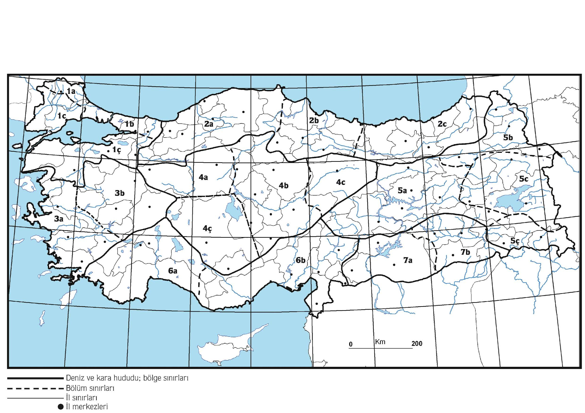
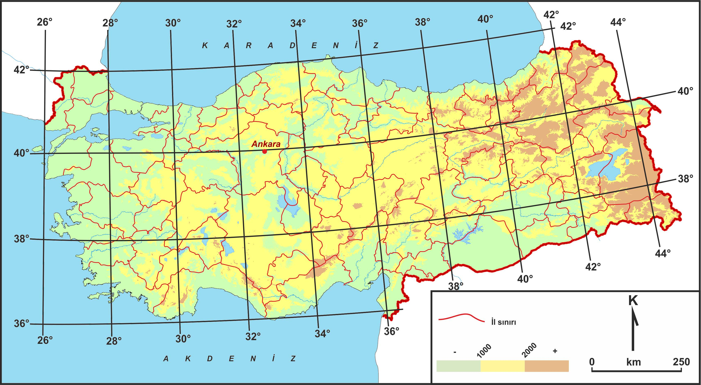
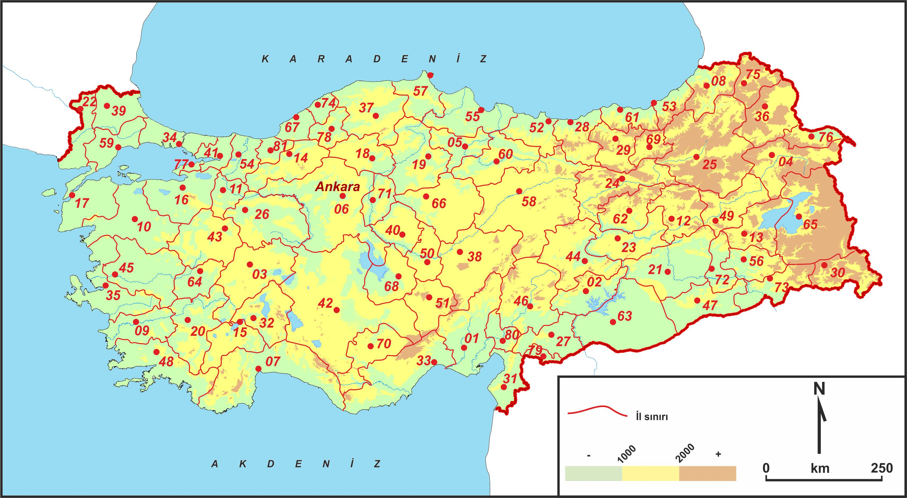
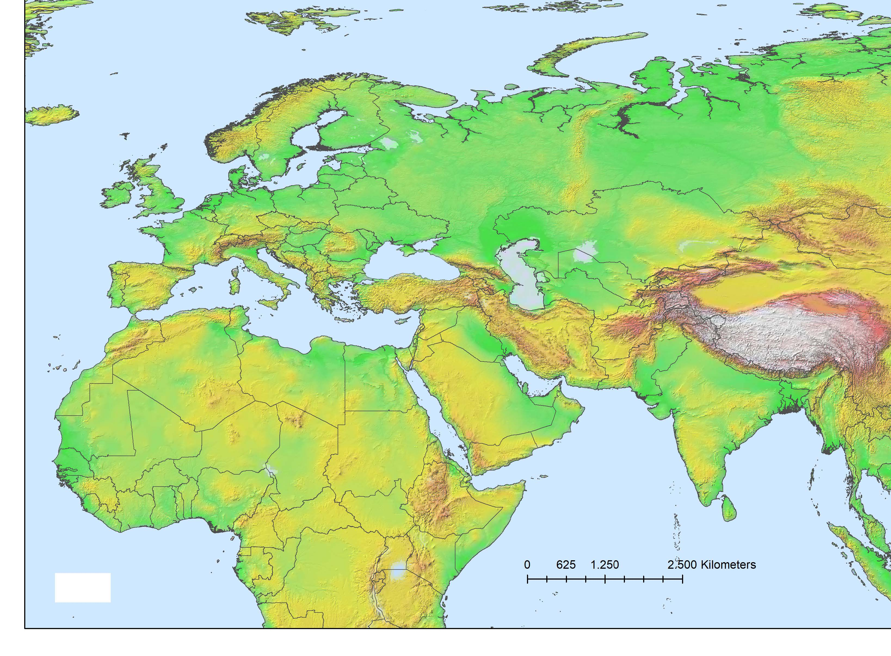

# Yayılışlar

**Tür yayılışı**: Türün Türkiye'deki yayılışı iki türlü verilecektir:
{: style="text-align: justify"}

**a- Herhangi bir herbaryum örneğine atıf yapmadan**, sadece bulunduğu yerler
(bölgeler ve bölümler halinde). Buradaki yayılış bilgisi aynen "Türkiye Bitkileri Listesi"nde
olduğu gibidir.
{: style="text-align: justify"}

Yayılış için kullanılacak temel bölgeler haritası (Şekil 1) ve açıklaması izleyen sayfalardadır.
{: style="text-align: justify"}

{ width="600" }
/// caption
Şekil 1: Türlerin Türkiye Yayılışı için temel harita: Bölgeler ve Bölümler, haritada
gösterildiği gibi numaralandırılmıştır (numaralamada Batı'dan Doğu'ya, yukardan
aşağıya bir sıra izlenmiştir). (Sayın Sedat Avcı'ni izniyle.)
///

-   __Marmara Bölgesi 1__

    Istranca Bölümü 1a

    Çatalca-Kocaeli Bölümü 1b

    Ergene Bölümü 1c

    Güney Marmara Bölümü 1ç

- __Karadeniz Bölgesi 2__

    Batı Karadeniz Bölümü 2a

    Orta Karadeniz Bölümü 2b

    Doğu Karadeniz Bölümü 2c

- __Ege Bölgesi 3__

    Asıl Ege Bölümü 3a
    
    İç Batı Anadolu Bölümü 3b

- __İç Anadolu Bölgesi 4__

    Yukarı Sakarya Bölümü 4a
    
    Orta Kızılırmak Bölümü 4b
    
    Yukarı Kızılırmak Bölümü 4c
    
    Konya Bölümü 4ç

- __Doğu Anadolu Bölgesi 5__

    Yukarı Fırat Bölümü 5a
    
    Erzurum-Kars Bölümü 5b
    
    Yukarı Murat-Van Bölümü 5c
    
    Hakkâri Bölümü 5ç

- __Akdeniz Bölgesi 6__

    Antalya Bölümü 6a
    
    Adana Bölümü 6b

- __Güneydoğu Anadolu Bölgesi 7__

    Orta Fırat Bölümü 7a
    
    Dicle Bölümü 7b

Yayılış ifadeleri: Bir bitkinin, bir bölgenin bütün bölümlerinde olması durumunda sadece
bölge adını belirtmek yeterlidir (örneğin, bir bitki Batı, Orta ve Doğu Karadeniz
bölümlerinin hepsinde yer alıyorsa yayılış bilgilerinde sadece "Karadeniz Bölgesi" demek
yeterli olacaktır.
{: style="text-align: justify"}

**b- Herbaryum örneğine yapılacak atıflar halinde** yayılış belirtilmesi. Her
herbaryum örneği bir paragraf halinde ve herbaryum kısaltması dışında ==**hiçbir kısaltma
yapılmadan**== belirtilecek. Her örnekle ilgili şu bilgiler bulanacak: İl: Yer bilgisi (örn. İlçe,
Köy, Mevkii adı), yükseklik, habitat, varsa konum (koordinat), toplanma tarihi (gün/ ay
(küçük romen rakamı olarak)/ yıl), toplayıcı ve numarası ile varsa yardımcı toplayıcılar ve
bulunduğu herbaryum ya da herbaryumlar parantez içinde verilecek. Bu listede görülüp
incelenmiş örneklerin listelenmesi esastır. Ancak bazen örneklerin fotoğrafı, çizimi veya
sanal görüntüsü incelenmiş olabilir. Bu durumda gördüm “!” işareti şu biçimde
kullanılacaktır:
{: style="text-align: justify"}

- Örnek doğrudan görülmüş ve incelenmiş ise, bulunduğu herbaryum rumuzu
arkasına ünlem konacaktır (HUB!).
{: style="text-align: justify"}
- Örneğin sadece resmi, çizimi veya fotoğrafı görüldü ise, bulunduğu herbaryum
rumuzu arkasına ünlem köşeli parantez içinde [!] konacaktır (HUB[!]).
{: style="text-align: justify"}
- Örnek bir veb sayfasında görülmüş ve incelenmiş ise, bulunduğu herbaryum
rumuzu arkasına ünlem köşeli parantez içinde [veb!] biçiminde konacaktır. Ayrıca veb
adresi ve erişim tarihi belirtilecektir (HUB[veb!]).
{: style="text-align: justify"}

Herbaryum örnekleri için toplayıcı ve numarası esastır. Çünkü, bir örnek birkaç
herbaryuma dağıtılmış ise bu örneklerin ortak noktası sadece toplayıcı numarası
olmaktadır. Ancak bazı araştırıcılar sadece herbaryum numarası ile çalışmaktadır. Bu
durumda toplayıcı numarası yerine herbaryum numarası belirtilebilir.
{: style="text-align: justify"}

{ width="600" }
/// caption
Şekil 2: Türlerin yayılışı için temel harita.
///

**Her herbaryum örneği bir paragraf halinde belirtilecek.** Her örnekle ilgili şu
bilgiler bulanacak: İl: Yer bilgisi (örn. İlçe, Köy, Mevkii adı), yükseklik, toplanma tarihi
(gün/ ay (küçük romen rakamı olarak)/ yıl), toplayıcı ve numarası ile varsa yardımcı
toplayıcılar (örnek görüldü ise ünlem ! işareti) ve nokta (.). **Davis'in kitabındaki
kareleme sistemi kullanılmayacaktır.**
{: style="text-align: justify"}

**Yayılış uyuşmazlığı**

Çalışmanız sonunda bir türün yayılışının (herbaryum dağılımı ve Türkiye genel yayılışı),
sizden önceki eserlerdeki (özellikle Davis ve Türkiye Bitkileri Listesi) yayılış alanlarını
ihtiva etmemesi halinde (ilave başka yayılış alanları olabilir), bunun nedeninin türün
tartışma bölümünde mutlaka açıklanması gerekir. Eğer taksonomik bir izahı yoksa böyle
bir uyumsuzluk, bazen yeteri kadar herbaryum örneğinin incelenemediğinin göstergesi
olabilir. Konuya ilişkin aşağıdaki örneklere bakılabilir.
{: style="text-align: justify"}

!!! example "Örnek 1"
    Crocus scharojanii Rupr. türünün Türkiye Florasında Mathew (1984) tarafından
    Türkiye’de yayılış gösterdiği belirtilerek yayılış bilgisi olarak “N.E. Anatolia. A 7 Trabzon:
    Zigana pass, 2700 m, Furse 4110! A8 Gümüşhane: Haldizen Da. 2700 m, Balls 583! Rize:
    nr Djimil (Cimil), 2600 m, viii 1866, Bal. (type of C. lazicus)! Çoruh: Şavval Tepe above
    Murgul, 2300 m, D. 32293!” verilmiştir. Yazarlar yaptıkları taksonomik değerlendirmeler
    sonunda bu türün C. scharojanii olmadığına ve C. lazicus Boiss. türüne ait olduğuna karar
    vermişler ve tartışma bölümüne “Daha önce Mathew (1984) tarafından Türkiye’de yayılış
    gösterdiği belirtilen C. scharojanii (yaylakovan) örneklerinin, C. lazicus (civden) türüne ait
    olduğu anlaşılmıştır. Gürcistan’da yayılış gösteren C. scharojanii türü taç yapraklarının
    uçları sivri, kormlarının daha iri ve stolon bulunmamasıyla C. lazicus taksonundan ayrılır”
    şeklinde bir açıklama eklemişlerdir.
    {: style="text-align: justify"}

!!! example "Örnek 2"
    Allium circinnatum Sieber subsp. evae R.M.Burton Türkiye Bitkileri Listesi (Güner vd.,
    2012)’ne göre Antalya Bölümünde yayılış göstermektedir. Bu altürün yazarlar tarafından
    incelenen herbaryum materyallerine göre yayılışının Antalya Bölümüne değinilmeden Asıl
    Ege Bölümü olarak belirtilmesi halinde, taksonun tartışma bölümüne bunu izah edecek bir
    açıklamada bulunulması gereklidir. Bazen coğrafi bölümlerin komşu olduğu alanlardan
    toplanan örneklerin lokalitesinin tam olarak belirlenmemesi de bu karışıklığa neden
    olabilir. Bu gibi durumlarda taksonun lokalitesinin tam olarak belirlenmesi sorunu
    çözebilir.
    {: style="text-align: justify"}

!!! example "Örnek 3"
    Allium neapolitanum Cirillo türünün yayılışı Türkiye Bitkileri Listesi (Güner vd.,
    2012)’ne göre Çatalca-Kocaeli Bölümü ve Akdeniz Bölgesi olarak belirtilmiştir. Yazarlar bu
    türe ait inceledikleri herbaryum materyallerine göre türün dağılımını Güney Marmara
    Bölümü, Asıl Ege Bölümü ve Akdeniz Bölgesi olarak belirtmiş iseler daha önceki
    dağılımdan farklı olarak Güney Marmara Bölümü ve Asıl Ege Bölümü’nü içerecek şekilde
    ilave örnekler de incelemiş demektir. Bununla birlikte türün Çatalca-Kocaeli Bölümünde
    niçin dağılım göstermediği izah edilmeli. Bu yapılmadığında ya yeterli herbaryum örneği
    incelenmemiş, ya da tüm çabalara rağmen ilgili örneklere ulaşılmamış demektir. Eğer ilgili
    örneklere ulaşılamamış ise Türkiye Bitkileri Listesi veya Türkiye Florası veya ilgili
    kaynaklar referans gösterilerek türün dağılımı belirtilebilir. Bu durum tartışma bölümünde
    kısaca açıklanmalıdır. Aksi durumda eksik örnek incelenmesi çalışmanın güvenirliği
    tartışılır hale getirecektir.
    {: style="text-align: justify"}

!!! example "Örnek 4"
    Asphodelus ramosus’un (çirişağusu) Ankara’dan kaydedilen (K 000457317!) örneği,
    türün Türkiye’deki genel yayılış deseninin dışındadır. Sonradan başka bir örnek de
    toplanamamıştır. Bu nedenle ya kayıt yanlış ya da toplandığı yerde tükenmiş olduğu
    düşünülmektedir.
    {: style="text-align: justify"}

{ width="600" }
/// caption
Şekil 3: İdari bölünüş. Türlerin yayılışını öbür haritada işaretleyebilmek için yardımcı harita.
///

**Dünya yayılışı:** Eğer sadece Türkiye'de yaşayan bir tür ise "endemik" sözcüğü
kullanılacak. Bunun dışında çok dar yayılışlı bir endemik ise ".... has" veya "... özgü"
şeklinde belirtilebilir (örneğin "Rize'ye has", "Kaçkar Dağı'na özgü" vb).
{: style="text-align: justify"}

Türün bulunduğu komşu devletler (kara veya deniz) Rusya'dan başlayarak saat
yönündeki bir sırayla belirtilecek: Rusya, Gürcistan, Ermenistan, Azerbaycan (Nahcivan),
İran, Irak, Suriye, Kuzey Kıbrıs, Yunanistan, Bulgaristan, Romanya, Moldova, Ukrayna.
{: style="text-align: justify"}

Daha geniş yayılışa sahip türler için yayılış alanı devlet isimleriyle belirtilecektir.
Devletler alfabetik sırada olmalıdır.
{: style="text-align: justify"}

Tüm bu yayılışları doğru yazabilmek için şekil 4’deki harita sizlere yardımcı olacaktır.
{: style="text-align: justify"}

{ width="600" }
/// caption
Şekil 4: Türkiye ve komşuları: Bölgeler ve ülkeler.
///

!!! danger "Dikkat"
    Yayılışların harita üzerinde gösterilmesi işi editör heyeti
    tarafından yapılacaktır. Yazarlardan istenen, yazılı yayılış
    bilgisinin nasıl olacağıdır.
    {: style="text-align: justify"}