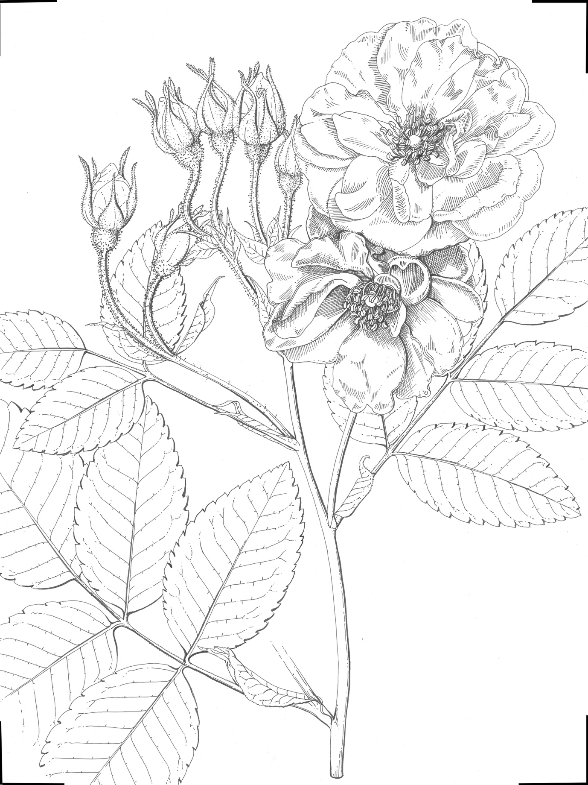
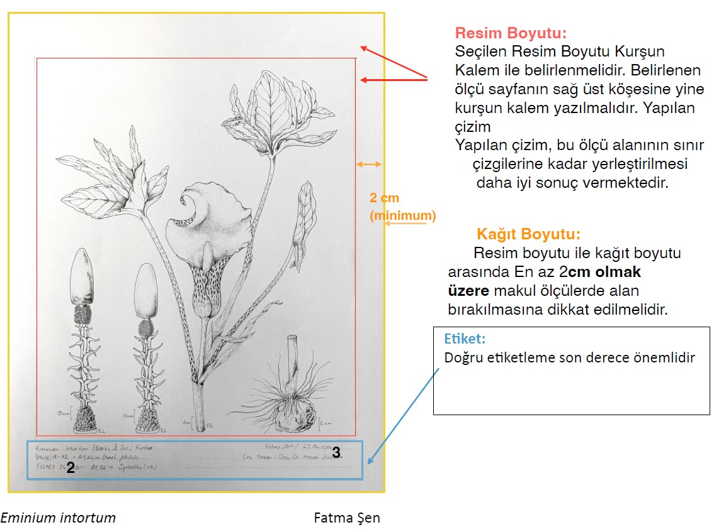
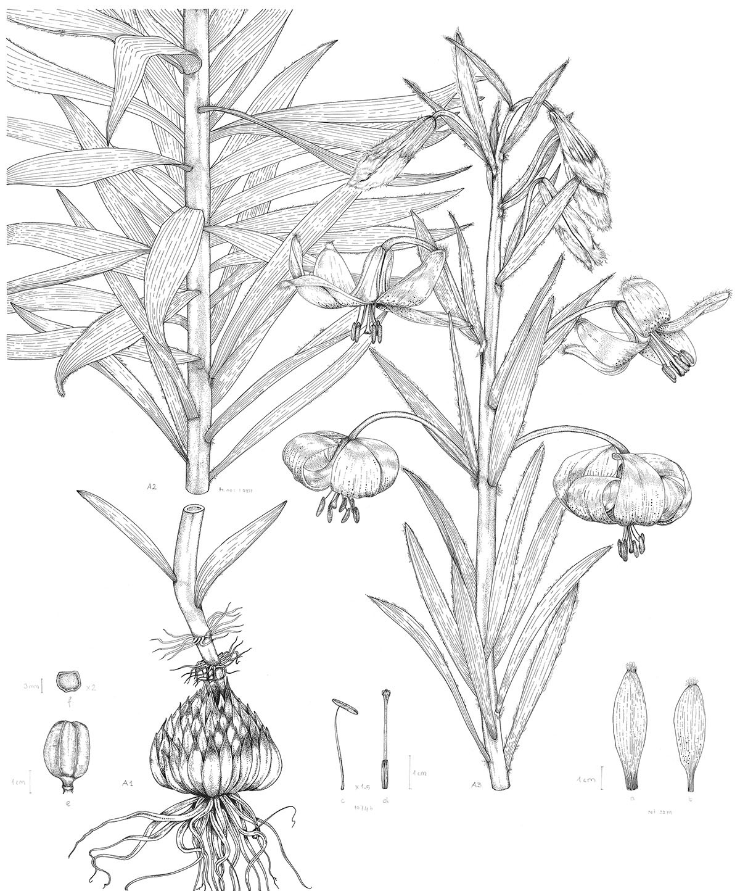
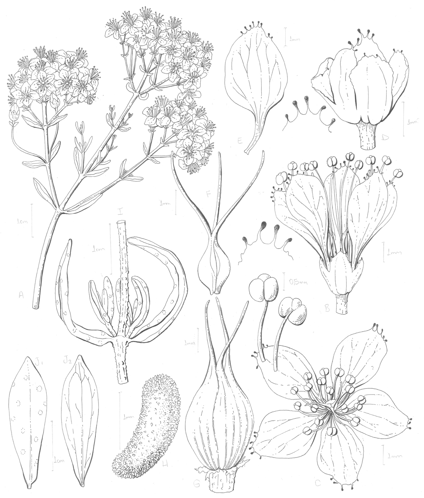
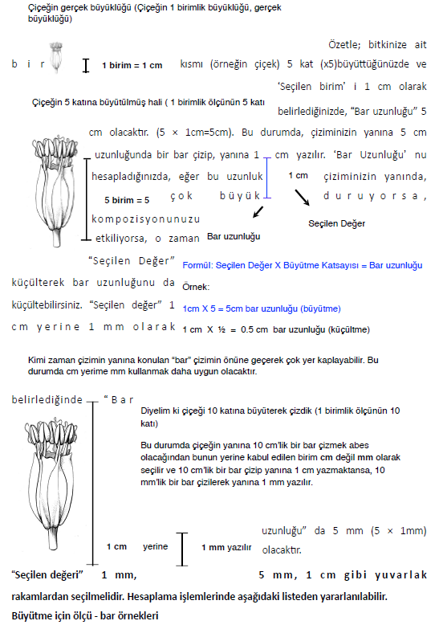
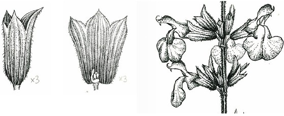
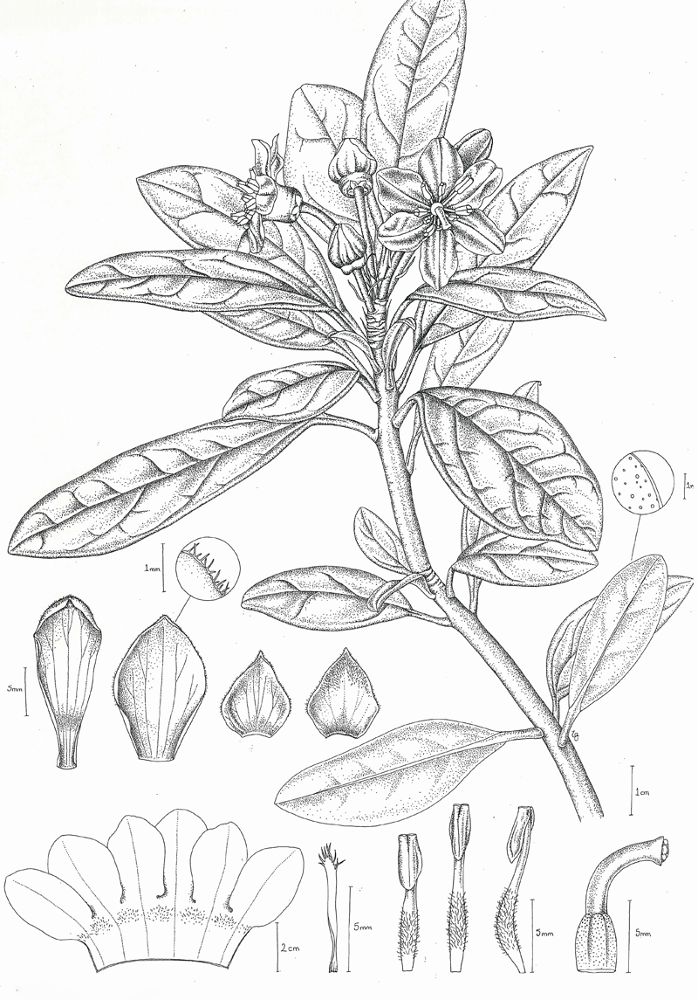
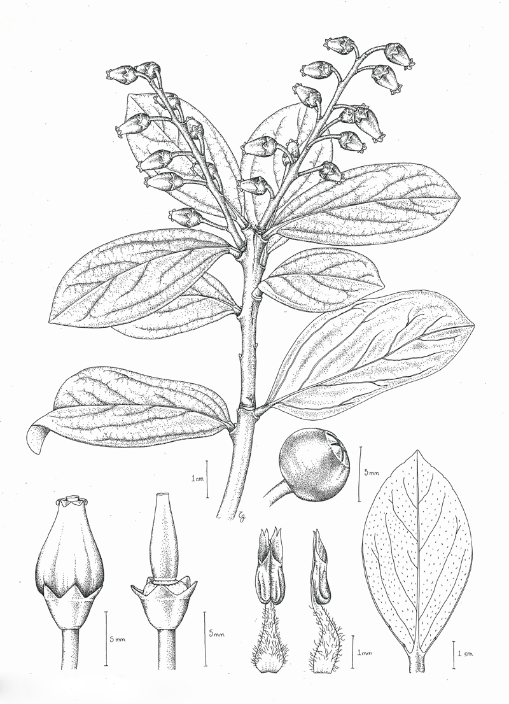

# Genel Çizim Kuralları

## Herbaryum Künyesi ve Toplayıcı numarası

Bir bitki resmi ne kadar güzel ve görkemli olursa olsun, resmin çizildiği materyale atıf yapılmadığı sürece **bilimsel 
resim olmayacaktır ve RTF’de yayınlanamaz**. Atıf, resmin çizildiği herbaryum örneğinin **toplayıcısı, varsa toplayıcı numarasını, 
bulunduğu herbaryumun kısaltmasını ve varsa herbaryum barkodunu ya da numarasını** mutlaka içermelidir. 
Bu konunun önemine binaen lütfen **==resme başlarken==** resim kâğıdına **==en önce bu atıf numaralarını kaydedip==** **SONRA RESMİ ÇİZİNİZ**. 
Resmi **eskizden temize çekerken** de lütfen önce atıf numaralarını yazınız.
{: style="text-align: justify"}

**Çizdiğiniz bütün herbaryum örneklerinin etiketi de görünecek şekilde bütün halinde fotoğraflarını çekerek DÖKÜMANLAR 
kısmından sisteme yükleyiniz.**
{: style="text-align: justify"}

## Resim Boyutları (Teknik çizim, Suluboya)

Resimli Türkiye Florası için hazırlanacak resimler için 2 ayrı çerçeve boyutu belirlenmiştir.
Ressamlar resimlerini, bitkinin büyüklüğüne göre küçük ya da orta boy ölçüleri kullanarak
hazırlamalıdırlar. Büyük boy çerçeve kullanım koşulu*** aşağıda açıklanmıştır.
{: style="text-align: justify"}

Baskıda orijinal çizime daha yakın bir görüntü kalitesi elde edebilmek açısından ilk iki ölçü
kullanılmalıdır.
{: style="text-align: justify"}

!!! info "Ölçüler"
    (1’e 1: Küçük boy, kitaba baslacak orijinal boyut) = 17× 22 cm
    
    Kullanılan diğer ölçüler, baskıya girerken orantılı şekilde küçültülecektir.
    
    (× 1.5: Orta boy) = 25.5× 33 cm

    ***(× 2 Büyük boy) = 34 × 44 cm (Büyük çerçeve boyutunun istisnai durumlar dışında kullanımı
    tercih edilmemektedir. Baskıda düşük kalite ile sonuçlanmaktadır. Ancak yine de büyük boy
    çerçeveye çalışma gerekliliği doğar ise lütfen önce “sanat editörlerine” danışınız).

Baskı aşamasında, resim fazla küçültüldüğünde, çizgilerin kaybolması, detayların yeterince
gözükmemesi gibi sorunlar yaşanmaktadır. Büyük boy ölçü kullandığınız takdirde, yaptığınız
çalışmaların küçültülerek basılacağını göz ardı etmeyiniz ve küçüldüğünde nasıl gözükeceğini
lütfen düşününüz.
{: style="text-align: justify"}

!!! note "Not"
    Lütfen çizimlerinize bastırarak çerçeve çizmeyiniz. Dört
    köşeden fazla bastırmadan yine cetvelle düzgün bir şekilde sınırları
    işaretlemeniz yeterlidir.

{ width="600" }
/// caption
*Rosa damascena* (AEF 13025) / Gülnur Ekşi Bona, 2024
///

!!! note "Not"
    Çalışmalara başlamadan önce lütfen **[YAZAR/RESSAM ÇALIŞMA REHBERİ](yazar_ressam_calisma_rehberi.md)** bölümünü
    okuyunuz!!!!

## Sayfa Düzeni

Etiket Aşağıdaki gibi hazırlanmalıdır;

{ width="800" }

- **Bitkinin Türkçe Adı / Latince adı / Etiket numarası mutlaka yazılmalıdır.**

!!! example "Örnek"
    çarpık yılanbacağı / Eminium intortum / ISTE 34465

    - Etiket/Herbaryum numarası olmayan çizimler kullanılmayacaktır.
    - Kurşun kalem ile yazılması gerekmektedir.

- **Çizimlerin alt kısmında bitkinin adı ve etiket numarası yazılmalıdır.**

!!! example "Örnek"
    Fatma Şen / 23.04.2016 / Yazar: Hasan Yıldırım

    - Kurşun kalem ile yazılması gerekmektedir.

!!! note "Not"
    Çizimde kare, dikdörtgen ya da daire içinde gösterilmiş yapılar varsa, kare, dikdörtgen ya da
    daire şeklindeki bu iç çerçeveler kurşun kalemle çizilmelidir.

- **Çizilen bitki kısımlarının tek tek maddeler halinde yazılması**

!!! example "Örnek"
    A1, A2 - Genel Görünüş (x1)
    B1, B2 - Spadiks (x2)

    - Kurşun kalem ile yazılması gerekmektedir.
    - Harflendirme, resim alanı içinde kurşun kalem ile yazılmalıdır.
    - Eğer bitkinin kısımları farklı herbaryum örneklerinden yararlanılarak yapılmışsa, kullanılan
    örneklerin etiket bilgileri mutlaka eklenmelidir.
    - Çalışılan bitki kısımları açık ve net bir şekilde belirtilmelidir.

{ width="600" }
/// caption
Lilium ciliatum, Gürol Aytepe
///

### Resim boyutu

Kurşun kalem ile çizilen çerçeveyi uygun bir şekilde kullanmak önemlidir.
{: style="text-align: justify"}

Yapılan çizimler bu çizgi sınırına kadar gidebilir, hatta bu çizgilere yakın bir şekilde
yerleştirilen çizimler, baskıda daha uygun gözükecektir.
{: style="text-align: justify"}

Çizilecek örnek, sayfaya sığmayacak kadar büyük ise, örnekte göründüğü gibi, bu sınır
çizgilerine kadar devam edebilir.
{: style="text-align: justify"}

## Ölçeklendirme

Göz kararı çizim yapmaktan kaçınılmalıdır. Yapılan çizimlerin kesin kurallarla belirlenmiş
bilimsel bir gerçekliği yansıtması gerekliliği gözardı edilmemelidir. Zira görsel materyalle
yazarın bitkinin betiminde sunacağı veriler tutarlılık içinde olmalıdır. Çizimlerde bitkinin genel
görünümü gerçek boyutunda, daha büyük ya da daha küçük çizilebilir. Asıl olan uygulanan
ölçünün “bar” ile çizilen kısımların hemen yanında gösterilmesidir. Ağaçlar gibi büyük
bitkilerde, genellikle karakteristik özellikleri yansıtan bir dal resmedilir. Ancak bitkinin tüm
hali bitkinin karakteristik özelliği açısından önemli ise, küçültülerek, resim alanının uygun bir
kısmına yerleştirilebilir.
{: style="text-align: justify"}

!!! note "Not"  
    - Çizilen bitki ve kısımları kesin olarak alınmış ölçülere dayandırılmalıdır.
    - Ressamların Ölçeklendirme kısmını büyük bir hassasiyetle yapmaları gerekmektedir
    - Yazarların, çizimlerin doğru ölçekte çizildiğinden emin olmaları, yapılan çizimi kontrol
    etmeleri gerekmektedir.

Çizimini ayrıca yapmak üzere gerekli görülen tüm kısımlar (çiçek, meyve vs.) ayrı ayrı ve yapılan
büyütme ya da küçültme oranında ölçeklendirilmelidir. Çizim üzerinde yapılan ölçeklendirme
gösterimleri kurşun kalemle yapılmalıdır! Bitkinin (çiçek, meyve, dişi organ, erkek organ, kozalak
gibi) kısımları kağıt üzerinde mantıklı bir dağılımda yerleştirilmelidir. Yani kağıt üzerinde bitki
kısımlarının dağılımı anlaşılır bir örüntüde olmalı, kafa karıştırıcı olmamalıdır. Unutulmamalıdır ki
kısımların ayrı ayrı çizilmesinin asıl amacı bitkiyi daha anlaşılır kılmaktır. Bu nedenle çiçek,
meyve, dişi organ, erkek organ, kozalak gibi kısımlar çizilirken yapılacak büyütme detayların tam
anlamıyla yansıtılabileceği bir oran olarak seçilmelidir.
{: style="text-align: justify"}

Çizimler Resimli Türkiye Florası ciltlerinde 17 × 22 cm olarak yer alacaktır. Ciltler için belirlenen
baskı ölçüleri bu şekildedir ve bu boyutlarda hazırlanan resimler, herhangi bir küçültme/
büyütme işlemi yapılmadan kitapta yer alacaktır. 17 × 22 cm’lik çerçevede çalışan çizerler için 
çizgilerin baskıda daha çok kalınlaşması ya da inceleşmesi gibi bir problem söz konusu değildir.
Ancak çalışılan bitkinin boyutlarından dolayı bu ölçülere sığdırmakta güçlük çekildiği takdirde,
tablo boyutu × 1.5 = 25.5 × 33 cm şeklinde büyütülebilir. Bu resimler de kitapta 17 X 22 cm
boyutunda basılacaktır. Bu durum teknik çizimde çok küçük detayların kaybolmasına sebep
olabilirken, özellikle suluboya çalışmalarda yapılan resimlerin daha boyutlu ve daha derin
gözükmesine sağlayabilir. Diğer taraftan özellikle teknik çizim yapacak çizerlerin baskı
boyutunun 1.5 ve özellikle 2 katı (2 kat çalışmak gerekliliği doğar ise öncelikle sanat
editörlerine danışılmalıdır) çalıştıkları taktirde kullandıkları kalem ucunun büyüklüğüne dikkat
etmeleri şattır. Zira 17 × 22 cm’lik bir tabloda çizim yaparken en ince uçlu rapido kalemler
uygunken 34 × 44 cm yani 2 katı tabloda ince uçlu rapido kalem kullanımı iyi bir tercih değildir.
{: style="text-align: justify"}

17 × 22 cm’lik çizim alanında hazırlanan çizimler dışındaki tüm boyutlar baskı aşamasında
küçültülecektir. Resimlerinizi büyük ölçülerde kağıtlara çalışacaksanız (×1.5, ×2), deneme
aşamasında fotokopi yoluyla yaptığınız büyütme oranında küçülterek sonucu test etmeniz yol
gösterici olabilir.
{: style="text-align: justify"}

### Bar metodu

Resminizde yer alan bitkinin bütün kısımları, yapılan büyütme ya da küçültme oranında
“BAR” kullanılarak ölçeklendirilmelidir. Resim alanı içerisinde (çerçeve içinde) yapılan
ölçeklendirme gösterimleri kurşun kalemle bastırmadan hafifçe yapılmalıdır. Resim
alanı dışında (çerçevenin hemen altında), bitki kısımları belirtilerken, bu kısımların
büyütme ve küçültme oranları x2, x10 vs. şeklinde yazılmalıdır.
{: style="text-align: justify"}

!!! note "Not"
    - Ressamlar çizimlerini sisteme yüklerken gerek eskizler gerekse orijinal çizim üzerinde
    mutlaka ==“bar”== kullanılarak ölçeklendirme yapılmalıdır!!!
    - ==Gerek harflendirme, gerekse bar çizimi hem eskiz hem de orijinal
    çizimde **KURŞUN KALEMLE** yapılmalıdır!!!!==

{ width="600" }
/// caption
Hypericum scabrum (AUEF1278) / Gülnur Ekşi Bona, 2024
///
/// caption
Genel görünüm (A), çiçek (B, C), kaliks (D), petal (E), dişi organ (F), meyve (G), tohum (H), gövdeden
kesit (I), yaprak üst yüzeyi (J1), yaprakalt yüzeyi (J2).
///

{ width="600" }
/// caption
Bar örnekleri
///

- Birebir çizilmişse: 1 cm uzunluğunda bar çizilir, yanına 1 cm yazılır.
- x2 kat büyütme yapılmışsa: 1 cm bar çizilir, yanına 5mm yazılır.
- x3 kat büyütme yapılmışsa: 12 mm bar çizilir, yanına 4 mm yazılır.
- x4 kat büyütme yapılmışsa: 12 mm bar çizilir, yanına 3 mm yazılır.
- x5 kat büyütme yapılmışsa: 1 cm bar çizilir, yanına 2 mm yazılır.
- x6 kat büyütme yapılmışsa: 12 mm bar çizilir, yanına 2 mm yazılır.
- x8 kat büyütme yapılmışsa: 16 mm bar çizilir, yanına 2 mm yazılır.
- x9 kat büyütme yapılmışsa: 18 mm bar çizilir, yanına 2 mm yazılır.
- x10 kat büyütme yapılmışsa: 10 mm bar çizilir, yanına 1 mm yazılır.
- x14 kat büyütme yapılmışsa 14 mm bar çizilir, yanına 1 mm yazılır.
- x15 kat büyütme yapılmışsa 15 mm bar çizilir yanına 1 mm yazılır.
- x20 kat büyütme yapılmışsa 1 cm bar çizilir yanına 0,5 mm yazılır.
- x40 kat büyütme yapılmışsa 12 mm bar çizilir yanına 0.3 mm yazılır.

**Küçültme için ölçü-bar örnekleri**

- /2 küçültme için 1 cm bar çizilir yanına 2 cm yazılır.
- /3 küçültme için 1 cm bar çizilir, yanına 3 cm yazılır.

!!! note "Not"
    - Çizim üzerinde ölçekleme yapılması şarttır. Ancak bu gösterim çizim üzerinde “ד ile değil
    “bar” ile yapılmalıdır. “ד büyütme oranı sadece çizim çerçevesinin altında açıklayıcı bilgi
    olarak verilmelidir.
    - Ölçeklendirme ve “bar” kullanımı yukarıda [Ölçeklendirme](#olceklendirme) ve [Bar Metodu](#bar-metodu) bölümlerinde
    detaylı olarak anlatılmıştır.
    - Aksi takdirde, çizim baskı aşamasında büyütüldüğünde ya da küçültüldüğünde boyutlarda
    kayma olacaktır.

## Herbaryum Örneğinden Çizim

Çizim kuru örnekten yapılıyor olsa da çizim bitkinin doğadaki halini yansıtmalıdır. Bu nedenle
yapılan çizim Flora’da anlatılanlar, varsa bitkinin fotoğrafları kullanılarak ve cins yazarının
rehberliğiyle canlı haline yakın bir şekilde resmedilmelidir. Amacımız bitkinin temel
karakterlerini değiştirmek değil, varolanı doğru bir şekilde aktarmak ve yapılandırmaktır. Kimi
herbaryum örnekleri zarar görmüş olabilir. Örneğin, çiçeği kopmuş, yaprakları kırılmış, meyvesi
eksik vs. Bu tür durumlarda 1’den çok herbaryum örneği kullanılabilir ya da yazarın sunacağı
fotoğraftan faydalanılabilir. Ancak kullanılan her bir herbaryum örneğinin numarası çizimin
altında belirtilmelidir. Tercihen tek bir herbaryum örneği üzerinden çalışmak daha uygundur.
{: style="text-align: justify"}

## Hacim/Gölgelendirme

Bitki ve kısımlarına hacim vermek üzere yapılan gölgelendirme çalışmasında abartıdan kaçınılmalı,
yapılan gölgelendirme bitkinin karakterlerini perdelememelidir.
{: style="text-align: justify"}

{ width="600" }
/// caption
Hacim ve Gölgelendirme
///

Bitkinizi açıklamak için çok gerekli değil ise, koyu çalışmalardan, gereksiz
noktalamalardan kaçınınız!
{: style="text-align: justify"}

Resimlerinizin, sade, anlaşılır olmasına dikkat edip, karmaşık gösterimlerden
kaçınmaya çalışınız.
{: style="text-align: justify"}

## Kompozisyon

Yapılan çizimler her ne kadar öncelikle bilimsel doğruluğu bakımından değerlendirilecek olsa da,
tıpkı bir kompozisyon yazımında giriş-gelişme-sonuç bölümlerinin olması gerektiği gibi çizimleri
yapılan bitki ve kısımlarının da belirli bir düşünce ve plan örüntüsü içinde kağıda aktarılmalıdır. Aynı
cinse ait türler benzer kompozisyonlarda hazırlanmalıdır. Gerek teknik kalem, gerekse suluboya
çalışmalarında, çizim öncelikle bilimsel doğruluğu bakımından değerlendirilecektir. Ancak kitabın
genel örüntüsünün düzenli ve anlaşılır olabilmesi için, ciltlerde yer alacak bütün çalışmaları,
mümkün olduğunca ortak bir düzene oturtmamız, ortak bir dil oluşturmamız gerekmektedir.
{: style="text-align: justify"}

Bu konudaki ilk adım, aynı cinse ait türlerin benzer kompozisyonlarda hazırlanmalarıdır.
Bunu sağlamak için lütfen aynı cinsi çalışan diğer ressam arkadaşlarınızla iletişimde kalarak,
birbirinizle fikir alışverişinde bulunmak ve özellikle sistemde cinsin onaylanmış çizimlerine
bakarak daha önce yapılmış çizimlere bakmak yardımcı olacaktır.
{: style="text-align: justify"}

### Eğer bitki TEKNİK KALEM ile çiziliyorsa, tabloda istenenler

#### Bitkinin genel görüntüsü

Buradaki amacınız bitkiyi okuyucuya en iyi şekilde anlatmak olduğu için, o bitkinin karakteristik
özelliklerini yansıtan, ideal örnek seçilmeli ve bu doğru açıdan çizilmelidir. Eğer elinizde var olan
örnek, ideal örneğe yakın değil ise, gerekli kısımları düzelterek çalışabilirsiniz. Örneğin; bitkinin
hastalıklı, yada kırılmış bir yaprağını, düzgün bir şekilde resmetmek; seçilen bitki örneğinde aşırı
yapraklanma varsa, ve bu durum sizin, bitkinin diğer kısımlarını anlatmanıza, göstermenize /
görmenize engel oluyorsa, yaprakların seyrekleştirilmesi; seçilen örnekte yapraklar ideal durumda
ancak çiçek kurumuş, formu bozulmuş ise, bunun yerine başka bir örnekten alınan düzgün formlu
çiçek kullanılması gibi. Bitkinin tekbir herbaryum materyali üzerinden çizilmesi en çok tercih
edilen yöntemdir. Ancak bunun yapılamadığı durumlarda başka örneklerden kullanılan bitki
kısımları mutlaka not edilmelidir. Örneğin, bitki AEF 1276 nolu herbaryum örneğine dayandırılarak
çizilmiştir. Ancak meyveler NGBB 1532 nolu örnekten faydalanılarak tamamlanmıştır gibi.
{: style="text-align: justify"}

Bitkinin genel görüntüsü çalışılırken, canlı örnek kullanma şansınız varsa, bitkinin doğal duruşunu,
tabloda daha iyi açıklayabilirsiniz.
{: style="text-align: justify"}

Çizim kuru örnekten çalışılıyor ise, fotoğraftan ve varsa çizilmiş diğer örneklerden faydalanılarak,
bitkinin genel görünüşünün 3 boyutlu, canlı haline en yakın şekilde resmedilmesi gerekmektedir.
Kimi herbaryum örnekleri zarar görmüş olabilir, örneğin, çiçeği kopmuş, yaprakları kırılmış, ya da
bitki uzun olduğundan dolayı katlanarak kurutulmuş olabilir, bu gibi durumlarda çiziminiz için
birden fazla herbaryum örneği kullanılabilir ya da yazarın sağlayacağı fotoğraftan yararlanılabilir.
Birden fazla örnek kullanarak bu çalışmayı yapıyorsanız eğer, kullanılan bütün örneklerin etiket
numaraları kaydedilmelidir. Tercihen çizimler tek bir herbaryum örneğine dayandırılmalıdır.
{: style="text-align: justify"}

!!! example "Örnek"
    Örneğin, bitki AEF 1276 nolu herbaryum örneğine dayandırılarak çizilmiştir. Ancak AEF
    1276 nolu herbaryum örneğinde meyveler olmadığından ya da zarar gördüğünden NGBB 1532
    nolu örnekten faydalanılarak tamamlanmıştır gibi.

#### Bitkinin detayları, kesit çalışmaları

Bitkiyi tanımlayıcı belli özelliklerin okuyucuya daha iyi anlatılması için, bitkinin belli
kısımları mikroskop altında büyültülerek, açıklayıcı bir şekilde resmedilmelidir. Bitkinin
hangi kısımlarının tabloda yer alacağı, yazarın karar vereceği bir durumdur. Ancak yazarın
çizilmesi gereken bitki kısımlarına karar verirken gereksiz parçaların tabloda
resmedilmesinin önüne geçmesi önemlidir.
{: style="text-align: justify"}

Bitkinin istenen gerekli bütün kısımlarının eskiz çalışmaları hazırlandıktan sonra,
kompozisyon üzerinde çalışmalar yapılmalı bu konuda başlangıç olarak Sanat Editörlerine
danışılmalıdır.
{: style="text-align: justify"}

Tablonun ağırlık merkezini aşağıda tutmak için, bitkinin kesit çalışmaları, mümkünse kağıdın
aşağısına doğru yerleştirilmelidir.
{: style="text-align: justify"}

Bitkinin karakterisitik özelliklerini bozmayacak şekilde, bitkinin genel görünüşü, resim alanına sığacak şekilde, 
kenarlarından kesilebilir.
{: style="text-align: justify"}

Daha küçük bir detay çalışılıyorsa, alttaki görselde olduğu gibi, yuvarlak (ya da kare) içine alınarak kesit çalışması
yapılabilir, bu detayların hangi kısmın büyültülerek çalışıldığı, bir çizgi yardımı ile gösterilebilir
(lütfen ok kullanmayınız). Bu yuvarlak/kare ve çizgiler teknik kalem kullanılarak yapılabilir.
{: style="text-align: justify"}

{ width="600" }
/// caption
Rhododendron trancongii / Işık Güner
///

Tercihen, bitkinin kesitleri, tablonun alt tarafına yerleştirilmelidir. Bu tablonun ağırlık merkezini
aşağıya taşıyarak daha dengeli görünmesini sağlayacak. Bunu sağlamak kompozisyonunuzun
genel görünüşü açısından el verişli değil ise diğer çözüm yollarınada gidilebilir.
{: style="text-align: justify"}

Bitkinin birbiriyle aynı kısımlarını yan yana koymaya dikkat etmelisiniz.
{: style="text-align: justify"}

{ width="600" }
/// caption
Vaccinium wattiarum / Işık Güner
///

### Bitki çalışmaları SULUBOYA ile hazırlanıyorsa eğer, tabloda istenenler;

#### Bitkinin genel görüntüsü

Yine buradaki amacınız, bitkinin genel görüntüsünü yansıtan ideal örneği kullanmaktır. Canlı
bitki örneğinden çalışılmalıdır. Bitki örneğiniz çok elverişli değil ise, fotoğraftan
yararlanılmalıdır. Ancak bitkinin genel görünüşünü sadece fotoğraftan çalışmayınız, bilimsel
hata yapma olasılığınız çok yüksektir. Yine aynı şekilde anlatılan ideal örneği resmetmek için,
uygun olmayan kısımlar çıkarılıp/uygun olan obje(çiçek, yaprak, meyve vs.) ile değiştirilerek
ideal örneğe ulaşılabilir. Örneğin, yaprakların ucu kurumuş ve bu gerçekten resminize estetik
katacak bir görünüş verecekse, resminizde bunlara yer verebilirsiniz, ancak bu durumu bütün
yapraklara uygulamanız (gerçekte öyle olsa bile) bitkiyi yanlış anlatmanıza sebep olacaktır. Bu
gibi deformeleri estetik kaygıyla resminizde yer vermek istiyorsanız bunu makul şekillerde,
resmin karakteristik özelliğini yitirmesine izin vermeden yapmalısınız.
{: style="text-align: justify"}

#### Bitkinin detayları, kesit çalışmaları

Suluboya resimlerde, elzem değil ise bu kesit çalışmalarını en azda tutmaya çalışacağız. O cinsin
teknik kalem olarak çizilmiş diğer türleri ile yapılan açıklama yeterli değil ise bu kesit
çalışmalarına yer verilebilir, ancak sade ve öz çizimler elde edilmeye çalışılmalıdır.
{: style="text-align: justify"}

## Malzeme

Resimli Türkiye Florası ressamlarının ihtiyaç duyduğu temel gereçler Resimli Türkiye Florası
tarafından temin edilmektedir. Kullanılan malzemenin uygunluğu çalışmalarımızın sağlıklı
ilerleyebilmesi ve sonuç vermesi açısından son derece önemlidir.
{: style="text-align: justify"}

!!! note "Temin Edilen Malzemeler"
    !!! abstract "Teknik Kalem"
        - Rapido kalem
        - Rapido mürekkebi
        - Bristol
    !!! abstract "Suluboya"
        - Suluboya
        - Fırça
        - Suluboya kağıdı

!!! note "Malzeme Temini için, gerekli iletişim bilgileri"
    - **Deniz Asal: 0537 605 0366**
    - **Email: denizasal@ngbb.org.tr**

## Teknik

Resimli Türkiye Florası için hazırlanan teknik kalem çizimleri, mümkün olduğunca sade ve
yalın olmalıdır. Noktalama ve gerekli görüldüğünde, çizgiler kullanılabilir. Gereksiz
noktalama, koyu tonlanan çalışmalardan kaçınılmalıdır.
{: style="text-align: justify"}

Mürekkebe su karıştırılarak yapılan çalışmalar, baskıda silindiği ve diğer kısımlarla uyumsuz
göründüğü için tercih edilmemelidir. Tek kullanımlık rapido kalemler ve isographlar içerdikleri
mürekkeplerin uçucu olması, renklerinin farklı olması nedeniyle kullanılmamalıdır.
{: style="text-align: justify"}

İkinci cilt baskısından sonra, yapılan bazı çalışmaların baskı kalitesinin düşük olduğunu farkettik.
Buna neden olan olumsuz deneyimlerimizi sizlerle paylaşmak isteriz:
{: style="text-align: justify"}

- Teknik kalem çalışmalarında su karıştırılarak yapılan çizimler (rapido ile) baskıda kurşun kalem gibi,
yanlışlıkla oluşmuş lekeler gibi görünüyor ya da tamamen kaybolur. Sonuç olarak istenmeyen
sonuçlar ortaya çıkmaktadır. Lütfen teknik kalem için kullandığınız mürekkeplere su karıştırmayınız.
Fırça ile, rapido mürekkebine su karıştırılarak yapılan uygulamalar da aynı sıkıntılı sonuçlara neden
olmaktadır. Lütfen bu tür tali yollara sapmayınız.
{: style="text-align: justify"}
- Fazla koyu yapılan çizimler (fazla noktalama, koyu çizgiler) baskı aşamasında bir miktar açılsa de
diğer resimlere oranla istemediğimiz kadar koyu ve diğer resimlere göre kopuk görünmekte ve
kitaptaki bütünlüğü bozmaktadır. Lütfen çok koyu çizimler yapmayınız. Standartlarımıza uymayan
çizimler kabul edilmeyecektir.
{: style="text-align: justify"}
- Çizimler baskıda küçültüldüğünde (büyük boy çerçeve kullanıldığında), detaylar yok olmaktadır.
Büyük resim boyutları kullanıldığınızda detayları yeterince büyüttüğünüzden ve kalın uçlu rapido
kalem kullandığınızdan emin olunuz!
{: style="text-align: justify"}