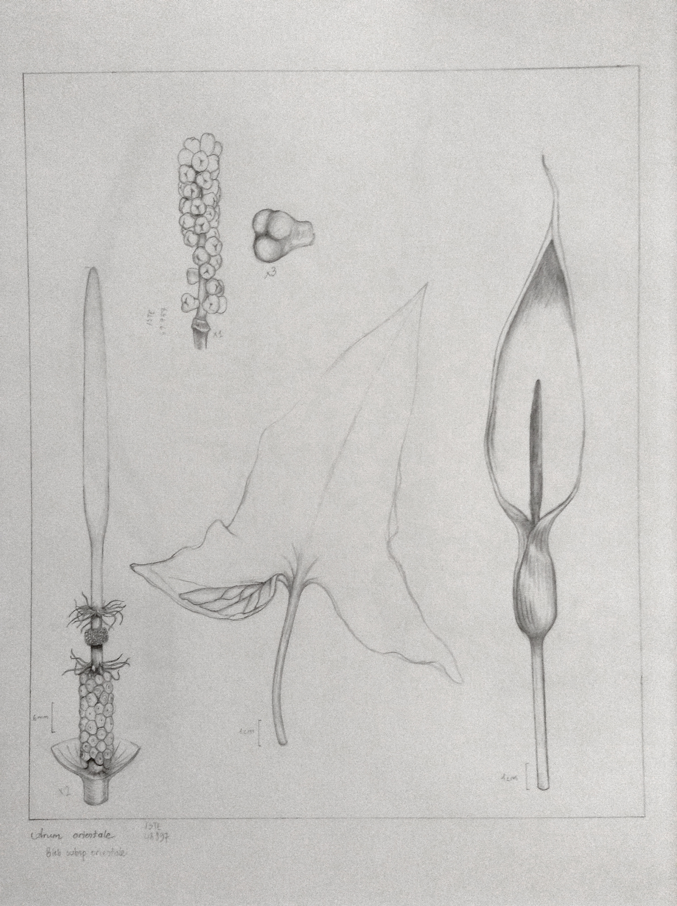
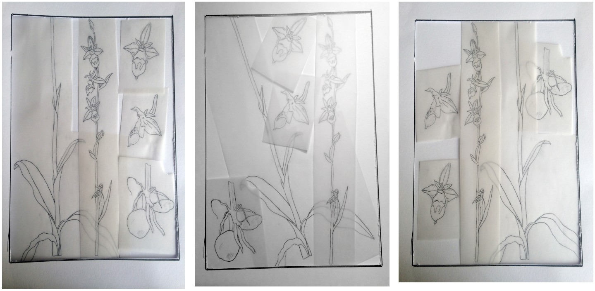
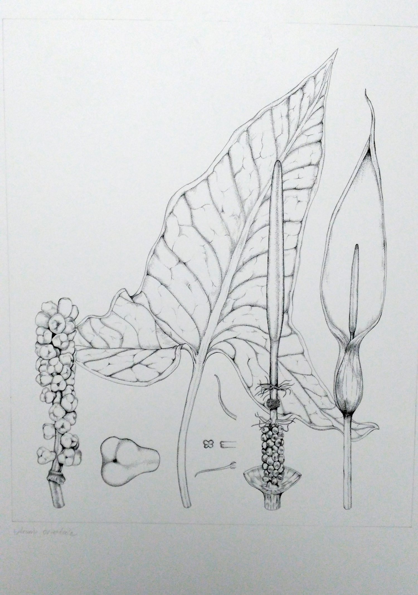

# Yazar/Ressam Çalışma Rehberi

Sanat editörleri olarak Resimli Türkiye Florası’nda yer alacak resimlerin aynı kalite standartlarında
olması ve resimlerin zamanında tamamlanabilmesi için yazar ve ressamların uymaları gereken
ideal çalışma yöntem ve prensiplerini aşağıda göreceğiniz üzere maddeler halinde sıraladık. Metni
lütfen dikkatle okuyunuz. Anlaşılmayan noktalarla ilgili lütfen bizlerle iletişime geçmekten
çekinmeyiniz.
{: style="text-align: justify"}

## Ressam Atamaları

Ressam atamalarını sanat editörleri yapmaktadır. Yazarlar ressamlar ile çalışmaya hazır
olduklarında, sanat editörleri ile iletişime geçmelidirler. Yazarların ressamlarla çalışmaya hazır
olduğu ideal dönem, çalışılan türlerin betimlerinin netleştiği aşamadır.
{: style="text-align: justify"}

**Sanat Editörleri tarafından, her “cins” için, yeterli sayıda ressam ataması yapılır. Bu atamalar
yapılmadan önce yazarların, sanat editörlerine sağlaması gereken bilgiler aşağıdaki gibidir:**
{: style="text-align: justify"}

- Türler canlı örnekten mi, yoksa herbaryum materyalinden mi çizilecek?
{: style="text-align: justify"}
- Bu örnekler nerede bulunmaktadır? (Canlı örnek ise, arazi çalışması mı yapılacak, tür Botanik
Bahçesi’nde mi yer almakta, herbaryum örneği ise, örnekler hangi herbaryumda bulunmaktadır?)
{: style="text-align: justify"}
- Hangi türün suluboya resimi yaplıcak? (Suluboya çalışmalar sadece “canlı” örnekten
yapılabilmektedir. Bu sebeple, suluboya resimi yapılacak olan örneğin, ulaşılabilir olması ve
ressamı bitkiye ulaştırmanın yolları önceden düşünülmeli ve ayarlanmalıdır.
{: style="text-align: justify"}
- Yazar Ressamlara bitki örneğini ve gerekli materyalleri sağlamakla yükümlüdür (Bknz - Sayfa 5).
{: style="text-align: justify"}
- Yukarıda yazar tarafından verilen bilgilere göre, bütün bir cins için, en uygun ressam ya da
ressamların atamaları sanat editörleri tarafından yapılır.
{: style="text-align: justify"}
- Ressam atamaları yapıldıktan sonra, yazar ve ressamların iş planlarını yapmaları ve çalışmalarla
ilgili öngörülen bitirme tarihini editörlere bildirmeleri beklenir.
edilmelidir) gerçekleştirirler. Bu durumda yapılan çizim görevlendirmeleri ressamlar tarafından
ivedilikle sanat editörlerine bildirilmelidir.
{: style="text-align: justify"}
- Bu bilgilendirmeye göre, sanat editörleri, gerekli tür ile ilgili görevlendirmeyi online [Ressam-
Yazar İş Takip Sistemi](http://proje.bizimbitkiler.org.tr/index.php) üzerinden gerçekleştirir.
{: style="text-align: justify"}

!!! note "Not"
    Yazarlardan ara ara ilerleyiş ile ilgili bilgi istenecektir. Bu nedenle bir “Excel” dosyasında
    ressamlar ile ilgili ilerleyişi kayıt altına almaları son derece önemlidir.
    {: style="text-align: justify"}

Bütün ressam ve yazarların, ressam atama ile ilgili yukarıdaki bölümü dikkatle incelemeleri ve
bu konuda bizimlerle iş birliği halinde ilerlemeleri iş akışının sağlıklı olabilmesi bakımından son
derece önemlidir. Bu yöntem sayesinde, bizler:
{: style="text-align: justify"}

1. Herhangi bir takson ile ilgili gerekli bitki materyalinin ressamda bulunup, bulunmadığını göz
önünde bulundurabileceğiz.
{: style="text-align: justify"}
2. Taksonlarla ile ilgili herhangi bir çalışma yapılıp yapılmadığını takip edebileceğiz.
{: style="text-align: justify"}
3. Çizimi yapılmış taksonların, tekrar çizilmesinin önüne geçebileceğiz.
{: style="text-align: justify"}
4. Çizimlerin bitiş sürelerini bir nebze daha iyi öngörebileceğiz.
{: style="text-align: justify"}
5. Ressamlar üzerindeki iş yüklerini net bir şekilde görebilmek daha sağlıklı görevlendirmeler
yapabilmemize olanak sağlayacaktır.
{: style="text-align: justify"}

## Genel Çalışma Yöntemi ve Sırası

### Yazarların İzlemesi Gereken Yol (Ressamların da Okuması Gerekir)

**1. Yazarlar, kendi cinsleri ile ilgili, ressamı bilgilendirmek üzere ön hazırlık yaparlar.**
{: style="text-align: justify"}

Çalışılan cins ile ilgili olarak, türlerin hangi kısımlarının tabloda yer alacağı önceden kararlaştırılır
(Örn; bitkinin genel görüntüsü + meyve + çiçek kesit), ve kararlaştırılan bu tablo, aynı cinste yer
alan bütün türler için kullanılmalıdır.
{: style="text-align: justify"}

!!! note "Not"
    Bu durum aynı cinse ait türlerin çizimlerinin birbirinden farklılık göstermemesi, farklı ressamların
    yapacağı türlerin, aynılaştırılması açısından önemlidir. Ancak bazı türlerin belirlenen kısımlarını,
    çeşitli sebeplerden dolayı çizmek mümkün değil ise ya da türe özgü bir karakter eklenmesi
    gerekiyorsa istisnalar göz önünde bulundurulabilir.
    {: style="text-align: justify"}

**2. Yazarlar, ressam için gerekli bitki materyalinin yanısıra betim, fotoğraf gibi ek materyalleri de sağlamakla yükümlüdür.**
{: style="text-align: justify"}

- Varsa bitkinin canlı örneği
{: style="text-align: justify"}
- Herbaryum örneği (Ressamın bu örneğe ulaşmasının sağlanması, gerekli düzenlemelerin
yapılması önemlidir.)
{: style="text-align: justify"}
- elinde kendi çalışacağı türler ile ilgili fotoğraf yoksa diğer meslektaşlarından bunu sağlama
yoluna gidilebilir.)
{: style="text-align: justify"}
- Türe ya da yakın türüne ait, flora kitaplarında, makalelerde yayınlanmış görseller hem
ressamın ne yapacağını somutlaştırmasında hem de kompozisyon konusunda yardım
sağlayacaktır.
{: style="text-align: justify"}
- Betim (Eğer yazarın betimi henüz metin haline getirilmemiş ise, ressama bitkinin takson
özelliklerinin detaylarıyla açıklanması gereklidir.)
{: style="text-align: justify"}

!!! note "Not"
    Ressamlarımızın çoğu temel bitki taksonomisi ve morfolojisi terimlerine hakim
    değildir. Bu sebeple, çalıştığınız ressamlara sunacağınız betimlerde yer alan Latince terimler ya da
    mesleki dilde ifadeler ressamlarımız tarafından tam olarak anlaşılamayabilir. Betimler elbette birinci
    kaynaktır ancak ressamlarla yapılacak yüz yüze görüşmelerde bitkinin kısımlarının detaylarıyla
    gösterilmesi kendileri için SON DERECE önemlidir. (Yazar ve ressamın buluşması mümkün olmayan
    durumlarda hazırlanan açıklayıcı görsellerin paylaşılması telefon, skype, zoom, e-posta gibi çeşitli
    yollarla yapılabilir.).
    {: style="text-align: justify"}

**3. Yazar, ressam tarafından hazırlanan çizimlerin takibini yapmak durumundadır.**
{: style="text-align: justify"}

Çizimlerin takibi online Ressam-Yazar İş Takip Sistemi üzerinden yapılmaktadır, bu sayede editörler
ve yazarlar çalışmaların ne aşamada olduğunun takibini aynı pencere üzerinden yapabileceklerdir.
Ancak, bu durum ressam ve yazar arasındaki çalışmanın hızını yavaşlatıyorsa, takip yüz yüze de
yapılabilir. Ancak sanat editörlerinin ilerlemeler ya da aksilikler hakkında bilgilendirilmesi
bakımından çizimin güncel hali sisteme yüklenerek ressam tarafından durum özetlenmelidir.
{: style="text-align: justify"}

**4. Yazar hazırlanan çizimlerin bilimsel doğruluğunu kontrol ederek ressama online Ressam-Yazar 
İş Takip Sistemi (daha önce yüz yüze ressama geri bildirimde bulunmuş olsa dahi) üzerinden geri bildirimde 
bulunmalıdır.**
{: style="text-align: justify"}

- Yapılan çizimlerin ilk kontrolü, ressamın hazırlayacağı eskiz üzerinden yapılır.
{: style="text-align: justify"}
- Yazarlar, bu aşamada sadece çizimlerin BİLİMSEL doğruluğunu kontrol eder.
{: style="text-align: justify"}
- Çizimlerin KOMPOZİSYON düzenlemesi RESSAM ve SANAT EDiTÖRLERİ arasında devam edecek
aşamadır.
{: style="text-align: justify"}

Bu kısımla ilgili daha detaylı bilgi [KONTROLLERİN YAPILMASI](#kontrollerin-yapilmasi) başlığı halinde verilmiştir.
{: style="text-align: justify"}

**5. Yazarlar, resimlerin zamanında tamamlanmasından sorumludur.**
{: style="text-align: justify"}

- Çizimlerin tamamlanma tarihleri yazar, ressamlar ve sanat editörleri arasında görüşülüp
kararlaştırılır ve tür bazında bütün çalışmaların bitiş tarihleri belirlenir.
{: style="text-align: justify"}
- Yazarlar bu tarihlere istinaden ressamın çalışmasının zamanında yapabilmesi için ressamla
iletişimde kalır ve gerekli desteği sağlar. (Örneğin, ressamla telefonda görüşüp: “Çizimlerle ilgili
son durumunuz nedir? Belirlediğimiz bitiş tarihini aşmamıza neden olacak bir engeliniz var mı?
{: style="text-align: justify"}

**6. Yazarlar, daha önce ressam tarafından kurşun kalemle yapılan ön çalışmayı online Ressam-
Yazar İş Takip Sistemi üzerinden takip ederek onayladıktan sonra, çizimlerin teknik kalemle
tamamlanmış hallerini de online sistem üzerinden kontrol ederek onaylamalıdırlar.**
{: style="text-align: justify"}

Çizimin bilimsel doğruluğu muhakkak yazarlar tarafından kontrol edilmeli ve uygunluğu teyit
edilmelidir. Yazarlar ve sanat editörleri tamamlanmış resimi onaylamadıkları sürece,
resimlerin teslim edilmesi mümkün değildir.
{: style="text-align: justify"}

Bu kısımla ilgili detaylı bilgi [KONTROLLERİN YAPILMASI](#kontrollerin-yapilmasi) başlığı altında verilmiştir.

### Ressamların İzlemesi Gereken Yol (Yazarların da Okuması Gerekir)

**1. Ressamlar, çalışmalarına başlamadan önce yazar ile görüşerek ön hazırlık yaparlar.**
{: style="text-align: justify"}

- Ressamlar çalıştıkları türlerin hangi kısımlarının tabloda yer alması gerektiğini yazarlar ile
görüşüp netleştirirler.
{: style="text-align: justify"}
- Ressamlar, çizimlerine başlamadan önce yazara mutlaka aşağıda işaret edilen soruyu
sormalıdır:
{: style="text-align: justify"}
- Bitkinin genel görüntüsü yanında tabloda hangi bitki kısımlarının / detaylarının yer almasını
istiyorsunuz? Kompozisyon tamamlandıktan sonra, ek çizimleri tabloya eklemek zor olacaktır,
bunu şimdiden netleştirmemiz, nasıl ilerleyeceğimi planlayabilmem ve diğer türleri de ortak bir
düzende hazırlayabilmem açısından son derece önemlidir.
{: style="text-align: justify"}

**İletişim**

Çoğunlukla büyük cinslere birden fazla ressam atanmaktadır. Bu ressamların birbirleriyle
iletişim halinde olmaları ve karşılıklı fikir alışverişinde bulunmaları sürecin sağlıklı
ilerleyebilmesi bakımından önemlidir. Böylece, aynı cinste yer alan türleri benzer
kompozisyonda resmetmek ve çizimlerde ortak bir anlatım dili oluşturmak mümkün olacaktır.
{: style="text-align: justify"}

**2. Ressamlar, çalışmalarına başlamak için gerekli materyali yazarlardan temin etmek
durumundadırlar.**
{: style="text-align: justify"}

- Yazarlar ressamlara herbaryum materyalini temin etmekle yükümlüdür. Ancak bazı durumlarda
ressamın çizimi bizzat bitkinin bulunduğu herbaryumda resmetmesi gerekebilmektedir. Bu
durum bitki örneğinin herbaryumdan çıkarılmasına izin verilmediği durumlar için geçerlidir.
Böyle bir gereklilik oluştuğunda yazarlar herbaryum yetkilileri ve ressam arasındaki iletişimi
koordine etmelidirler.
{: style="text-align: justify"}

**Yazardan gerekli bitki materyalini sağlamak için aşağıdaki soruları sormalısınız:**
{: style="text-align: justify"}

- Elinizde çizeceğim türe ait gerek kompozisyon düzenlemesi, gerekse teknik bakımdan örnek
oluşturacak daha önceden yapılmış (Flora, makale vs.) bir çizim var mıdır?
{: style="text-align: justify"}
- Şayet elinizde bitkiye ait fotoğraflar, hatta detay çizimleri için mikroskop görüntüleri var ise, bu
görselleri tarafıma ulaştırmanız mümkün olur mu? (Fotoğraflar fikir oluşturmak adına
{: style="text-align: justify"}

==**Fotoğraftan çizilen hiçbir resmin, bilimsel değeri olmayacağı için kabul edilmeyecektir!**==
{: style="text-align: center"}

- Türe ait betimi gönderebilir misiniz? (Ressamlar internet ya da ‘Flora of Turkey’ kitabı gibi
kaynaklardan betim bulup çalışmalarını bu yolla devam ettirmemelidir. Yazar’ın gerekli betimi
ressama sağlaması önemlidir).
{: style="text-align: justify"}
- Göndermiş olduğunuz betimden yeterli botanik bilgim olmadığından çok şey anlayamadım.
Karşılıklı görüşebilmemiz ve bana bitkinin önemli kısımlarını göstererek anlatabilmeniz
mümkün olur mu?
{: style="text-align: justify"}

**3. Ressamlar, gerekli materyali temin ettikten sonra ilk eskizlerini hazırlarlar ve oluşturdukları
eskizi sisteme yüklerler.**
{: style="text-align: justify"}

Eskizler mat yüzeyli herhangi bir eskiz kağıdına yapılabilir. Aydınger kağıdı sadece
kompozisyon düzenlemesi yapmak ve eskizi orijinal kağıda aktarmak için kullanılmalıdır. Aydınger
kağıdı eskiz çalışmaları için uygun değildir. Hem yüzey parladığı için sistem üzerinde çizim
anlaşılmamaktadır hem de gölge ve detay çalışmaları için uygun zemini sağlamamaktadır.
{: style="text-align: justify"}

Bu kısımla ilgili detaylı bilgi 4.A. ÇALIŞMALARIN SİSTEME YÜKLENMESİ (sayfa 9) başlığı altında
verilmiştir.
{: style="text-align: justify"}

**4. Ressamlar, çizimlerinin eskizlerini sisteme yükledikten sonra yazarın onayını beklerler. Yazar
bilimsel doğruluğunu onayladıktan sonra süreç sanat editörlerinin rehberliğinde devam eder.**
{: style="text-align: justify"}

- Yazarlar, çizimleri, SADECE bilimsel doğruluğu bakımından kontrol ederler. (Ölçüler doğru mu?,
Çizim betim ile uyumlu mudur? Genel görünüş ve ayrıntı çizimlerin tamamı gerek doğruluk
gerekse ölçeklendirme bakımından ayrı ayrı kontrol edilmelidir.)
{: style="text-align: justify"}
- Yazarlar bu ONAYI sistem üzerinden yapmalıdır. Yazarın, çizimin altına yazacağı yorum, ressam ve
sanat editörleri için önemlidir. Bazen, Yazarlar, ressamlar ile birebir kendi aralarında görüşüp,
çizimin doğruluğunu onaylamaktadırlar. Bu durumda, ressamın çizimi siteme yüklerken, yazardan
onayını aldığını belirtmesi önemlidir.
{: style="text-align: justify"}
- Sanat editörleri, çizimleri kompozisyon ve genel kurallara uygunluğu bakımından kontrol eder.
{: style="text-align: justify"}

**5. Ressamlar, yazarlar ve sanat editörlerinden kompozisyonları ile ilgili onayı aldıktan sonra,
teknik kalem aşamasına geçerek, çalışmalarını tamamlarlar.**
{: style="text-align: justify"}

Eskiz çalışmaların onaylanmasından sonra: Bu aşamada, yazardan gelecek, “şu kısmı da ekleyelim”, 
“bitkinin genel görünüşü uygun olmamış”, “acaba bitkinin şu kısmını tablodan kaldırsak mı?” gibi ifadeler,
ressamların ve sanat editörlerinin işlerini son derece sıkıntıya sokmakta ve tam bir zaman kaybına sebep olmaktadır. 
Çizimlerle ilgili olası memnuniyetsizlikler eskiz çalışması aşamasında dile getirilmelidir.
{: style="text-align: justify"}

!!! note "Not"
    Şayet ressam, eskiz ve kompozisyona onay aldıktan sonra teknik kalem aşamasında, zorluk
    yaşayacak olursa sanat editöründen destek almak için, çalışmasını sisteme tekrar yükleyebilir. Bu

**6. Ressamlar, resimlerin belirlenen tarihte tamamlanmasından sorumludur.**
{: style="text-align: justify"}

- Çizimlerin tamamlanma tarihleri, ressamlar, ve sanat editörleri arasında görüşülüp kararlaştılır ve
tür bazında bütün çalışmaların bitiş tarihleri belirlenir.
{: style="text-align: justify"}
- Ressamlar bu tarihlere uymak durumundadır. Ancak çalışmasını zamanında tamamlamasına
engel olabilecek durumlarlarla ilgili (materyal eksiği, yazar tarafından onay bekleyen çalışmasının
olması ya da özel nedenlerden dolayı) sanat editörlerini muhakkak haberdar etmelidirler. Lütfen,
bizlere e-posta ile ulaşınız. Cevap alamazsanız telefon etmekten çekinmeyiniz!
{: style="text-align: justify"}

**7. Bütün koşullar sağlandıktan sonra, çalışmalar tamamlanır ve orijinal, yani bitmiş çizimler
sisteme yüklenir.**
{: style="text-align: justify"}

- Tamamlanan çizimler (çizimin son hali) sisteme yüklendikten sonra, son çizimin yine
YAZAR ve SANAT EDİTÖRLERİ tarafından onaylanması gerekir. Eğer çalışma uygun ise, çizim
sistemden onaylanır ve ressam çizimini NGBB’ye (Nezahat Gökyiğit Botanik Bahçesi) teslim
edebilir. Çizim sitemden ONAYLANMADIĞI sürece, çizimin teslim edilmesi uygun değildir.
{: style="text-align: justify"}

## Kontrollerin Yapılması

**1. Çizimlerin ilk kontrolü eskiz aşamasında yapılır.**

- Ressam eskizini tamamlar, ilk kompozisyon çalışmasını oluşturur ve sisteme yükler.
{: style="text-align: justify"}
- Yazar bu aşamada çizimin sadece BİLİMSEL anlamda doğruluğunu kontrol eder.
Kompozisyon sanat editörlerinin sorumluluğundadır. Özellikle detay çalışmalarında olmak üzere
tüm ölçeklerin- boyutların doğruluğunu kontrol etmek yazarların sorumluluğu dahilindedir.
{: style="text-align: justify"}
- Sanat editörü, kompozisyon ve çizimin flora standartlarına uygun olup olmadığını kontrol
eder. Kompozisyon belirlendikten sonra ressam değişiklik yapmak isterse durumu uygulamaya
geçmeden önce sanat editörlerine bildirir. Bu durumda ressamın sunacağı kompozisyon önerisi
tekrar değerlendirmeye alınır.
{: style="text-align: justify"}

**2. Çalışma uygun ise onay verilir, ressam çalışmasına devam eder, teknik kalem/suluboya
aşamasına geçer. (Çalışmanın devam edebilmesi için hem yazarın hem sanat editörünün
çalışmayı onaylaması gerekir.)**
{: style="text-align: justify"}

- Çalışma uygun değil ise, ressamın çizimini geliştirmesi için, ressam yönlendirilir.
{: style="text-align: justify"}
- Ressam teknik kalem aşamasına geçtiği sırada, daha önce kararlaştırılmış olan tabloya
ekleme çıkarma ve büyük değişikliklerden kaçınılmalıdır. Yazar bu gibi durumları eskiz aşamasında
dile getirmelidir.
{: style="text-align: justify"}

**3. Teknik kalem/Suluboya aşaması tamamlandıktan sonra, çalışma tekrar sisteme yüklenir.**
{: style="text-align: justify"}

**4. Yazar, sanat editörleri ve ressam, çizimin son durumunu kontrol eder. Uygun ise onaylanır
ve çizim teslim edilir. Uygun değil ise, gerekli değişiklikler yapılması için ressam yönlendirilir, bu
değişiklikleri yapmak mümkün değil ise, çizim tekrar edilir.**
{: style="text-align: justify"}

- Çalışmalarınız onaylanmadan bir sonraki aşamaya geçmeyiniz.
- Tamamlanmış çiziminiz onaylanmadan teslim etmeyiniz.

## İş Takip Sistemi

Değerli ressam arkadaşlarımız, bildiğiniz üzere Flora çalışmaları ile ilgili ilerlemeyi “Ressam-Yazar İş
Takip Sistemi” üzerinden yapıyoruz. Çalışmalarınızı sisteme zamanında yüklemeniz, bizim
çalışmalarınızı düzenli bir şekilde takip edebilmemiz için önemlidir.
{: style="text-align: justify"}

### Çalışmaların Sisteme Yüklenmesi

**Çalışmalarınızı sisteme yüklemeden önce dikkat etmeniz gereken kısımlar aşağıdaki gibidir:**
{: style="text-align: justify"}

- Çalışmalar ilk olarak ESKİZ aşamasında sisteme yüklenir (çerçeve boyutu mutlaka belirtilmelidir,
çizim üzerine “bar” ölçekleri eklenmelidir) ve çalışmayı ileri aşamaya taşımadan önce, sanat
editörlerinden (kompozisyon ve resim açısından) ve tür yazarınızdan (bilimsel doğruluk bakımından)
onay alınması şarttır. (Örnek 1).
{: style="text-align: justify"}
- Eskizinizi sisteme yüklerken, aşağıdaki işlemleri uygularsanız, süreç herkes için daha sistemli
ilerleyecektir.
{: style="text-align: justify"}
- Tabloda yer alacak bütün kısımların çizildiğinden emin olunuz (bunu yazarınız ile sürekli
iletişimde kalarak yapabilirsiniz). Boyutların anlaşılması açısından büyütme yaptığınız kısımların yan
taraflarına x2, x3 gibi büyütme katsayılarını yazmakla birlikte mutlaka “bar” ile de gösterimde
bulununuz. Böylece yazarlar ve sanat editörleri boyutları çok daha rahat algılayacaktır.
{: style="text-align: justify"}
- Eğer bazı kısımlar için henüz elinizde materyal yoksa ancak eskizlerin o aşamaya kadar olan kısmı
ile ilgili yorum almak isterseniz, çiziminizin tamamladığınız kadarını sisteme yükleyebilirsiniz, ancak
bu durumu NOT olarak yazmayı unutmayınız, çünkü bu aşamada KOMPOZİSYON üzerine
konuşmamız sonuca hizmet ETMEYECEKTİR.
{: style="text-align: justify"}
- Tür ile ilgili eskizinizi tamamladığınızda, öncelikle lütfen kendi kompozisyon fikirinizi oluşturunuz.
Özetle, yapılan bütün çizimleri sisteme tek tek yüklemek yerine kompozisyonunuzu oluşturarak
yükleyiniz. Sanat editörleri var olan kompozisyonda, varsa aksaklıkları ve iyileştirme yollarını sizinle
paylaşacaktır. (Örnek 2)
{: style="text-align: justify"}
- Aşağıda yer alan örneklerde gösterildiği gibi, kompozisyonda yer alacak bütün kısımların, ayrı ayrı
eskiz kağıtlarına çizilmesi, farklı kompozisyon fikirleri oluşturmanıza yardımcı olurken, yapılacak
değişikleri uygulamanızda da zaman kaybetmenizi engelleyecektir. (Örnek 2)
{: style="text-align: justify"}
- Oluşturulan kompozisyon çalışmasını sunarken, lütfen çerçeve çizgilerinin gözüktüğünden emin
olun ve kullandığınız çerçeve boyutunu belirtiniz. Örneğin 17x22 cm ölçülerine yapılmıştır.
{: style="text-align: justify"}

{ width="600" }
/// caption
Örnek 1. İlk Eskiz Çalışması
///
/// caption
Arum orientale, Ressam: Gürol Aytepe
///

**İlk eskizler hazırlanır ve sisteme yüklenir.**

1. Yazar eskizi/eskizleri bilimsel doğruluk ve çizimde yer alması gereken kısımlar bakımından,
sanat editörü bilimsel bitki çizim kuralarına uygunluk bakımından kontrol eder ve uygun
bulunursa onaylanır.
{: style="text-align: justify"}
2. Yapılan eskiz çalışmalarının muntazam olması, kullanılan çizgilerin özenle yapılması, bitkinin
bilimsel olarak uygun olup olmayacağını ya da çizimin Flora kitabında yer alacak nitelikte olup
olmadığını anlamamız için önemlidir. Lütfen bu aşamada, karalama çalışmalarınızı değil, güzel
eskiz çizimlerinizi yükleyiniz.
{: style="text-align: justify"}
3. Sanat editörü ve yazar çizimin doğruluğu ve yeterliliği konusunda hem fikir olduğunda, bir
sonraki aşama kompozisyon aşamasıdır.
{: style="text-align: justify"}

{ width="600" }
/// caption
Örnek 2. Kompozisyon Fikirleri
///
/// caption
Ophrys apifera, Ressam: Sanem Koç Usal
///

**Kompozisyon denemeleri hazırlanır ve sisteme yüklenir.**

1. Ressam kompozisyonda yer alacak bütün kısımları, ayrı ayrı aydınger (transfer kağıdı) kağıtlarına
aktarır ve sanat editörlerine kompozisyon fikirini/fikirlerini sunar.
{: style="text-align: justify"}
2. Çerçevenin net olarak görülmesi sanat editörlerinin genel kontrolü yaparken, kompozisyon
üzerinde daha net bir kanaate varabilmeleri açısından son derece önemlidir.
Yaptığınız kompozisyon çalışmasının sanat editörlerinden sadece biri tarafından onaylanması
yeterlidir.
{: style="text-align: justify"}

Yaptığınız kompozisyon çalışması, sanat editörleri tarafından uygun görülmez ise; Size
yeni bir düzenleme fikiri sunacaklardır. Bu düzenlemeye göre, kompozisyonunuzu yeniden
oluşturup, resminizi tekrar sisteme yüklemeniz gerekecektir. Sanat editörünüz onay aldığınız
takdirde çalışmanızı teknik kalem/suluboya aşamasına taşıyabilirsiniz.
{: style="text-align: justify"}

Sisteme yüklenecek bitmiş çalışmalar TAMAMLANMIŞ ÇALIŞMA bölümünde işaret edilen
şekilde olmalıdır. (Örnek 3)
{: style="text-align: justify"}

{ width="600" }
/// caption
Örnek 2. Tamamlanmış Çalışma
///
/// caption
Arum orientale, Ressam: Gürol Aytepe
///

**Kompozisyon denemeleri hazırlanır ve sisteme yüklenir.**

1. Sanat editörü ve yazar eskiz çalışmalarını ve kompozisyonu onayladıktan sonra, teknik kalem /
suluboya aşamasına geçilir.
{: style="text-align: justify"}
2. Çalışma tamamlandıktan sonra tekrar sisteme yüklenir. (Eğer ressam, çalışmayı tamamlamadan
önce editörlerden görüş almak isterse, bunu özelden mail yoluyla değil de yine Ressam-Yazar İş
Takip Sistemi üzerinden yapması uygundur. Böylece takip kolaylaşacaktır.)
{: style="text-align: justify"}
3. Son hali verilen bitmiş çalışmanın yine sanat editörü ve yazarın onayını alması gerekir.
{: style="text-align: justify"}

==**Bitmiş çizimler yazar ve sanat editörü onaylamadığı sürece teslim edilemez!!!**==
{: style="text-align: center"}

## Tamamlanmış Çalışmaların Teslimi

**1. İkinci Cilt baskısı sırasında edindiğimiz tecrübelere göre, resimlerinizi teslim etmeden önce
dikkat etmeniz gerekenler:**
{: style="text-align: justify"}

- Resimlerin altındaki kurşun kalem izleri tamamen silinmelidir. Bunlar çıplak gözle bakıldığında çok
belli olmasa da resimler yüksek çözünürlükle tarandığından taranmış hâllerine çok fazla iz
oluyor. Bu nedenle resim teslim edilmeden önce iyice silinmeli (Öneri: yumuşak yağsız silgi).
{: style="text-align: justify"}
- Yapılan her çizim için herbaryum numarası belirtilmesi şarttır. Resim altına mutlaka herbaryum
numarası, toplayıcı numarası veya varsa her ikisi yazılmalı. Aksi halde resimler kabul
edilmeyecektir.
{: style="text-align: justify"}
- Resmin canlı örnekten çizildiği durumlarda mutlaka çizilen örnek herbaryum materyali hâline
getirilmeli ve bir toplayıcı numarası verilerek herbaryuma teslim edilip herbaryum demirbaş
numarası istenmeli, bu bilgiler de resmin altına yazılmalı.
{: style="text-align: justify"}
- Eğer resmin parçaları çizilirken farklı örneklerden faydalanıldıysa mutlaka resmin altına hangi
parçanın hangi herbaryum örneğinden çizildiği yazılmalı.
{: style="text-align: justify"}
- Resim üzerine mutlaka ölçek (bar) çizilmeli. Ölçek çizerken büyütme veya küçültme oranlarının
doğru hesaplanmasına dikkat edilmeli.
{: style="text-align: justify"}
- Ölçek çizilirken sınırları belli edilerek çizilmeli (üstüne ve altına küçük bir çizgi ile). Aksi halde bazı
taramalarda çizgi silikleştiğinden ölçeğin sınırlarını anlamak mümkün olmuyor.
{: style="text-align: justify"}
- Parçalar çizilirken harflendirmede Ç, Ğ, I gibi Türkçe karakterler de kullanılmalı.
{: style="text-align: justify"}
- Resim altına (etiket kısmına) ressam ismini yazmalı, resme imza atılmamalı.
{: style="text-align: justify"}

**2. Çalışmalarınızı sisteme yüklerken dikkat etmeniz gerekenler:**

- Yükleyeceğiniz dosyanın çok büyük olmamasına dikkat ediniz (en fazla 1 MB)(Çalışmalarınızı
tarayıcıda taratıp yüklüyorsanız, dosya boyutu çok büyük olacaktır. Bu dosyaların boyutlarını
küçülterek yüklemeniz gerekmektedir. Bu durum profesyonel kamera ile yapılan fotoğraflar için
de geçerlidir).
{: style="text-align: justify"}
- Büyük dosyaların yüklenmesi, sistemin çalışmasını yavaşlatmakta hatta bazen başka yükleme
yapılabilmek mümkün olmamakta ve sistem kullanılamaz hale gelmektedir. En uygun ve kolay
yöntem fotoğraf çekimleridir.
{: style="text-align: justify"}
- Telefonlarla çekeceğiniz fotoğraflar, dosya büyüklüğü açısından ve bizim onları tam olarak
görmemiz açısından YETERLİDİR. Ancak çalışmalarınızı telefonunuzla yapacağınız fotoğraflama
ile sisteme yükleyecekseniz, lütfen aşağıdakilere dikkate ediniz.
{: style="text-align: justify"}
      - Çalışmanızın fotoğraflarınını aydınlık bir alanda çekiniz (gündüz vakti, gün ışığında, direk
      güneş ışığı almayan ama aydınlık bir ortamda, camın kenarına koyacağınız bir masa
      üzerinde fotoğraL çekilebilir) Yani fotoğrafın, arka fonunun (kâğıdın) mümkün olduğunca
      beyaz olmasına dikkat ediniz.)
      - Çalışmanızın fotoğrafın tam tepeden çekiniz, yani telefonunuzu eğimli bir açıyla
        tutmayınız.
      - Fotoğraflama yaparken, çerçevenin fotoğraf karesi içinde olduğuna dikkat ediniz
- Fotoğrafın net bir şekilde çekildiğine emin olunuz.
{: style="text-align: justify"}
- Çalışmanızı sisteme yüklerken, sistemde iki seçenek göreceksiniz (Yükle / Döküman Ekle)Lütfen
ÇİZİM olarak yükle kısmını seçiniz.
{: style="text-align: justify"}

Bunu aşağıda anlatılanan şekilde yapabilirsiniz.

**Dosya boyutunu küçültmek için:** 

- MacOS kullanıyorsanız, fotoğraf önizleme ile açtıktan sonra **Önizleme**
uygulamasında, (İşaretleme araç çubuğu görünmüyorsa) **İşaretleme Araç Çubuğunu Göster**
düğmesini tıklayın, sonra **Boyutu Ayarla** düğmesini tıklayın.
{: style="text-align: justify"}
- Windows kullanıyorsanız “Paint” ile açıp, uygun bir dikdörtgen seçim ile “kırp” kutucuğuna
tıklayıp kaydetme yöntemlerini kullanabilirsiniz.
{: style="text-align: justify"}

**Çizim yüklemek için:**

1. “Dosya Seç” butonunu tıklayarak görseli ekleyiniz.
2. Son olarak işlem tamamlanana, sol alt köşede “Çiziminiz Yüklenmiştir” uyarısını görene kadar
bekleyiniz.

!!! note "Not"
    Çizim çerçevesinin sağında yer alan “Döküman Ekle” butonu yazarların destekleyici fotoğraf ya
    da belge göndermesi için bulunmaktadır. Lütfen çizim yüklemek için kullanmayınız.
    {: style="text-align: justify"}

Sistemle ilgili herhangi sorun yaşamanız durumunda sağ üst köşede adınızın yanında aşağı yöne
bakan ^ işeretine tıkladığınızda “Mesaj Gönder” butonu çıkacaktır. Alıcı kısmından “Teknik
Yardım Ekibi” seçeceğini seçerek lütfen mesajınızı iletiniz. Aynı Mesaj Gönder butonu üzerinden
sanat editörleri seçeneğini seçerek, sanat editörleri ile iletişim kurabilirsiniz.
{: style="text-align: justify"}

## İletişim

Bildiğiniz üzere Resimli Türkiye Florası 30 ciltten oluşmaktadır, ancak bu ciltler eş zamanlı
ilerlemektedir, bu da bizlerin çok sayıda ressam ve yazar ile sürekli iletişim halinde olmamızı, çok
sayıda bitki resmini gözden geçirmemizi ve çok fazla takson-ressam-yazar organizasyonunu
yapmamızı gerektirmektedir.
{: style="text-align: justify"}

İletişim sürecinin sorunsuz bir şekilde ilerleyebilmesi için en önemli noktalardan biri aramızdaki
İLETİŞİMİ kesintisiz olarak sürdürmektir. Lütfen bunun için aşağıdaki hususlara dikkat ediniz,
yapılan çalışmaların ne aşamada olduklarına dair bizleri bilgilendirmeyi ihmal etmeyiniz. İletişim
halinde ilerleyebilmemiz için;
{: style="text-align: justify"}

**E-POSTA ile;**

Çalışmanız ile ilgili bir bir konuyu görüşecekseniz (ne aşamada olduğu/problemler/yapılan
ilerlemeler/yardım ihtiyacı) her ne sebeple olursa olsun, bu iletinizi sanat editörlerine (Gülnur
Ekşi, şık Güner ve Fatma Şen’e (hepsine birden), türünüzün yazarına/ressamına/ressamlarına
gerekli görüyorsanız, RTF baş editörü, Adil Güner’e kopyalayarak gönderiniz.
{: style="text-align: justify"}

Böylece birbirimizden TEK BİR MAİL ile sürekli haberimiz olacak, ne aşamada olduğumuzu,
bilebileceğiz. Aksi halde TEK BİR MAİL ile çözülebilecek konular, ardı sonu olmayan bir mail
silsilesine dönüşecektir ki ortaya çıkan bu karmaşa bizlere zaman kaybettirecektir.
{: style="text-align: justify"}

Size bu şekilde gelen mailleri cevaplarken, lütfen “Reply all/ Tümünü yanıtla /Hepsine
cevap ver..” gibi seçenekleri seçerek cevaplayınız. Sadece ‘Reply/Yanıtla’ seçeneği ile mail
{: style="text-align: justify"}

- Telefon iletişimi oldukça hızlandıran bir araçtır, gerekli olduğu durumlarda kullanmanızı
diliyoruz.
{: style="text-align: justify"}
- Telefonda alınan kararlarla ilgili sonrasında, konuyla ilişkili diğer kişi/kişileri bilgilendirmeniz
önemlidir.
{: style="text-align: justify"}